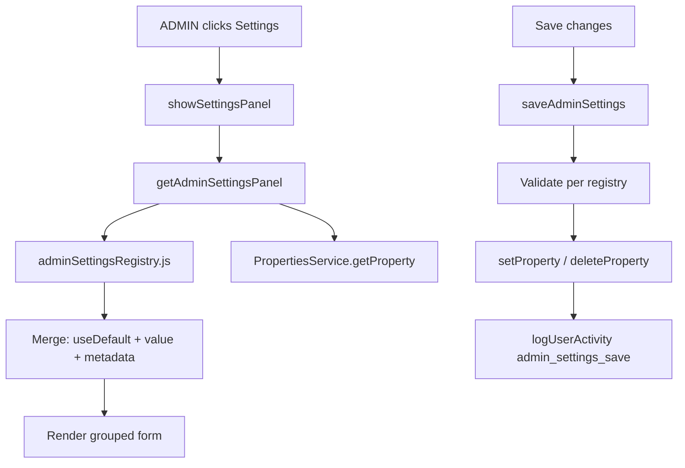

# Implementation plan — Admin settings environment panel

> Companion to [011-admin-settings-environment-panel.md](011-admin-settings-environment-panel.md). **Implemented v2.2.0** in a single release (decisions: hide Settings for non-admins; read-only auth spreadsheet id and snapshot folder id).

## Summary

| Item | Choice |
|------|--------|
| **Version** | **2.2.0** (MINOR) |
| **PRD** | **FR-106**, **AC-62** |
| **Entry** | Sidebar **Settings** → `#panel-settings` |
| **Auth** | Users sheet **Role** = `ADMIN` (case-insensitive) |
| **Storage** | Existing **Script Properties** (no new sheet) |
| **Registry** | New `src/adminSettingsRegistry.js` + `src/adminSettingsApi.js` |

## Architecture



### Default toggle semantics

1. **Registry** defines `defaultValue` (number/string/boolean) or `null` (no default → required).
2. **Load:** `useDefault = !props.hasProperty(key)` (or key absent/blank per type rules).
3. **Display:** If `useDefault`, show default as read-only hint; inputs disabled.
4. **Save:** For each field:
   - `useDefault === true` → `deleteProperty(key)`
   - `useDefault === false` → `setProperty(key, serialize(value))`
5. **Runtime:** Existing `getAgreementThresholds_()`, `getUtilizationThresholds_()`, etc. unchanged—they already read property then fall back to defaults. Optional follow-up: thin wrappers call `getResolvedAdminSetting_(key)` to avoid drift.

### ADMIN gate

```javascript
function requireAdminRole_(auth) {
  if (!auth || String(auth.role || '').trim().toUpperCase() !== 'ADMIN') {
    throw new Error('FORBIDDEN'); // map to safe client message
  }
}
```

Wire into `getAdminSettingsPanel` and `saveAdminSettings` only (not into every Fibery fetch).

### Navigation / visibility

**Option A (recommended):** `buildNavigationModel_` sets `isAdmin`; client hides `#settings-link` wrapper when `!isAdmin`.

**Option B:** Show Settings for all; non-admin gets modal “Administrator access required.”

Plan assumes **Option A**.

## Phased delivery

### Phase 1 — Registry and server read (no UI)

**Goal:** Single catalog + authorized read API; no writes yet.

| Task | Detail |
|------|--------|
| 1.1 | Add `src/adminSettingsRegistry.js` with all groups and entries from feature spec catalog. |
| 1.2 | Add `src/adminSettingsApi.js`: `getAdminSettingsPanel()`, `requireAdminRole_()`. |
| 1.3 | Implement `buildAdminSettingsViewModel_()` — merge registry + properties; mask secrets; mark `readOnly` for `FOS_SNAPSHOT_DRIVE_FOLDER_ID`. |
| 1.4 | Unit-test in editor: run as ADMIN user vs non-admin via manual `getAdminSettingsPanel()`. |

**Exit:** ADMIN can call API from editor; JSON matches registry shape.

### Phase 2 — Server write + validation

**Goal:** Safe persistence with validation and audit log.

| Task | Detail |
|------|--------|
| 2.1 | `saveAdminSettings(updates)` — `updates[]: { key, useDefault, value? }`. |
| 2.2 | Reject unknown keys; validate types/ranges/json; cross-field rules (e.g. crit stale days > warn days). |
| 2.3 | `FIBERY_API_TOKEN`: only set when `value` non-empty; never return on read. |
| 2.4 | Whitelist `admin_settings_save`, `admin_settings_save_error`, `settings_panel_open` in `userActivityLog.js`. |
| 2.5 | Log changed **keys only** (no values). |

**Exit:** Editor can round-trip a non-secret key; property appears/disappears in Script Properties UI.

### Phase 3 — Shell panel (read-only UI)

**Goal:** Settings panel renders groups; no Save yet.

| Task | Detail |
|------|--------|
| 3.1 | Add `#panel-settings` HTML (accordion cards per group). |
| 3.2 | `showSettingsPanel()`, `setActiveNav('settings')`, topbar title **Settings**. |
| 3.3 | On load: `getAdminSettingsPanel()` → render fields, tooltips (Bootstrap), default toggles (disabled Save). |
| 3.4 | `buildNavigationModel_` → `isAdmin`; hide settings link if false. |
| 3.5 | Replace `showComingSoon` on settings click for ADMIN only. |

**Exit:** ADMIN sees full form; non-admin does not see Settings.

### Phase 4 — Save / discard / client validation

**Goal:** End-to-end admin edits from browser.

| Task | Detail |
|------|--------|
| 4.1 | Track dirty state; **Discard** reloads from server. |
| 4.2 | Client mirrors server validation (ranges) for fast feedback. |
| 4.3 | **Save** → `saveAdminSettings`; success toast + clear session caches (`AGREEMENT_CACHE_KEY`, `UTIL_CACHE_KEY`, `DELIVERY_CACHE_KEY`). |
| 4.4 | Error banner on partial validation failure. |

**Exit:** ADMIN changes `UTILIZATION_TARGET_PERCENT`, saves, refreshes Operations → new thresholds apply.

### Phase 5 — Docs, PRD, version bump

| Task | Detail |
|------|--------|
| 5.1 | `docs/FOS-Dashboard-PRD.md` — FR-106, AC-62, changelog 2.2.0, overview paragraph. |
| 5.2 | `FOS_PRD_VERSION = '2.2.0'` + `src/*` headers. |
| 5.3 | `docs/features/000-overview.md` — planned → shipped when done. |
| 5.4 | `README.md` — link feature 011; note admin UI supersedes raw editor for listed keys. |
| 5.5 | Update [001](001-dashboard-shell-navigation.md) Settings AC (ADMIN panel vs coming soon). |
| 5.6 | `.cursor/rules/google-apps-script-core.mdc` — when adding Script Properties, update registry. |

### Phase 6 — Manual E2E (deployed Web App)

| # | Step | Expected |
|---|------|----------|
| 1 | User with Role `Viewer` | No Settings link |
| 2 | User with Role `ADMIN` | Settings opens panel, all groups visible |
| 3 | Toggle **Use default** on `AGREEMENT_CACHE_TTL_MINUTES`, Save | Property deleted; client TTL shows default 10 |
| 4 | Set custom TTL 5, Save | Property set; Agreement TTL dropdown seeds 5 on next load |
| 5 | Invalid JSON in `LABOR_HOURS_COMPANY_TARGETS_JSON` | Save blocked, inline error |
| 6 | Set new Fibery token | Save succeeds; Fibery dashboards work; token not in network response |
| 7 | User Activity | `admin_settings_save` row with keys only |

## Files to create / modify

| File | Action |
|------|--------|
| `src/adminSettingsRegistry.js` | **Create** — catalog |
| `src/adminSettingsApi.js` | **Create** — get/save APIs |
| `src/authUsersSheet.js` | **Edit** — export `requireAdminRole_` or add to small `src/adminAuth.js` |
| `src/Code.js` | **Edit** — `isAdmin` on nav model |
| `src/DashboardShell.html` | **Edit** — panel HTML, CSS, JS, settings click |
| `src/userActivityLog.js` | **Edit** — whitelist events |
| `docs/features/011-*.md` | **Done** (this review) |
| `docs/FOS-Dashboard-PRD.md` | **Edit** on implement |
| `README.md` | **Edit** on implement |

**No change** to threshold modules in Phase 1–4 except optional shared constant imports in Phase 5+ refactor.

## UI component checklist

- [ ] Group accordion headers with chevron
- [ ] Info icon + tooltip per field (`data-bs-toggle="tooltip"`)
- [ ] “Use built-in default” switch per eligible field
- [ ] `form-control` / `form-select` / `form-check` aligned with dark theme
- [ ] Sensitive: password input type for token replace
- [ ] Read-only snapshot folder id with copy-to-clipboard
- [ ] Unsaved changes warning on nav away (optional v1.1; recommend `beforeunload` only if dirty)

## Risk register

| Risk | Mitigation |
|------|------------|
| Registry defaults drift from `agreementThresholds.js` | Phase 1 checklist: diff defaults against README table; long-term import shared constants |
| Admin locks out Fibery | Keep `AUTH_SPREADSHEET_ID` editable but show strong warning; document break-glass via Apps Script editor |
| Large save payload | Batch limit 50 keys; single save button |
| Concurrent admins | Last write wins (Script Properties); show `lastModified` from property metadata if available (optional) |
| Token leaked in logs | Never log values; code review save path |

## Product decisions (locked for v2.2.0)

1. **Non-admin Settings:** **Hide** the sidebar link (`#settings-link-wrap` stays `d-none`).
2. **`AUTH_SPREADSHEET_ID`:** **Read-only** in the UI (Apps Script editor for changes).
3. **`FOS_SNAPSHOT_DRIVE_FOLDER_ID`:** **Read-only** in the UI (`ensureSnapshotDriveFolder()` in editor).
4. **Fibery groups:** Split **API** and **deep links** (as spec).
5. **Post-save:** Banner + clear client caches; user refreshes open dashboards.

## Estimate (rough)

| Phase | Effort |
|-------|--------|
| 1–2 Server | 1–2 days |
| 3–4 Client | 2–3 days |
| 5 Docs / QA | 0.5 day |
| **Total** | **~4–5 days** |

## Approval checklist

- [ ] Product approves **ADMIN** role string and hide-Settings UX
- [ ] Security approves **write-only** token and audit logging
- [ ] Engineering approves **registry** approach vs inline property list
- [ ] Scope sign-off on **v1 catalog** (no queue props, read-only snapshot folder)

Once approved, implementation starts at **Phase 1** without editing this plan file unless scope changes.
