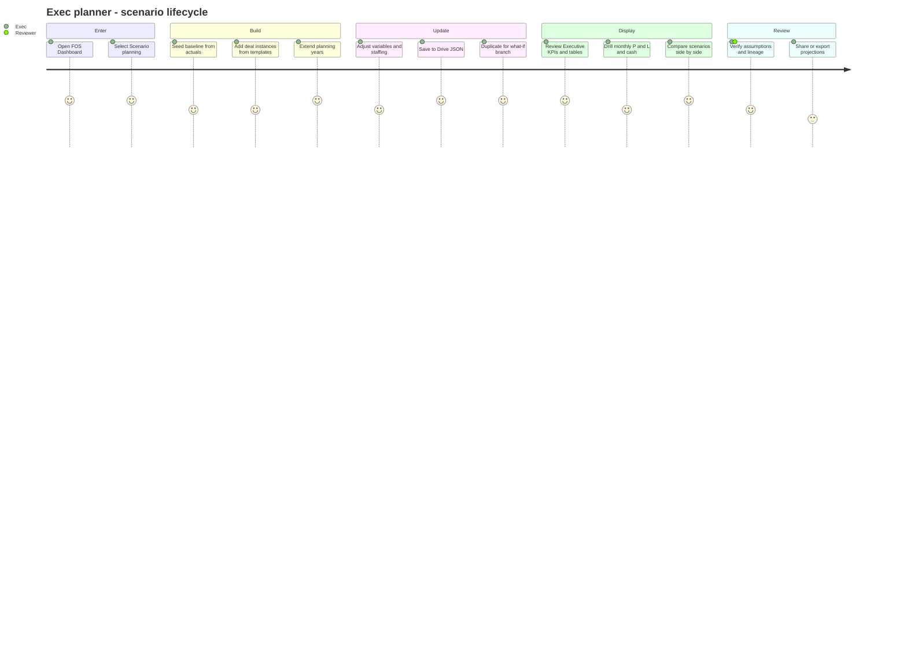
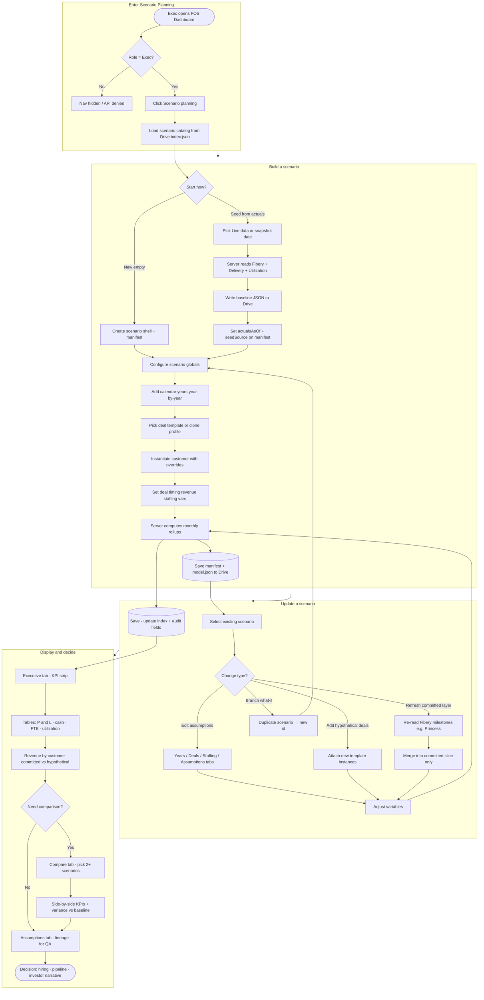
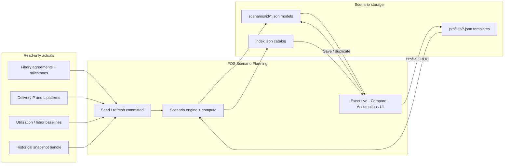

# Feature: Scenario Planning

> **PRD version TBD** - see `docs/FOS-Dashboard-PRD.md` (FR/AC numbers reserved when this feature is scheduled for release).

> **Imported baseline PRD:** [`docs/financial_scenario_modeling_prd.md`](../financial_scenario_modeling_prd.md) (Financial Scenario Modeling & Forecasting Platform, May 2026). This file is the **FOS Dashboard** adaptation: same product intent, constrained to **Google Apps Script + HtmlService**, **Exec** access, and **Drive JSON** storage. 
> **Parent product baseline:** `docs/FOS-Dashboard-PRD.md` 
> **Authorization:** [002 - Spreadsheet user authorization](002-spreadsheet-user-authorization.md) (`Role` column) 
> **Actuals sources (read-only):** [003 - Agreement Dashboard](003-agreement-dashboard-fibery-client-cache.md), [006 - Delivery P&L](006-delivery-project-pnl.md), [005 - Utilization](005-utilization-management-dashboard.md), [009 - Historical snapshots](009-dashboard-historical-snapshots.md) 
> **Storage pattern reference:** [009 - Dashboard historical snapshots](009-dashboard-historical-snapshots.md) (Drive JSON layout)

## Executive summary

harpin leadership needs **flexible forecasting beyond month-end close**: baseline conservative plans, upside scenarios (e.g. **+5 new customers in 12 months**), **resource planning** (e.g. **3 vs 5 engineers**), and **multi-year contract** integration (e.g. **Princess** 5-year SOWs) - without the version-control and cell-by-cell QA burden of a **15-tab spreadsheet**.

**Scenario Planning** adds a **top-level FOS Dashboard route** that:

- supports **internal strategic planning** and **investor-facing projections** (export/reporting TBD),
- **seeds from actuals** (Fibery, Delivery P&L, Utilization; optional historical snapshots) but **stores scenarios separately** as **JSON in Google Drive**,
- provides a **scenario modeling engine**, **reusable deal templates** (customer profiles), **revenue + staffing forecasts**, and **comparison dashboards**,
- integrates **Fibery read-only** in early phases; **QuickBooks** read-only in a later phase.
- implements **Tier 1** capabilities (driver-linked compute, non-destructive branching, plan vs actual, assumption registry, instant recompute, committed vs hypothetical layers) benchmarked against modern FP&A tools (Runway, Pigment) - see [Core capabilities](#core-capabilities-runway--pigment-benchmark).

## Business context

harpin operates a **hybrid model** (from imported PRD §3):

| Stream | Planning implications |
| --- | --- |
| **Service-based consulting** | Project value, billable hours, milestones, delivery phases, contractor mix |
| **Subscription** | MRR/ARR, seat growth, churn, expansion revenue; **order forms** for ongoing subscription terms |
| **Hybrid engagements** | Mixed structures in one customer/deal instance |
| **Staffing** | Employees, contractors, offshore, fractional resources |
| **Delivery operations** | Utilization, capacity, bottlenecks |

The modeling engine must reflect **both service delivery and recurring subscription** economics, aligned with data already normalized in Agreement, Delivery, and Operations dashboards.

## Stakeholders

| Audience | Examples | In-app role (v1) |
| --- | --- | --- |
| **Primary** | Executive leadership, founders, ops/finance leadership | **Exec** role - full Scenario Planning access |
| **Secondary** | Sales leadership, delivery management | No route access v1; may consume exports |
| **Reviewers** | Scott, Ray (spreadsheet QA today) | Assumption/lineage review on saved scenarios |
| **External** | Investors, advisors, strategic partners | **Investor dashboard** view + export (Phase G backlog) |

## Objectives

Leadership should be able to (imported PRD §2, FOS-scoped):

1. **Forecast revenue growth** (service, subscription, hybrid)
2. **Model staffing requirements** (FTE, contractors, capacity)
3. **Analyze profitability impact** (gross margin, delivery cost, EBITDA where modeled)
4. **Evaluate subscription scaling economics** (MRR/ARR, seats, churn, order-form renewals)
5. **Compare multiple business scenarios** side-by-side
6. **Present investor-ready projections** (export format TBD)
7. **Support operational planning** (hiring timelines, utilization gaps)

**Success metrics** (imported PRD §11):

- Build forecasts quickly vs the legacy spreadsheet
- Evaluate growth opportunities with confidence
- Reduce manual spreadsheet modeling and version confusion
- Improve staffing and hiring decisions
- Present investor-ready scenarios when export ships
- Increase forecasting accuracy via seeded actuals + auditable assumptions

## Status

Phases below map to [Tier 1](#tier-1--required) and [Tier 2](#tier-2--high-value) capabilities. **Tier 1** items are required for the product to replace Guy’s spreadsheet workflow; **Tier 2** items should ship in early phases where possible, not deferred indefinitely.

| Phase | Scope | Tier | Status |
| --- | --- | --- | --- |
| **Phase A - Route shell + access + storage** | Top-level nav **`scenario-planning`** · `#panel-scenario-planning` · **Exec** gate · Drive folder + `index.json` · scenario list / create / duplicate / archive · **`scenarioKind`** on manifest (`baseline` \| `working` \| `archived`) | - | **Planned** |
| **Phase B - Baseline from actuals + plan vs actual** | Seed from live or snapshot actuals · **`actualsAsOf`** / **`seedSource`** · **plan vs actual timeline** (actual \| plan \| variance for elapsed months) · **reforecast** (re-seed actuals, preserve hypotheticals) · no write-back | **T1** | **Planned** |
| **Phase C - Deal templates (profiles)** | Reusable **customer profiles** (OOP): create, clone, edit · **immutable `profileVersion` pinning** on scenario references · built-in archetypes (**subscription onboarding**, enterprise consulting, managed services) | **T2** | **Planned** |
| **Phase D - Driver engine + variables** | **Driver-linked compute graph** (globals → profiles → instances → revenue → P&L → cash; staffing → utilization) · year-by-year horizon (unbounded) · adjustable scenario variables · **instant recompute** + cached `computed` · monthly / Q / annual rollups | **T1** | **Planned** |
| **Phase E - Revenue, staffing & capacity** | Service / subscription / hybrid revenue · **headcount plan feeds P&L, cash, and utilization** (not isolated tables) · staffing categories · capacity gaps · labor cost forecast | **T1**, **T2** | **Planned** |
| **Phase F - Financial outputs + P&L→cash** | Monthly **P&L**, **cash** (simplified operating cash from P&L + DSO/DPO/payroll lag v1), **FTE**, **utilization**, **revenue by customer** · gross margin · optional EBITDA · **cash runway** KPI | **T1**, **T2** | **Planned** |
| **Phase G - Dashboards, compare & export** | Executive summary · **non-destructive compare** (pinned baseline id) · **assumption diff vs baseline** · **sensitivity strip** (one-variable delta) · **time-grain toggle** (month/Q/year) shared with Compare · **board snapshot** export (CSV + print/HTML) | **T1**, **T2** | **Planned** |
| **Phase H - Committed layer refresh** | **Refresh committed** from Fibery (milestones, Princess-class contracts, pipeline) **without wiping hypothetical instances** · merge into committed slice only | **T1** | **Planned** |
| **Phase I - QuickBooks read** | Revenue history, payroll, contractor spend, expenses (read-only seed/actuals overlay) | - | **Backlog** |
| **Phase J - Investor export** | Investor dashboard slice + polished export format (PDF/HTML) beyond Phase G board snapshot | **T2** | **Backlog** |

## Core capabilities (Runway / Pigment benchmark)

Capabilities distilled from off-the-shelf FP&A tools ([Runway](https://runway.com), [Pigment](https://www.pigment.com)) that **must** or **should** appear in the FOS build. Harpin-specific differentiators (Fibery milestones, subscription order forms, FOS actuals seed) sit on top of this foundation.

### Tier 1 - Required

Without these, Scenario Planning risks rebuilding spreadsheet chaos in JSON.

| # | Capability | Requirement | Primary phase |
| --- | --- | --- | --- |
| **T1.1** | **Driver-based model** | Forecast is a **dependency graph**, not static tables. Changing hiring timing, MRR ramp, margin, or deal timing **automatically recomputes** P&L, cash, FTE, utilization, and revenue-by-customer together. | D, E |
| **T1.2** | **Non-destructive scenario branching** | **`baseline`** scenario is **read-only** (or locked until “Promote to baseline”). What-ifs via **Duplicate** → new `working` scenario. **Compare** always references a **pinned `baselineScenarioId`**. | A, G |
| **T1.3** | **Plan vs actual in one timeline** | For months ≤ **`actualsAsOf`**: show **actual \| plan \| variance**. Future months: plan only. Supports reviewer QA against facts, not cell hunting. | B, F |
| **T1.4** | **Rolling reforecast** | **Reforecast** action: re-seed actuals from Live/snapshot while **preserving** hypothetical deal instances and staffing assumptions. | B |
| **T1.5** | **Assumption registry (first-class UI)** | **Assumptions** tab lists every driver: name, value, source (`global` \| `profile` \| `instance` \| `committed`), **`profileVersion`**, last editor, timestamp. **Diff vs baseline** in Compare. | G |
| **T1.6** | **Instant recompute + cached outputs** | On assumption edit or save: invalidate `computed`, recompute (target ≤5s). UI shows stale state if compute pending/failed. User does not manually refresh five output tabs. | D, F |
| **T1.7** | **Committed vs hypothetical layers** | Two logical layers in every scenario: **committed** (Fibery/QBO-sourced) and **hypothetical** (profile instances). **Refresh committed** updates milestones/order forms **only** - never deletes hypotheticals. | B, H |

### Tier 2 - High value (prioritize early)

| # | Capability | Requirement | Primary phase |
| --- | --- | --- | --- |
| **T2.1** | **Sensitivity / one-variable impact** | **Sensitivity strip** in Compare or Executive: pick one assumption (e.g. +2 engineers, +10% churn), show **KPI delta vs pinned baseline** without creating a full duplicate scenario (duplicate remains available for complex what-ifs). | G |
| **T2.2** | **Headcount ↔ P&L ↔ utilization coupling** | Staffing plan drives **labor cost** (P&L), **payroll cash timing**, and **capacity/utilization** (demand from deal instances vs available hours). Core enabler for “3 vs 5 engineers.” | E |
| **T2.3** | **P&L → cash linkage** | v1: **simplified operating cash** from P&L using configurable **DSO**, **DPO**, and **payroll lag**; opening cash from seed; **cash runway months** on executive KPI strip. Full balance sheet out of scope. | F |
| **T2.4** | **Consistent KPIs across views** | **Executive**, **Compare**, and **Sensitivity** use the **same KPI definitions** and **time-grain toggle** (month / quarter / year). | G |
| **T2.5** | **Profile version pinning** | Scenarios store **`profileId` + `profileVersion`** per instance. Editing a profile creates a **new version**; existing scenarios remain on pinned versions until user explicitly upgrades. | C |
| **T2.6** | **Board snapshot export** | **Copy CSV**, **print stylesheet**, and/or **HTML snapshot** of scenario + assumption summary (mirror [007](007-labor-hours-dashboard.md) / [008](008-revenue-review-dashboard.md) patterns) for stakeholders without Exec access. | G |

### Design acceptance test

Before a phase ships, validate:

> Guy can **duplicate the baseline**, add one **enterprise consulting** instance from a template, change hiring from **3 → 5 engineers**, and Scott/Ray can see **why** revenue, margin, cash, and utilization moved - via the **Assumptions** registry and **Compare** diff - **without opening a spreadsheet**.

### Driver dependency graph (T1.1)

```text
scenario.globals ──┬── profile.defaults ── instance.overrides
 │
 ├── committed layer (Fibery seed / refresh)
 │
 ▼
 revenue engine (service · subscription · hybrid)
 │
 ┌───────────┼───────────┐
 ▼ ▼ ▼
 rev/customer staffing utilization
 │ │ │
 └─────► monthly P&L ◄──┘
 │
 ▼
 cash (DSO/DPO/payroll lag)
 │
 ▼
 computed cache (invalidated on edit)
```

## Problem statement

Today, Guy’s forward planning relies on a **multi-tab spreadsheet** maintained on an individual laptop. That workflow creates:

- **Version control confusion** - multiple copies, unclear “source of truth.”
- **High QA cost** - Scott and Ray validate individual cells and formulas rather than business assumptions.
- **Limited agility** - hard to compare a conservative baseline vs upside cases outside month-end close rhythms.

Scenario Planning moves this into the **FOS Dashboard**: structured, auditable, JSON-backed models that **start from actuals** but live **entirely outside** systems of record.

## User stories

### Epic

- As a **user with Exec role on the authorization spreadsheet**, I want a **Scenario Planning** area where I can build, save, **duplicate**, and **compare** forward-looking plans **year by year** for as many years as I need, **so that** we replace spreadsheet chaos with one trusted, versioned planning surface for **internal and investor** audiences.

### Supporting stories

- As an **Exec planner**, I want to create a **baseline conservative scenario** seeded from **current actuals**, **so that** leadership has a sober plan-of-record separate from upside cases.
- As an **Exec planner**, I want **reusable deal templates** I can clone and edit, **so that** I model “new enterprise customer in Q1” without rebuilding assumptions from scratch.
- As an **Exec planner**, I want to add **generic customer instances** from templates with overrides, **so that** I can run pipelines like “**+5 similar customers over 12 months**.”
- As an **Exec planner**, I want to adjust **scenario variables** (revenue, deal timing, staffing, margins, overhead, hiring timelines, salaries), **so that** I can run what-if simulations in one place.
- As an **Exec planner**, I want to compare **hiring plans** (e.g. **3 vs 5 engineers**) and see **utilization gaps** and **labor cost**, **so that** staffing decisions are data-driven.
- As an **Exec planner**, I want **Princess** and other **multi-year contracts** from Fibery in the baseline, **so that** I do not re-key milestone schedules.
- As a **reviewer** (Scott, Ray), I want an **assumption registry with diff vs baseline**, **so that** QA focuses on business rules - not spreadsheet copies.
- As an **Exec planner**, I want **plan and actual on one timeline** and **reforecast** when new actuals arrive, **so that** forward plans stay grounded without rebuilding hypotheticals.
- As **Exec leadership**, I want an **executive dashboard** (revenue, margin, staffing, growth KPIs), **compare**, and **board export**, **so that** we can present scenarios without rebuilding decks in Sheets.

## Scenario modeling engine

Imported PRD §5.1 - implemented inside the FOS Web App (not a separate product). Must satisfy **Tier 1** capabilities [T1.1 - T1.7](#tier-1--required).

### Scenario kinds (T1.2)

| `scenarioKind` | Behavior |
| --- | --- |
| **`baseline`** | Plan of record; **read-only** by default (unlock requires explicit “Edit baseline” or admin override). One **`baseline`** per catalog recommended; Compare pins this id. |
| **`working`** | Editable what-if copies (from duplicate or new). Default for duplicated scenarios. |
| **`archived`** | Soft-deleted; hidden from default picker; retained in Drive. |

Manifest fields: **`scenarioKind`**, **`baselineScenarioId?`** (set on working copies for compare lineage), **`locked`** (boolean; true for baseline unless editing).

### Scenario lifecycle

| Action | Requirement |
| --- | --- |
| **Create** | New empty scenario or **seed from actuals** (Phase B); first seeded scenario may be promoted to **`baseline`**. |
| **Duplicate** | Clone scenario JSON + new manifest id · **`scenarioKind: working`** · copy **`baselineScenarioId`** from source · audit fields reset (T1.2). |
| **Promote to baseline** | Demote prior baseline to **`working`** or **`archived`**; set new **`baseline`** · **`locked: true`**. |
| **Reforecast** | Re-seed **committed** actuals · update **`actualsAsOf`** · preserve **hypothetical** instances and staffing vars (T1.4). |
| **Refresh committed** | Re-read Fibery milestones/agreements into **committed layer only** (T1.7, Phase H). |
| **Save** | Persist to Drive · invalidate + recompute **`computed`** (T1.6) · update `index.json` under lock. |
| **Archive** | Set **`scenarioKind: archived`** · update index. |
| **Compare** | Select baseline + 1+ working scenarios · side-by-side KPIs · assumption diff (T1.5, Phase G). |

### Scenario variables (adjustable per scenario or instance)

Users must be able to model changes to:

- Revenue assumptions · contract values · deal timing
- Staffing levels · contractor utilization · hiring timelines · salary assumptions
- Subscription seat growth · churn · expansion · **order-form** terms (where template = subscription/hybrid)
- Gross margin targets · delivery complexity · project timelines
- Overhead expenses · operating expenses (cash / P&L)

Precedence: **`instance.overrides` > `profile.defaults` > `scenario.globals`**.

## Deal templates (customer profiles)

Imported PRD §5.2 - stored as **`profiles/<profileId>.json`** (OOP **classes**); scenarios hold **instances** with overrides.

### Built-in archetypes (seed library in Phase C)

| Template | Typical defaults |
| --- | --- |
| **Subscription onboarding** | Initial onboarding duration, implementation hours, support load; **order forms** for ongoing subscriptions (renewals, seat tiers, usage-based add-ons); seat expansion and MRR ramp |
| **Enterprise consulting** | Delivery phases, contractor requirements, margin targets, resource map, timeline |
| **Managed services** | Monthly recurring revenue, ongoing staffing, support utilization |

### Template operations

- Create · **clone** · edit · assign default assumptions · **version** (**required:** immutable **`profileVersion`** pinned on scenario references - T2.5)
- Editing a profile **creates a new version**; scenarios referencing an older **`profileVersion`** are unchanged until the user **upgrades** the reference

### Profile schema (extended)

```javascript
{
 profileSchemaVersion: 1,
 id: 'enterprise-consulting',
 name: 'Enterprise consulting engagement',
 templateKind: 'enterprise-consulting', // subscription-onboarding | enterprise-consulting | managed-services | custom
 description: '…',
 defaults: {
 contractType: 'services', // services | subscription | hybrid
 revenueModel: 'milestone', // milestone | mrr | hybrid
 initialAcv: 500000,
 acvGrowthRateAnnual: 0.05,
 mrr: null,
 seatCount: null,
 seatGrowthRateMonthly: null,
 churnRateMonthly: null,
 targetMarginPct: 0.35,
 rampMonths: 6,
 contractDurationMonths: 36,
 billingPattern: 'monthly-milestones',
 deliveryPhases: [], // optional phase timeline
 fteDemand: { engineers: 2, deliveryLeads: 0.5, contractors: 0, offshore: 0, fractional: 0 },
 utilizationTargetPct: 0.75,
 implementationHours: null,
 supportHoursPerMonth: null
 }
}
```

**Subscription onboarding** profile (`templateKind: 'subscription-onboarding'`) - example defaults:

```javascript
{
 profileSchemaVersion: 1,
 id: 'subscription-onboarding',
 name: 'Subscription onboarding',
 templateKind: 'subscription-onboarding',
 description: 'Initial implementation plus order forms for ongoing subscription revenue.',
 defaults: {
 contractType: 'subscription',
 revenueModel: 'mrr',
 initialAcv: null,
 mrr: 10000,
 seatCount: 100,
 seatGrowthRateMonthly: 0.02,
 churnRateMonthly: 0.01,
 rampMonths: 3,
 implementationHours: 120,
 supportHoursPerMonth: 8,
 orderForms: [
 {
 label: 'Ongoing subscription - base seats',
 kind: 'recurring',
 startOffsetMonths: 0,
 durationMonths: 12,
 mrr: 10000,
 renewalAssumption: 'auto-renew'
 },
 {
 label: 'Order form - usage / expansion tier',
 kind: 'expansion',
 startOffsetMonths: 6,
 trigger: 'seat-threshold',
 incrementalMrr: 2500
 }
 ]
 }
}
```

> **Terminology:** Use **subscription** (not SaaS) in product copy, `templateKind` values, and revenue-stream labels. **`subscription-onboarding`** covers the initial engagement **and** **order forms** that govern ongoing subscription terms (aligned with harpin agreement types such as subscription order forms in Fibery).

## Revenue forecasting

Imported PRD §5.3 - computed from committed (Fibery) + hypothetical (instances).

| Revenue type | Forecast inputs |
| --- | --- |
| **Service** | Project value, billable hours, resource allocation, timeline, delivery milestones |
| **Subscription** | MRR/ARR, seat growth, churn, expansion revenue; recurring terms via **order forms** |
| **Hybrid** | Combined rules on one instance (`contractType: 'hybrid'`) |

**Granularity:** monthly (required); **quarterly** and **annual** rollups for dashboards (Phase D/F).

## Staffing & capacity planning

Imported PRD §5.4. Must implement **T2.2** (headcount ↔ P&L ↔ utilization coupling).

### Staffing categories

- Full-time employees · contractors · offshore · fractional resources

### Capacity features

- Forecast hiring needs · model contractor usage · delivery capacity · utilization gaps · delivery bottlenecks (rules TBD in implementation plan)

### Staffing ↔ financial linkage (T2.2)

Staffing inputs are **drivers**, not a standalone grid:

| Staffing input | Downstream effect |
| --- | --- |
| FTE start date + role + salary/cost | **Labor line** in monthly P&L |
| Payroll timing assumption | **Cash outflow** (with payroll lag - T2.3) |
| Capacity hours (FTE × availability) | **Utilization** vs demand from deal instances |
| Contractor hours / rates | P&L labor + cash + utilization (non-FTE bucket) |

Changing “3 vs 5 engineers” must move **P&L, cash, FTE, and utilization** in one recompute (T1.1).

### Staffing outputs

| Output | Use |
| --- | --- |
| Hiring timelines | Plan when to add FTE |
| Resource shortages | Flag months under capacity |
| Utilization % | Align with [005 - Utilization](005-utilization-management-dashboard.md) semantics where practical |
| Forecasted labor costs | Feed P&L and cash |

## Financial forecasting outputs

Imported PRD §5.5 - monthly minimum per product decision; extended metrics below.

| Category | Metrics |
| --- | --- |
| **Revenue** | Monthly, quarterly, annual; by customer; by stream (service / subscription / hybrid) |
| **Profitability** | Gross margin, net margin (if modeled), **EBITDA** (confirm in open questions), cost of delivery |
| **Cash flow** | Revenue timing, payroll, contractor payments, operating expenses |
| **Core FOS outputs** | Monthly **P&L**, **cash**, **headcount (FTE)**, **utilization**, **revenue by customer** |

### Plan vs actual timeline (T1.3)

For each monthly row through **`actualsAsOf`**:

| Column | Source |
| --- | --- |
| **Actual** | Seeded from Fibery / Delivery / Utilization / snapshot |
| **Plan** | Scenario model at time of last save (or baseline for compare) |
| **Variance** | Actual − plan (or %), surfaced in Executive and Compare |

Months **after** **`actualsAsOf`**: plan columns only.

### P&L → cash (T2.3)

v1 uses **simplified operating cash**, not a full balance sheet:

- P&L revenue and expenses drive cash with configurable **`dsoDays`**, **`dpoDays`**, **`payrollLagDays`** on `scenario.globals`
- **Opening cash** from seed
- Executive KPI strip includes **cash runway months** (cash ÷ trailing burn or modeled forward burn - define in implementation plan)

Computed snapshots are cached in scenario JSON (`computed: { asOf, invalidatedAt?, … }`) and **invalidated on any assumption change** (T1.6).

## Dashboards & reporting

Imported PRD §5.6 - tabs/views within `#panel-scenario-planning`.

| View | Contents |
| --- | --- |
| **Executive** | Revenue forecast, profitability trends, staffing forecasts, growth projections, KPI strip (see [Suggested KPIs](#suggested-kpis)) · **time-grain toggle** month / Q / year (T2.4) |
| **Assumptions** | **Assumption registry** (T1.5): all drivers, sources, profile versions, last editor · filter committed vs hypothetical |
| **Scenario comparison** | Side-by-side vs **pinned baseline** · KPI + table variance · **assumption diff** · **sensitivity strip** for one-variable delta (T2.1) · same KPI defs as Executive (T2.4) |
| **Investor** | ARR growth, revenue trajectory, margin expansion - **Phase J**; Phase G ships **board snapshot** export first (T2.6) |

Charts: reuse **Chart.js** (already in FOS) where appropriate; FOS dark chrome throughout.

## Example workflow

Imported PRD §10.

**Question:** “What happens if we close a new enterprise customer in Q1?”

| Step | Action |
| --- | --- |
| 1 | Duplicate **baseline** scenario or create from actuals |
| 2 | Add instance from **Enterprise consulting** template: contract value, duration, subscription seats or order forms (if hybrid), staffing |
| 3 | Set deal timing (Q1 start), hiring timeline, salary assumptions |
| 4 | Review outputs: revenue increase, margin impact, hiring needs, cash flow, capacity/utilization |
| 5 | Compare to baseline in **Compare** view |

## User journey map

End-to-end path for an **Exec planner** (build → update → display → compare). Reviewers (Scott, Ray) enter during **Assumptions** review and **Compare**; actuals systems (Fibery, snapshots) are read-only inputs.

### Journey overview



### Detailed flow - build, update, and display



### System touchpoints (read vs write)



| Phase | User intent | Primary UI | Persists to |
| --- | --- | --- | --- |
| **Build** | Establish baseline or blank plan | New / Seed wizard, Years, Deals | `scenarios/<id>/`, `index.json` |
| **Update** | Change assumptions or branch | Staffing, Assumptions, Duplicate, Refresh | Same scenario folder or new id on duplicate |
| **Display** | Understand impact | Executive, monthly tables, Compare | Cached `computed` in JSON optional |
| **Review** | Trust the model | Assumptions lineage, `actualsAsOf`, profile versions | Audit fields on manifest |

## Access control

| Rule | Detail |
| --- | --- |
| **Entitlement** | **`Role` = `Exec`** (case-insensitive, trimmed - same pattern as **`ADMIN`** for Settings). |
| **Server** | `requireAuthForApi_()` + **`requireExecForScenarioPlanning_()`** on all scenario/profile/compute APIs. |
| **Navigation** | `scenario-planning` omitted from nav for non-Exec. |
| **Drive** | Exec users access scenarios **only via server APIs** in v1 (no raw Drive URLs). |
| **Audit** | `createdBy` / `updatedBy` on manifest; [004 - User Activity](004-user-activity-logging.md) for `scenario_planning_*` events. |

Imported PRD §6.2 (RBAC, encrypted storage) is satisfied by **Workspace auth + Exec gate + Google Drive ACLs**; no separate auth provider.

## Navigation

- **Placement:** **Top-level** (sibling to Agreement, Operations, Delivery).
- **Route id:** **`scenario-planning`**
- **Panel id:** **`#panel-scenario-planning`**
- **Label (draft):** **Scenario planning**
- **Icon (draft):** `bi-diagram-3` or `bi-sliders2`

## Actuals vs scenarios (separation of concerns)

| Layer | Role | Storage | Mutability |
| --- | --- | --- | --- |
| **Actuals** | Ground truth for seeding | Fibery (live), [snapshots](009-dashboard-historical-snapshots.md), future QuickBooks read | Read-only |
| **Scenario - committed** | Fibery-sourced agreements, milestones, order forms | Inside scenario JSON **`committed`** slice | **Refresh committed** only (T1.7) |
| **Scenario - hypothetical** | Profile instances, staffing what-ifs | Inside scenario JSON **`hypothetical`** slice | User edit |
| **Scenario - computed** | Derived P&L, cash, KPIs | `computed` cache in scenario JSON | Regenerated on recompute (T1.6) |

**Seeding (Phase B):** Agreement ([003](003-agreement-dashboard-fibery-client-cache.md)), Delivery P&L ([006](006-delivery-project-pnl.md)), Utilization ([005](005-utilization-management-dashboard.md)); optional snapshot date via [010](010-dashboard-historical-data-source.md).

**Reforecast (T1.4):** Updates **committed** + **`actualsAsOf`** from latest actuals; **does not** remove or overwrite **`hypothetical.instances[]`** or user staffing overrides.

**Refresh committed (Phase H):** Same as partial reforecast - Fibery milestone/agreement pull into **`committed`** only.

## Data integrations

Imported PRD §5.7 - **FOS adaptation** (no standalone Node/React stack).

| Source | Phase | Data (read-only) | Sync |
| --- | --- | --- | --- |
| **Fibery** | B, H | Agreements, milestones, revenue items, labor, pipeline/allocations (H) | On seed/refresh + manual **Refresh**; reuse existing connectors |
| **FOS snapshots** | B | Point-in-time copies of dashboard payloads | User-selected snapshot date |
| **QuickBooks** | I (backlog) | Revenue history, expenses, payroll, contractors | Daily preferred; manual refresh; MCP/API TBD |
| **Legacy spreadsheet** | Optional one-time import | Guy workbook → JSON migration | Open question |

**Requirements:** read-only integrations initially · error logging · sync status in UI (warnings partial/failed) · validation on seed.

> **Out of scope for FOS:** Imported PRD §7 suggested stack (React/Next.js, PostgreSQL, AWS/Vercel). Scenario Planning **extends the existing Apps Script Web App** (`clasp`, HtmlService, `google.script.run`).

## Storage layout (Google Drive)

Root: **`SCENARIO_PLANNING_DRIVE_FOLDER_ID`**

```text
<root>/
 index.json
 profiles/
 <profileId>.json
 scenarios/
 <scenarioId>/
 manifest.json # scenarioKind, baselineScenarioId, locked, actualsAsOf, …
 model.json # globals, committed, hypothetical, assumptions[]
 computed.json # optional shard: cached rollups (or embedded in model.json)
```

### Manifest fields (extended)

| Field | Purpose |
| --- | --- |
| `scenarioSchemaVersion` | Breaking JSON changes |
| `id`, `name`, `description` | Identity |
| `scenarioKind` | `baseline` \| `working` \| `archived` (T1.2) |
| `baselineScenarioId` | On working copies: id of baseline used for compare |
| `locked` | Baseline read-only when true |
| `actualsAsOf` | Last actuals month/day in seed/reforecast |
| `seedSource`, `seedSnapshotDate?` | Provenance |
| `years[]` | Modeled calendar years |
| `assumptions[]` | Registry snapshot or refs for T1.5 UI |
| `createdBy`, `createdAt`, `updatedBy`, `updatedAt` | Audit |
| `profileRefs[]` | `{ profileId, profileVersion, instanceId? }` (T2.5) |

### Catalog (`index.json`)

Rolling index written with **`LockService`** on mutations. Each scenario entry includes **`scenarioKind`**, **`actualsAsOf`**, **`years[]`**, and audit fields for the scenario picker.

```javascript
{
 indexVersion: 1,
 updatedAt: '2026-05-22T…',
 baselineScenarioId: 'uuid-of-current-baseline',
 scenarios: [
 {
 id: 'uuid-or-slug',
 name: 'Baseline FY26 - FY30',
 scenarioKind: 'baseline',
 status: 'active',
 actualsAsOf: '2026-04-30',
 years: [2026, 2027, 2028, 2029, 2030],
 updatedAt: '…',
 updatedBy: 'user@harpin.ai'
 }
 ],
 profiles: [
 { id: '…', name: 'Enterprise consulting', templateKind: 'enterprise-consulting', profileVersion: 1 }
 ]
}
```

## UI anatomy (draft)

```text
┌────────────────────────────────────────────────────────────────────────────┐
│ Scenario planning [ Scenario ▾ ] [ Duplicate ] [ + New ] [ Save ]│
│ Baseline FY26 - FY30 · actuals through Apr 2026 · last saved … │
├────────────────────────────────────────────────────────────────────────────┤
│ [ Executive ] [ Years ] [ Deals ] [ Staffing ] [ Assumptions ] [ Compare ] [ Export ] │
├────────────────────────────────────────────────────────────────────────────┤
│ KPI: Revenue · Gross margin · EBITDA? · Cash · FTE · Utilization · ARR/MRR │
├────────────────────────────────────────────────────────────────────────────┤
│ Workspace: charts + tables (monthly / Q / annual toggle) │
└────────────────────────────────────────────────────────────────────────────┘
```

- **Executive** - leadership KPIs and trends (imported §5.6).
- **Deals** - template library + instances (committed vs hypothetical).
- **Staffing** - hiring plans, contractor mix, capacity gaps.
- **Assumptions** - assumption registry + diff vs baseline (T1.5).
- **Compare** - pinned baseline vs working scenarios + sensitivity strip (T2.1).
- **Export** - board snapshot CSV / print / HTML (T2.6).

Branding: `.fos-agreement-root`, `.fos-section-card`, `.fos-agreement-kpi` ([007](007-labor-hours-dashboard.md), [008](008-revenue-review-dashboard.md)).

## Non-functional requirements

Imported PRD §6 - **Apps Script realistic targets.**

| Area | Target |
| --- | --- |
| **Performance** | Scenario **recompute ≤ 5s** for typical horizon; panel **initial load ≤ 3s** when reading cached `computed`; chunk heavy recompute if needed |
| **Security** | Exec-only; no secrets in Drive JSON; server re-auth on every API |
| **Scalability** | Year sharding; optional `SCENARIO_PLANNING_MAX_YEARS`; profile/scenario count growth via index |
| **Usability** | Executive-friendly; minimal steps to duplicate baseline and add one deal instance |
| **Concurrency** | Last-write-wins + audit fields v1; no real-time co-editing |

## Non-goals (initial release)

- **Write-back** to Fibery, QuickBooks, or the legacy spreadsheet
- **Standalone** forecasting app (separate from FOS Dashboard)
- **Full replacement** of all 15 spreadsheet tabs in Phase A
- **AI-assisted forecasting** (imported PRD §9 - future)
- **Comments / approval workflows / shared editing** (future)
- **Multi-entity / multi-company** modeling (open question)
- **Generic BI explorer** ([000-overview](000-overview.md))

## Future enhancements (backlog)

From imported PRD §9:

- AI-assisted forecasting · automated scenario suggestions · risk analysis
- Multi-year fundraising / valuation modeling
- Resource optimization · profitability recommendations
- Collaboration: comments, shared scenarios, approval workflows

## Acceptance criteria (testable)

### Access & navigation

- [ ] **Given** Role **`Exec`**, **when** the Web App loads, **then** **Scenario planning** appears and `#panel-scenario-planning` is usable.
- [ ] **Given** Role **not** `Exec`, **when** the Web App loads, **then** the route is hidden and APIs return access denied.

### Storage & lifecycle

- [ ] **Given** configured Drive folder, **when** Exec creates/duplicates/archives a scenario, **then** `index.json` and `scenarios/<id>/` update correctly.
- [ ] **Given** saved scenario JSON, **when** inspected, **then** no API tokens or Script Property secrets are present.

### Tier 1 - driver engine & layers

- [ ] **Given** a change to hiring count or deal timing, **when** the user saves, **then** P&L, cash, FTE, utilization, and revenue-by-customer **all update** from one recompute within 5s (T1.1, T1.6).
- [ ] **Given** a **baseline** scenario, **when** a user opens it without unlock, **then** assumptions are **read-only**; **Duplicate** creates a **`working`** copy (T1.2).
- [ ] **Given** months ≤ **`actualsAsOf`**, **when** viewing Executive tables, **then** **actual**, **plan**, and **variance** columns appear (T1.3).
- [ ] **Given** a scenario with hypothetical deals, **when** user runs **Reforecast**, **then** **`actualsAsOf`** and **committed** update and **hypothetical instances remain** (T1.4).
- [ ] **Given** the Assumptions tab, **when** opened, **then** every material driver shows value, source, profile version, and last editor (T1.5).
- [ ] **Given** **Refresh committed**, **when** Fibery data changes, **then** only the **committed** slice updates - not hypothetical instances (T1.7).

### Baseline & separation

- [ ] **Given** seed from Live or snapshot, **when** complete, **then** `actualsAsOf` / `seedSource` are set and source systems are unchanged.
- [ ] **Given** edits after seed, **when** saved, **then** only scenario JSON changes.

### Templates & engine

- [ ] **Given** profile library, **when** user clones **subscription onboarding**, **enterprise consulting**, or **managed services** template, **then** a new editable profile is created with version id.
- [ ] **Given** a scenario referencing **`profileVersion` 2**, **when** profile is edited to version 3, **then** the scenario **still uses version 2** until user upgrades (T2.5).
- [ ] **Given** a scenario, **when** user adds years, **then** horizon extends without a fixed cap.
- [ ] **Given** scenario variables change, **when** user saves, **then** monthly P&L, cash, FTE, utilization, and revenue-by-customer outputs refresh.

### Tier 2 - compare, sensitivity, export

- [ ] **Given** pinned baseline + working scenario, **when** user opens **Compare**, **then** side-by-side KPIs use the **same definitions** as Executive at the selected time grain (T2.4).
- [ ] **Given** Compare, **when** user selects one assumption for sensitivity, **then** KPI **delta vs baseline** displays without requiring a new scenario file (T2.1).
- [ ] **Given** staffing change (e.g. 3 → 5 engineers), **when** recomputed, **then** labor P&L, cash, and utilization all reflect the change (T2.2).
- [ ] **Given** P&L outputs, **when** cash is computed, **then** cash reflects **DSO/DPO/payroll lag** globals and **runway months** appear on KPI strip (T2.3).
- [ ] **Given** a saved scenario, **when** user exports, **then** CSV and/or print/HTML snapshot includes outputs + assumption summary (T2.6).

### Compare & dashboards

- [ ] **Given** two saved scenarios, **when** user opens **Compare**, **then** side-by-side KPIs (and key tables) render with variance vs pinned baseline.
- [ ] **Given** executive view, **when** a scenario is selected, **then** revenue, margin, staffing, and growth KPIs display at monthly/quarterly/annual grain.

### Fibery / long contracts (Phase H)

- [ ] **Given** multi-year Fibery agreements (e.g. Princess), **when** seeding or refreshing committed revenue, **then** milestones appear without manual spreadsheet entry.

### Observability

- [ ] **Given** Exec actions, **when** activity logging is on, **then** `scenario_planning_*` events log with route **`scenario-planning`**.

## Suggested KPIs

Imported PRD §14 - primary executive/compare strip.

| Group | KPIs |
| --- | --- |
| **Revenue** | MRR, ARR, revenue growth rate, average deal size |
| **Operational** | Utilization rate, delivery margin, staffing capacity, contractor spend |
| **Financial** | Gross margin, EBITDA (if in scope), burn rate, cash runway |

## Script Properties (planned)

| Property | Default | Purpose |
| --- | --- | --- |
| `SCENARIO_PLANNING_DRIVE_FOLDER_ID` | - | Drive root |
| `SCENARIO_PLANNING_ENABLED` | `true` | Kill-switch |
| `SCENARIO_PLANNING_MAX_YEARS` | unset | Optional cap |

## Server modules (planned)

| Module | Role |
| --- | --- |
| `src/scenarioPlanningAuth.js` | Exec gate |
| `src/scenarioPlanningStore.js` | Drive I/O, index, CRUD, duplicate |
| `src/scenarioPlanningSeed.js` | Actuals → baseline (Fibery + snapshots) |
| `src/scenarioPlanningProfiles.js` | Template/profile CRUD, versioning |
| `src/scenarioPlanningCompute.js` | Driver graph, revenue, staffing, P&L, cash, utilization, sensitivity delta |
| `src/scenarioPlanningApi.js` | `google.script.run` surface |
| `src/Code.js` | Navigation |
| `src/DashboardShell.html` | Panel UI |

## Open questions

| # | Question | Source | Notes |
| --- | --- | --- | --- |
| 1 | **Cash model depth** - full 3-statement vs operating cash from P&L + DSO/DPO? | FOS discovery | **Resolved for v1:** simplified operating cash (T2.3); full BS backlog |
| 2 | **EBITDA** in v1 or Phase F+ only? | Imported §5.5 | Open |
| 3 | **Utilization formula** - match Operations exactly or planning-specific capacity? | FOS discovery | Open |
| 4 | **Scenario variants** - duplicate scenario vs in-scenario branches? | FOS discovery | **Resolved:** duplicate → **`working`** scenario; sensitivity strip for single-variable (T1.2, T2.1) |
| 5 | **Profile versioning** - pin `profileVersion` on scenario reference? | FOS discovery | **Resolved:** required (T2.5) |
| 6 | **Legacy spreadsheet import** - one-time migration vs seed-only? | FOS discovery | Open |
| 7 | **Compare MVP** - full side-by-side tables vs KPI delta strip only? | Imported §5.6 | **Resolved:** both - full compare + sensitivity strip (T2.1, T2.4) |
| 8 | **Sensitivity analysis** depth in Phase G? | Imported §5.6 | **Resolved:** one-variable KPI delta in v1 (T2.1); multi-variable tornado backlog |
| 9 | **Investor export format** (PDF, HTML, CSV)? | Imported §12 | Phase G board snapshot first (T2.6); Phase J polished investor pack |
| 10 | **QuickBooks** - MCP vs direct API; which entities first? | Imported §5.7 | Open |
| 11 | **Multi-company / multi-entity** support? | Imported §12 | Open |
| 12 | **Shard** `model.json` vs `years/YYYY.json` / separate `computed.json`? | FOS discovery | Open |
| 13 | **Data refresh cadence** for Fibery seed (manual only vs scheduled)? | Imported §12 | Open |

## Related documents

- [`docs/financial_scenario_modeling_prd.md`](../financial_scenario_modeling_prd.md) - imported full PRD (external stack recommendations superseded by this feature file).
- [014-scenario-planning-implementation-plan.md](014-scenario-planning-implementation-plan.md) - phased delivery plan (R1-R7 + backlog).
- `docs/FOS-Dashboard-PRD.md` - FR/AC when Phase A ships.

## Changelog

| Date | Change |
| --- | --- |
| 2026-05-22 | Initial feature request (Exec, Drive JSON, year-by-year, OOP profiles, actuals seed). |
| 2026-05-23 | Merged [`financial_scenario_modeling_prd.md`](../financial_scenario_modeling_prd.md): deal templates, revenue/staffing/financial forecasting, dashboards, integrations, NFRs, KPIs, phased roadmap; explicit FOS Apps Script constraints vs imported standalone stack. |
| 2026-05-23 | Added [User journey map](#user-journey-map) (Mermaid): build, update, display, compare, and system touchpoints. |
| 2026-05-23 | Terminology: **SaaS** → **subscription**; **`saas-onboarding`** → **`subscription-onboarding`** with **order forms** for ongoing subscription revenue. |
| 2026-05-23 | Added **Tier 1 / Tier 2 core capabilities** (Runway/Pigment benchmark): driver graph, baseline branching, plan vs actual, assumption registry, recompute, committed/hypothetical layers, sensitivity, P&L→cash, profile pinning, board export; updated phases and acceptance criteria. |
