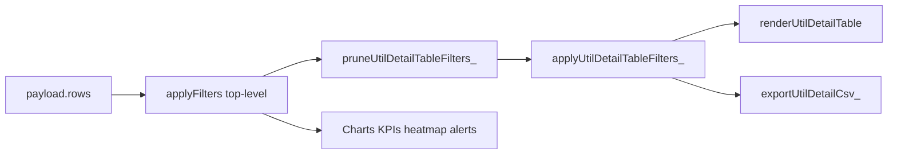

# Implementation plan: Feature 026 - Utilization detail table filters and CSV export

> **PRD version 2.17.0** - planned work shipped in **v2.17.0**.

Parent spec: [`026-utilization-detail-table-filters-export.md`](026-utilization-detail-table-filters-export.md)  
Parent feature: [`005-utilization-management-dashboard.md`](005-utilization-management-dashboard.md)

## Summary

Add a **table-scoped filter toolbar** and **Copy CSV** to the Utilization **Detail entries** section in `src/DashboardShell.html`. Table filters are a **subset** of the top-level global filter: they only narrow rows already allowed by `applyFilters()`. CSV exports **visible table columns only**. All logic is client-side; no cache schema bump.

## Architecture



- **Top-level filters** → KPIs, charts, alerts, heatmap, and the row pool for table menus.
- **Table filters** → detail table + CSV only, always `globalRows ∩ detailFilters`.

## Reviewer decisions (locked)

| Topic | Decision |
| --- | --- |
| **Company** | Fibery `Agreement Management/Clockify User Company` (`enum/name`) → row field `clockifyUserCompany` |
| **CSV columns** | Match visible table headers only: Date, Person, Customer, Project, Role, Hours, Cost, Bill rate |
| **Filter relationship** | Table filters are a subset of top-level filters; prune invalid table picks on global change; global Clear clears table filters |

## Files to touch

| File | Change |
| --- | --- |
| `src/DashboardShell.html` | HTML toolbar; `utilState.detailFilters`; prune + apply helpers; menus; CSV; wire events; global Clear clears table filters |
| `src/userActivityLog.js` | Allow `util_detail_table_filter`, `util_detail_export_csv` |
| `docs/features/004-user-activity-logging.md` | Document new event types (on ship) |
| `docs/features/005-utilization-management-dashboard.md` | Status row when shipped |
| `docs/FOS-Dashboard-PRD.md` | **FR-121**, **AC-80** on ship |

**No changes:** `fiberyUtilizationDashboard.js` (field already mapped), snapshot job, `cacheSchemaVersion`.

## Step-by-step implementation

### 1. HTML (Detail entries header)

In `#panel-operations`, inside the Detail entries `fos-section-card`:

- Add `div.fos-util-detail-toolbar` with three `.fos-util-multi` blocks:
  - `#util-detail-company-trigger` / `#util-detail-company-menu`
  - `#util-detail-person-trigger` / `#util-detail-person-menu`
  - `#util-detail-role-trigger` / `#util-detail-role-menu`
- Buttons: `#util-detail-clear-filters`, `#util-detail-export-csv-btn`
- Status: `#util-detail-csv-status`

Register elements on `els` near existing `utilDetail*` refs.

### 2. State and persistence

```javascript
utilState.detailFilters = { companies: {}, persons: {}, roles: {} };

var UTIL_DETAIL_FILTERS_STORAGE_KEY = 'fos_utilization_detail_filters_v1';
var UTIL_DETAIL_FILTERS_SCHEMA = 1;
```

- `readUtilDetailFilters_()` / `persistUtilDetailFilters_()` mirror `persistUtilFilters_()`.
- On `showOperations()`, load stored table filters, then prune after payload apply.
- Reset `utilState.detail.page = 0` on any table filter change.

### 3. `companyKeyForRow_` and filter helpers

```javascript
function companyKeyForRow_(r) {
  return String(r.clockifyUserCompany || '').trim() || '(No company)';
}
```

**`pruneUtilDetailTableFilters_(globalRows)`**

- Build sets of valid company / person / role keys from `globalRows`.
- Delete any selected table filter key not in the corresponding set.
- Persist after prune.

**`applyUtilDetailTableFilters_(globalRows)`**

- AND across dimensions; OR within each multi-select.
- Empty dimension = no extra constraint.

### 4. Populate dropdown menus

`populateUtilDetailFilterMenus_(globalRows)`:

- Distinct values **only** from `globalRows` (subset guarantee).
- `populateMultiMenu` + trigger labels ("All companies", etc.).
- Person: alpha sort (FR-87). Company + Role: alpha.

Call from `renderUtilDashboard()` after `globalRows = applyFilters(p.rows)` and `pruneUtilDetailTableFilters_(globalRows)`.

### 5. Render pipeline

```javascript
var globalRows = applyFilters(p.rows || []);
pruneUtilDetailTableFilters_(globalRows);
var detailRows = applyUtilDetailTableFilters_(globalRows);
renderUtilDetailTable(detailRows);
// charts/KPIs/heatmap use globalRows
```

`#util-detail-count` = `detailRows.length`. Optional hint when table filters active.

### 6. Global Clear integration

In existing global **Clear filters** handler:

```javascript
utilState.detailFilters = { companies: {}, persons: {}, roles: {} };
persistUtilDetailFilters_();
```

### 7. CSV export

`exportUtilDetailCsv_(detailRows)`:

- Header: `Date,Person,Customer,Project,Role,Hours,Cost,Bill rate`
- One row per `detailRows` entry; formatting mirrors `renderUtilDetailTable` cell render.
- `writeTextToClipboard_(text)` + `#util-detail-csv-status` flash (~3s).
- `logActivity_('util_detail_export_csv', 'operations', 'rows=' + detailRows.length)`.
- Disable when `detailRows.length === 0`.

### 8. Event wiring

- Table menu change → update `detailFilters` → `renderUtilDashboard()` (or table-only re-render if safe).
- **Clear table filters** → empty `detailFilters` only.
- Log `util_detail_table_filter` on table filter change.

### 9. Activity logging

Add to `userActivityLog.js`:

- `util_detail_table_filter`
- `util_detail_export_csv`

## Testing matrix

| Case | Expected |
| --- | --- |
| No table filters | Table = global subset (today’s behavior) |
| Table Company filter | Table narrows; charts = global only |
| Global Customer change | Table filter menus shrink; invalid picks pruned |
| Global Clear | Global + table filters cleared |
| Clear table filters only | Global unchanged |
| 250 rows, page 2 | CSV = 250 rows, 8 columns |
| CSV headers | Match visible table columns exactly |
| Snapshot mode | Works on snapshot payload |

## Estimated effort

| Area | Hours |
| --- | --- |
| HTML + state + prune/apply | 2 |
| Menus + wiring + global Clear hook | 2 |
| CSV (visible columns) | 1 |
| Persistence + activity | 1 |
| Docs + PRD on ship | 1 |
| **Total** | **~7** |

## PRD draft (for ship commit)

**FR-121 [Planned]:** Utilization Detail entries MUST expose table-local multi-select filters for **Company** (Fibery `Agreement Management/Clockify User Company` / `clockifyUserCompany`), **Person**, and **Role** that narrow only the detail table and CSV export within the active top-level filter set. Table filter options and selections MUST remain a subset of globally filtered rows; global **Clear filters** MUST clear table filters. **Copy CSV** MUST export all matching rows with columns Date · Person · Customer · Project · Role · Hours · Cost · Bill rate (visible columns only). Events `util_detail_table_filter` and `util_detail_export_csv` with `Route = operations`.

**AC-80 [Planned]:** Detail entries toolbar; subset filter contract with prune on global change; CSV matches eight visible columns; persistence in `fos_utilization_detail_filters_v1`; snapshot-compatible.
