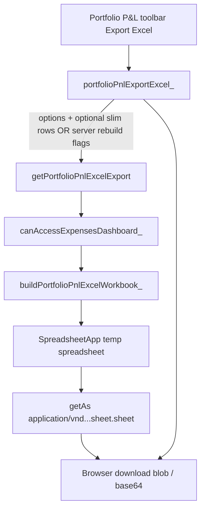

# Implementation plan: Feature 031 - Portfolio P&L Excel export

> **PRD version 2.22.0** - Released with feature **031**.  
> **Feature spec:** [031-portfolio-pnl-excel-export.md](031-portfolio-pnl-excel-export.md)  
> **Parent:** [022-portfolio-project-pnl.md](022-portfolio-project-pnl.md), [025-portfolio-pnl-performance-and-load-source-ux.md](025-portfolio-pnl-performance-and-load-source-ux.md)  
> **Status:** Implemented (**v2.22.0**)

## Summary

Add an **Export Excel** action on `#panel-portfolio-pnl` that produces a **`.xlsx`** workbook whose **row outline groups** mirror the Web App hierarchy (Customer → Project → Revenue/Costs → leaf metrics). Prefer **server-side generation with SpreadsheetApp** (native Excel outline / `.xlsx` export) over a client-side XLSX library (HtmlService size, license, and Apps Script constraint fit).

## Goals / non-goals

| In scope | Out of scope (v1) |
| --- | --- |
| `.xlsx` download from Portfolio toolbar | Live linked formulas to Fibery |
| Excel row groups for Customer / Project / Revenue / Costs | Multiple years in one book |
| Match current type + quarter + projected toggles | Perfect Google Sheets outline parity (secondary) |
| Red font for costs (parentheses) and negative margins | Permanent Drive archive of every export |
| Partial-load notes | CSV export (separate small follow-on if needed) |

## Recommended architecture



### Why server SpreadsheetApp (recommended)

| Option | Pros | Cons |
| --- | --- | --- |
| **A. SpreadsheetApp + export blob** | Built-in **row grouping** (`groupRows` / outline levels); true `.xlsx`; no new npm dependency in HtmlService | Subject to Apps Script time/memory; temp sheet cleanup |
| **B. Client SheetJS / ExcelJS** | Offloads CPU from Apps Script | Large CDN / bundle in `DashboardShell.html`; outline APIs harder; license review |
| **C. Write permanent Drive file** | Easy re-open | Clutter / sharing policy; overkill for one-shot download |

**Recommendation:** Option **A**.

### Data path (freshness)

**Preferred (aligned with proposed Decision):**

1. Client already holds `portfolioPnlState.pnlById` + projects + toggles after panel load.
2. Client calls RPC with **export options** + **compact metric tree** built by a shared client helper `portfolioPnlBuildExportTree_()` (same math as `renderPortfolioPnlGrid_`), **or**
3. Server rebuilds from **Drive daily `portfolio-pnl-cache`** / snapshot bundle when the client sends only filter flags and `useServerBundle: true` (smaller request payload).

Avoid a full re-Fibery of every project solely because the user clicked Export.

**Payload size note:** Sending every month × every leaf for ~24–80 projects may approach `google.script.run` argument limits. If that happens, prefer **server rebuild from Drive cache / slim bundle** (Feature **025**) keyed by calendar year + filters.

## Excel structure

### Sheet 1: `Portfolio P&amp;L`

| Column A | B… | Notes |
| --- | --- | --- |
| Label (hierarchy indent via outline, not only spaces) | Period columns (Jan… / Q / FY or Q-only) | Match on-screen column set |

**Row outline levels (proposed):**

| Level | Rows |
| --- | --- |
| 1 | Portfolio Revenue (portfolio total) |
| 2 | Customer subtotal |
| 3 | Project subtotal |
| 4 | Revenue, Costs, Margin $, Margin % |
| 5 | Subscription, Services / Employee, Contractor, ODC |

**Grouping API sketch:**

```javascript
// After writing contiguous child rows under a parent:
sheet.getRange(childStart, 1, childEnd, lastCol); // optional
sheet.getSheetValues(...);
// SpreadsheetApp: sheet.groupRows(childStart, childEnd);
// Set summary row above/below per Excel convention (summary above for finance trees).
```

Lock **summary row above** detail (matches reading portfolio totals then drilling down).

**Default collapse:** After grouping, set outline so depth &gt; customer summary is collapsed (`setRowGroupControlPosition` / collapse depth APIs as available in Apps Script at implementation time; verify in Editor against Excel desktop).

### Sheet 2 (optional but recommended): `Export notes`

- Calendar year, generated at, data source (Live / Drive cache / Snapshot date)
- Filter flags (Subscription / Services / Group by quarter / Include projected)
- Project count included vs failed
- Failed project names + short messages
- Legend: parentheses = costs; red = negative margin / cost presentation

### Formatting

| Rule | Implementation |
| --- | --- |
| Currency / percent | Number formats where possible; costs may need text or custom format `($#,##0)` to match parentheses |
| Negative margins | Font color red (`#B91C1C` or theme danger) |
| Cost rows | Red font + parentheses presentation |
| Projected month headers | Fill muted orange (when Include projected is on and months shown) |
| Quarter / FY columns | Distinct header fill (match Web App spirit) |
| Freeze | Freeze column A + header row 1 |
| Column widths | Auto / sensible defaults for label + periods |

**Numeric identity:** Prefer writing **numbers** for Margin $ and revenue so Excel can sum; use display formats. Cost rows that must show parentheses may be formatted values or custom formats - verify Excel still outlines correctly (outline is row-based, not format-based).

## Phases

### Phase 0 - Spec lock (no code)

1. Customer / product confirms Decisions table in feature **031** (especially full tree vs visible-only; data freshness; SpreadsheetApp).
2. Create Teamwork notebook + Finance release task `Feature 031 - Portfolio P&L Excel export`.
3. Sync approved notebook → git.

### Phase 1 - Server builder spike (tiny throwaway)

1. In Apps Script editor, write **10-row** nested tree, `groupRows`, export blob, open in Excel → confirm outline `+`/`−` works.
2. Confirm download from Web App (`google.script.run` returning base64 ≤ practical size; if oversize, switch to temporary Drive file + `getDownloadUrl` with short TTL cleanup).

**Exit:** Proven outline + download path.

### Phase 2 - Shared export tree

1. Extract **pure** aggregation used by `renderPortfolioPnlGrid_` into helpers that emit:

```javascript
{
  columns: [{ id, label, kind }],
  rows: [{
    id, label, kind, outlineLevel,
    values: { JAN: number|null, ... },
    children: [ /* same */ ]
  }],
  meta: { ... }
}
```

2. Prefer keeping one source of truth in **client** first (already has metrics), then either:
   - **2a.** Client sends tree to server for formatting only, or
   - **2b.** Duplicate aggregation in Apps Script from `pnlById`-like map for rebuild path.

**Recommendation:** Start with **2a** for fidelity to on-screen numbers; add **2b** if payload size fails Phase 1 scale test (~50 projects).

### Phase 3 - Production RPC + UI

| File | Change |
| --- | --- |
| `src/portfolioPnlExcelExport.js` (new) | `buildPortfolioPnlExcelWorkbook_(tree)`, blob/base64 helpers, temp SS create/trash |
| `src/portfolioPnlDashboard.js` or thin wrapper | `getPortfolioPnlExcelExport(request)` + auth |
| `src/DashboardShell.html` | Export Excel button; `portfolioPnlExportExcel_`; busy state; mobile wrap |
| `src/userActivityLog.js` | Whitelist `portfolio_pnl_export_excel` |
| `docs/features/004-user-activity-logging.md` | Document event (on ship) |
| `docs/FOS-Dashboard-PRD.md` | New **FR** / **AC** (e.g. FR-125 / AC-84) at ship |
| `docs/features/022-*.md` | Cross-link export capability when shipped |
| `docs/features/000-overview.md` | Shipped line at ship |

**No:** portfolio `cacheSchemaVersion` bump unless export forces a payload shape change (it should not).

### Phase 4 - Hardening

1. Cap / messaging when tree too large.
2. Temp spreadsheet always deleted in `finally`.
3. Snapshot / Drive cache only: ensure export works without live Fibery.
4. Partial failures sheet.
5. Mobile verification at ~390px.

## Apps Script constraints (callouts)

| Constraint | Mitigation |
| --- | --- |
| ~6 min execution | Prefer client-built tree + format-only server pass; or Drive-cache rebuild (no Fibery loops) |
| Response size | Base64 of `.xlsx` for 24 projects should be fine; monitor; fallback Drive short-lived file |
| Concurrent exports | Unique temp spreadsheet name; trash after |
| `groupRows` quirks | Spike in Phase 1; document summary-above vs summary-below |

## Activity logging

```text
Event: portfolio_pnl_export_excel
Route: portfolio-pnl
Note:  ok=true|false · year=2026 · projects=24 · projected=0|1 · quarters=0|1 · bytes≈N
```

Do **not** log dollar amounts or project P&amp;L lines.

## Test plan (manual)

1. Export full hierarchy; Excel desktop outline collapse/expand Customers and Projects.
2. Match three FY totals from UI KPI strip vs Portfolio row vs Export notes.
3. Group-by-quarter on/off parity.
4. Type filter Subscription-only parity.
5. Projected on: orange headers / included months; projected off: excluded.
6. Costs red + parentheses; negative margin red.
7. Partial load note sheet.
8. Mobile export control reachable.
9. Forbidden role: RPC returns FORBIDDEN.

## Effort estimate (for Teamwork Estimated Dev Hours)

| Block | Rough hours |
| --- | --- |
| Phase 0 intake / notebook | 0.5–1 |
| Phase 1 spike | 1–2 |
| Phase 2 tree helper + fidelity | 3–5 |
| Phase 3 RPC + formatting + UI + docs/PRD | 4–6 |
| Phase 4 hardening + ship ritual | 1–2 |
| **Total** | **~10–16** lead-dev hours |

Refine with `teamwork_estimate.py` at ship.

## Open questions for reviewers

1. **Full tree always** (recommended) vs export only currently expanded UI rows?
2. Confirm **SpreadsheetApp** vs client library preference.
3. If client→server tree is too large, is **Drive-cache rebuild** acceptable even when the user has slightly older browser-cache KPIs on screen?
4. Is a second **CSV** control desired in the same release or deferred?
5. Primary acceptance target: **Excel desktop** only, or must Google Sheets outline work day one?

## Ship checklist (when approved and coded)

- [ ] PRD bump + **FR/AC** + `FOS_PRD_VERSION` + `src/*` headers
- [ ] Feature **031** Status → Released; changelog with version
- [ ] Teamwork: rename task to `vX.Y.Z - Portfolio P&L Excel export`; `teamwork_ship_task.py`; sync notebook
- [ ] `clasp push` + smoke Export on deployed Web App
