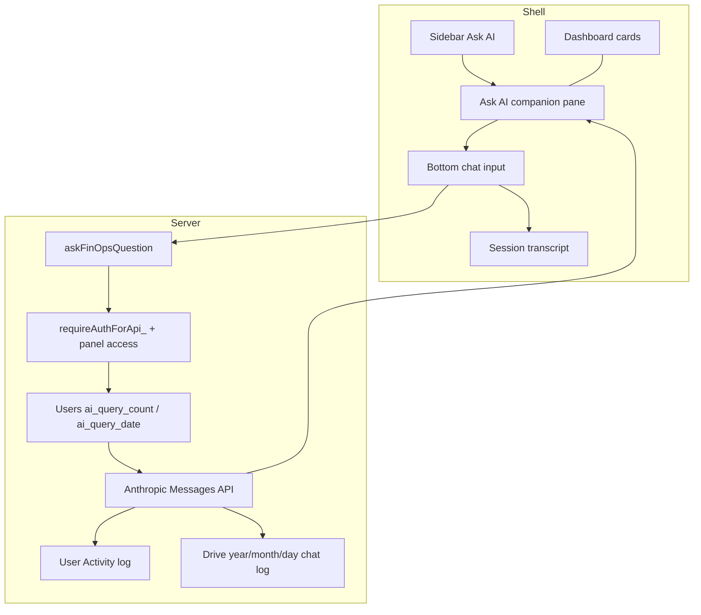

# Implementation plan: Feature 032 - FinOps Ask (panel-scoped AI Q&A)

> **Feature spec:** [032-finops-ai-ask-panel.md](032-finops-ai-ask-panel.md)  
> **Release task:** [Feature 032 - FinOps Ask (panel-scoped AI Q&A)](https://win.godeap.io/app/tasks/40429663)  
> **Teamwork notebook:** [Feature 032](https://win.godeap.io/app/projects/1615262/notebooks/312389)  
> **Status:** In development (Phases A–C in code; Phase D ops + verify + ship remaining)  
> **PRD version (at ship):** **2.27.0**  
> **Expected ship type:** MINOR  
> **Depends on:** Shell + nav (**001**); mobile shell (**029**); Anthropic property patterns (**017**); Live vs snapshot (**009** / **010**); Users sheet auth (**002** / **033** Profile column patterns); access gates in `Code.js` / dashboard modules

## Summary

| Item | Choice |
| --- | --- |
| **Product** | Read-only, panel-scoped natural-language Q&A grounded in the **currently loaded** dashboard view |
| **Approach** | **Approach 1** only (no cross-panel tool-calling) |
| **LLM** | Anthropic **Messages API** server-side via `UrlFetchApp` |
| **API key** | **Separate** Script Property `FINOPS_ASK_ANTHROPIC_API_KEY` (not Admin usage key) |
| **Context strategy** | **Client-built compact summary** of in-memory panel payload + filters + data source; server validates access, size, and sanitizes before LLM |
| **UI entry** | Sidebar link **Ask AI** (AI icon) **above** the **Dashboards** heading |
| **UI layout** | Companion pane in the **main window**, to the **right of existing dashboard cards**; chat input at bottom; **rich text** answers in the pane |
| **Transcript (UI)** | Persists when switching dashboard panels; **cleared on full page reload** |
| **Daily quota** | **20** questions / user / calendar day; count on Users tab column **`ai_query_count`** |
| **Activity** | Log each question (and outcome) to **User Activity** |
| **Chat archive** | **Drive** filesystem only (not FOS Dashboard Data spreadsheet): `year/month/day` files |
| **Write-back** | None to Fibery |
| **Cache schema** | No `cacheSchemaVersion` bumps |

## Locked product decisions (review 2026-07-17)

| # | Topic | Decision |
| --- | --- | --- |
| A | Daily cap + storage | Cap **20**/user/day. Persist count on auth **Users** tab column **`ai_query_count`**. |
| B | Activity log | **Yes** - log questions to User Activity (include question text + panel + data source + outcome). |
| C | Separate Messages API key | **Yes** - `FINOPS_ASK_ANTHROPIC_API_KEY`. |
| D | Defer Home / Resource assignments / per-project P&L | **No** - include in v1 (Settings still excluded: no dashboard payload). |
| E | Placement + chrome + archives | Sidebar **Ask AI** above Dashboards; main-window pane **right of cards**; bottom chat; rich text; Drive daily chat logs under year/month/day. |
| F | Transcript across panels | **Persist** across panel changes; page reload clears UI transcript. |
| G | Spec Approved before coding | **Yes**. |
| H | Ship while Spec Draft | **No**. |

### Engineering detail for decision A (daily reset)

Users tab column header default **`ai_query_count`** (`AUTH_COL_AI_QUERY_COUNT`).

A bare integer cannot know which calendar day it belongs to. Implement as:

| Column | Default header | Value |
| --- | --- | --- |
| Count | `ai_query_count` | Integer for the date in `ai_query_date` |
| Date | `ai_query_date` | `YYYY-MM-DD` in script / `NOTIFICATIONS_DEFAULT_TIMEZONE` (or Ask-specific TZ property) |

On each Ask: under script lock, if `ai_query_date` ≠ today → set count `0` and date today; if count ≥ 20 → reject; else increment and proceed.

If product insists on **one** spreadsheet column only, encode `YYYY-MM-DD|N` in `ai_query_count` instead (document in ops). Prefer two columns for spreadsheet readability.

### Engineering detail for decision E (Drive chat logs)

Not in the FOS Dashboard Data spreadsheet.

```text
{FINOPS_ASK_DRIVE_FOLDER_ID or under snapshot root}/finops-ask-chats/
  YYYY/
    MM/
      YYYY-MM-DD.jsonl   (or .json array append)
```

Each line/record: timestamp, user email, panelId, dataSource, question, answer (or error), usageMeta optional.

Append on every successful or failed Ask after the LLM attempt (still log failures). Use DriveApp + script lock / retry; do not block UI on log failure beyond `console.warn`.

## Goals / non-goals

| In scope (v1) | Out of scope (v1) |
| --- | --- |
| Ask companion pane + sidebar Ask AI | Approach 2 tool-calling / cross-panel tools |
| Grounding in **current** panel’s loaded data | Voice input |
| Home, Resource assignments, Delivery per-project P&L when data loaded | Persisting UI transcript across browser reloads |
| Rich-text answers in pane | Storing chat archives in the auth/data spreadsheet |
| Users-tab daily quota (20) | Replacing ADMIN Settings |
| User Activity question logging | Metrics catalog (Approach 3) |
| Drive year/month/day chat archives | Snapshot pre-generated briefs |
| ADMIN enable/disable, model, Messages key, cap override | Ask on Settings (no metrics payload) |

### v1 supported panels

| Route id | Label | Notes |
| --- | --- | --- |
| `home` | Home | Summarize home glance / quick-access signals when present; honest empty if none |
| `agreement-dashboard` | Agreements | `getAgreementDashboardData` / client agreement payload |
| `operations` | Utilization | `utilState` + filters |
| `labor-hours` | Labor hours | Same util/labor payload family |
| `resource-assignments` | Resource assignments | When payload loaded |
| `delivery` | Projects & P&L | List + **loaded** per-project P&L cards in client state |
| `revenue-review` | Revenue review | Agreement-family payload |
| `portfolio-pnl` | Portfolio P&L | Bundle + type/year filters |
| `expenses` | Expenses | |
| `pipeline` | Pipeline | |
| `ai-usage` | AI Usage | |

**Excluded:** `settings`, `profile` (no Ask grounding payload).

## Recommended architecture



### Module split (proposed)

| Module | Responsibility |
| --- | --- |
| `src/finopsAsk.js` | `askFinOpsQuestion`; access; quota; activity; orchestrate Drive log; `_diag_*` |
| `src/finopsAskAnthropic.js` | Messages API client (`FINOPS_ASK_ANTHROPIC_API_KEY`) |
| `src/finopsAskSummarizers.js` | Sanitize / size-cap `contextSummary` by panel |
| `src/finopsAskQuota.js` | Users-tab `ai_query_count` / `ai_query_date` read-increment under lock |
| `src/finopsAskChatLog.js` | Drive folder ensure + append daily file under `YYYY/MM/` |
| `src/DashboardShell.html` | Sidebar Ask AI; split main area (cards + pane); rich-text render; session transcript; context builders |
| `src/authUsersSheet.js` | Header resolution for new Users columns (same pattern as Profile) |
| `src/adminSettingsRegistry.js` | `FINOPS_ASK_*` props + optional Drive folder id |
| `src/userActivityLog.js` | Whitelist `finops_ask_*` including question text in detail |
| `src/Code.js` | Optional nav affordance flag; Ask is not a dashboard route that replaces cards |

### Context request shape

```text
{
  panelId,                    // active dashboard route grounding the answer
  question,
  dataSource: { mode, snapshotDate? },
  filters: { ... },
  fetchedAt,
  contextSummary: { kpis, rowsTopN, alerts?, projectPnL?, notes? },
  conversationTurns?: [...]   // session transcript tail for follow-ups
}
```

Server steps: auth → panel access → Ask enabled/key → quota increment → sanitize → Messages API → activity log (question + meta) → Drive append → response.

## Locked engineering defaults

| # | Topic | Default |
| --- | --- | --- |
| 1 | Messages API key | `FINOPS_ASK_ANTHROPIC_API_KEY` |
| 2 | Enable flag | `FINOPS_ASK_ENABLED` default **false** |
| 3 | Model | `FINOPS_ASK_MODEL` default current Sonnet id (Settings-adjustable) |
| 4 | Daily cap | `FINOPS_ASK_DAILY_CAP` default **20** (must match product) |
| 5 | Question max length | **500** characters |
| 6 | Conversation turns sent to model | Last **N** turns from session transcript (cap ~8 messages) |
| 7 | Quota store | Users **`ai_query_count`** + **`ai_query_date`** |
| 8 | Activity | Log **question text**, panelId, dataSource, ok/error |
| 9 | Answer format | **Rich text** in pane (safe HTML from constrained markdown; sanitize) |
| 10 | Context size budget | **≤ 80KB** sanitized JSON |
| 11 | Chat log root | `FINOPS_ASK_DRIVE_FOLDER_ID` or subfolder under snapshot Drive root |
| 12 | Chat log path | `finops-ask-chats/YYYY/MM/YYYY-MM-DD.jsonl` |
| 13 | UI transcript | In-memory only; survives panel nav; dies on reload |

## Phased delivery

### Phase A - Shell split pane + Settings + quota columns + stub RPC

| Task | Detail |
| --- | --- |
| A.1 | Registry **FinOps Ask**: enabled, model, daily cap, Messages key, Drive folder id |
| A.2 | Users columns `ai_query_count` / `ai_query_date` + `finopsAskQuota.js` |
| A.3 | Sidebar **Ask AI** (AI icon) **above** Dashboards heading; toggles companion pane |
| A.4 | Main layout: dashboard cards left, Ask pane right (desktop); stacked / full-width toggle on mobile |
| A.5 | Pane: context strip, scrollable rich transcript, bottom chat input (≥ 44px) |
| A.6 | Session transcript state; persist across `setActiveNav`; clear on reload |
| A.7 | Stub `askFinOpsQuestion` (auth, gate, disabled/not-configured, quota check) |
| A.8 | Activity whitelist |

**Exit:** Ask AI pane opens beside cards; stub submit hits server; quota/disabled paths clear. No Anthropic calls.

### Phase B - Messages + Utilization E2E + Drive log + Activity

| Task | Detail |
| --- | --- |
| B.1 | `finopsAskAnthropic.js` |
| B.2 | Prompts: answer only from context; cite panel + source + filters |
| B.3 | Utilization context builder |
| B.4 | Quota increment on accepted Ask |
| B.5 | User Activity with question text |
| B.6 | Drive `YYYY/MM/YYYY-MM-DD.jsonl` append |
| B.7 | Rich-text render in pane |
| B.8 | `_diag_finopsAskSample('operations')` |

**Exit:** Real Utilization answers; activity + Drive log + quota columns update.

### Phase C - All remaining supported panels

| Task | Detail |
| --- | --- |
| C.1 | Agreements, Labor, Revenue review |
| C.2 | Delivery list + loaded per-project P&L slices |
| C.3 | Portfolio, Expenses, Pipeline, AI Usage |
| C.4 | Home + Resource assignments |
| C.5 | Context strip updates on panel change; transcript **kept** |
| C.6 | Truncation / narrow-filters warnings |

**Exit:** All supported panels ground Ask when data is loaded.

### Phase D - Hardening + ship

| Task | Detail |
| --- | --- |
| D.1 | Verification matrix (desktop + ~390px) |
| D.2 | Sync feature notebook Change requests / UI notes to match this plan |
| D.3 | PRD FR/AC + MINOR bump + overview |
| D.4 | Teamwork Spec Approved → implement → ship ritual |

## Access gating

| Panel family | Gate |
| --- | --- |
| Ops / Delivery / Home (non-finance) | Same as today (`requireAuthForApi_` + fibery where required) |
| Finance group | `canAccessExpensesDashboard_` |
| Pipeline / Resource assignments | Existing CE / pipeline helpers |
| Ask pane | Available to authorized users; each submit re-checks access for **active** `panelId` |

## UI notes (engineering)

### Desktop

- In `.fos-sidebar-nav`, **before** the “Dashboards” label, render **Ask AI** (e.g. `bi-stars` / `bi-robot`) using `.fos-nav-btn` chrome.
- Clicking Ask AI opens/focuses the companion pane; does **not** unload the current dashboard.
- Main content: CSS grid/flex - existing `#panel-*` cards share space with `#fos-ask-pane` on the right (~360–420px, resizable later optional).
- Pane chrome: title Ask AI, context strip (active panel + Live/snapshot + filters), transcript (rich text), bottom composer.

### Mobile (`< 768px`)

- Ask AI remains in sidebar / More (and optional top affordance if needed for discoverability).
- Companion pane becomes full-width overlay or bottom ~70vh sheet so cards are not unusably squeezed; ≥ 44px targets.
- Transcript still session-persistent across bottom-nav panel changes.

### Rich text

- Prefer model markdown → sanitized HTML (allow: `p`, `ul`, `ol`, `li`, `strong`, `em`, `code`, `pre`, `br`, `a` with safe hrefs).
- No raw script; strip unknown tags.

## Testing / verification matrix

| Case | Expect |
| --- | --- |
| Ask AI sidebar | Appears above Dashboards; opens right pane |
| Cards + pane | Dashboard remains visible left; Ask right |
| Panel switch | Context strip updates; transcript preserved |
| Reload | Transcript empty; Drive/Activity history still exist |
| Quota 20 | 21st Ask blocked; Users `ai_query_count` = 20 for today |
| New calendar day | Count resets via `ai_query_date` |
| Activity | Question text present on User Activity row |
| Drive log | File under `finops-ask-chats/YYYY/MM/YYYY-MM-DD.jsonl` |
| Resource assignments / Home / project P&L | Ask works when those payloads are loaded |
| Snapshot | Answer cites snapshot date |
| Mobile | Usable Ask UI; no horizontal-only chat |

## Notebook / spec sync required before coding

Original notebook assumes top-bar Ask + drawer/bottom sheet. This review **replaces** that UX with sidebar Ask AI + companion pane + Drive archives + Users quota column.

Before Phase A:

1. Move Feature 032 to **Spec Approved** (or update Spec Draft notebook first, then approve).
2. Sync notebook ↔ `docs/features/032-finops-ai-ask-panel.md` (UI Notes, AC, Data model, Operations).
3. Keep this implementation plan as engineering source for phases.

## Implementation checklist

- [x] Lock open questions A–H (2026-07-17)
- [x] Update Teamwork notebook UI / AC to match locked decisions
- [x] Spec Approved in Teamwork
- [x] Sync notebook → git feature doc
- [x] Phase A (shell, Settings registry, quota, stub gates)
- [x] Phase B (Messages API, Activity, Drive log, Utilization path)
- [x] Phase C (remaining supported panels + Home / RA / project P&L slices)
- [x] PRD FR-132 / AC-94 + headers → **2.27.0**
- [ ] Ops: Users columns + Settings props + `clasp push`
- [ ] Mobile AC verified (~390px)
- [ ] Teamwork ship ritual

## Risk notes

| Risk | Mitigation |
| --- | --- |
| Split pane squeezes dense tables | Cap pane width; mobile full-sheet mode |
| Users column missing | Auto-detect header; clear error if column absent (ops add column) |
| Drive append races | Script lock; one file per day; retry |
| Question text in Activity (PII/sensitivity) | Authorized admins only already see Activity; document in ops |
| Larger panel set (Home / RA / project P&L) | Phase C last; honest “load data first” when empty |
| Admin vs Messages key | Distinct property + tooltip |

## Change requests

| Date | Request | Resolution |
| --- | --- | --- |
| 2026-07-17 | Cap 20/day on Users `ai_query_count` | **Accepted** - plus `ai_query_date` for daily reset |
| 2026-07-17 | Log questions to User Activity | **Accepted** |
| 2026-07-17 | Separate Messages API key | **Accepted** |
| 2026-07-17 | Do not defer Home / RA / per-project P&L | **Accepted** - Settings still excluded |
| 2026-07-17 | Sidebar Ask AI + right companion pane; rich text; Drive year/month/day chat logs | **Accepted** - replaces top-bar drawer UX |
| 2026-07-17 | Transcript persists across panels; reload clears | **Accepted** |
| 2026-07-17 | Spec Approved before code; no ship from Draft | **Accepted** |
