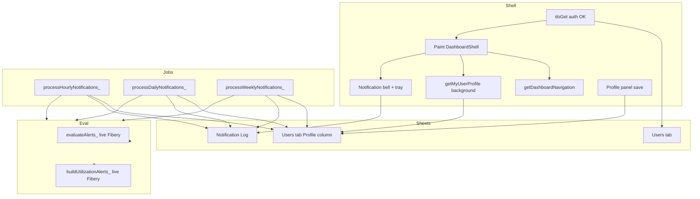

# Implementation plan: Feature 033 - User profile and alert email notifications

> **Feature spec:** [033-user-profile-alert-email-notifications.md](033-user-profile-alert-email-notifications.md)  
> **Inbox:** [Feature Request - Notifications…](https://godeap.teamwork.com/app/tasks/40228889) (`40228889`)  
> **Release task:** [Feature 033…](https://godeap.teamwork.com/app/tasks/40497529)  
> **Teamwork notebooks:** [Feature](https://win.godeap.io/app/projects/1615262/notebooks/312624) · [Plan](https://win.godeap.io/app/projects/1615262/notebooks/312625)  
> **Status:** In-progress in Teamwork (Profile JSON on Users tab **Profile** column)  
> **PRD version:** 2.25.3  
> **Expected ship type:** MINOR (new Profile surface + scheduled notification jobs + in-app tray)  
> **Depends on:** Auth Users sheet (**002**); Agreement alerts (**003**); Utilization alerts (**005**); Mobile shell (**029**); Admin Settings remains separate (**011**)

## Summary

| Item | Choice |
| --- | --- |
| **Customer primary** | **Daily** summarized HTML digest of subscribed existing alerts + deep links |
| **Frequencies** | **Hourly**, **Daily**, **Weekly** only (**no Immediate**) |
| **Weekly** | **Tuesday mornings** |
| **Sidebar** | Move signed-in identity into footer above Settings; add Profile link + icon |
| **Profile UI** | New `#panel-profile` (notifications only; no extra fields) |
| **Storage** | Auth spreadsheet **Users** tab: existing Email (+ Role/Team/…) plus **Profile** column (JSON) |
| **Load** | Lazy `getMyUserProfile` after shell paint |
| **Opt-in** | `emailEnabled` default **`false`** |
| **Catalog** | **Fine-grained**; **all** current Agreement + Utilization alerts |
| **Access** | Filter by dashboards the user can access |
| **Eval source** | **Always live Fibery** |
| **In-app inbox** | Notification Log + upper-right bell + slide-out tray + Clear |
| **Schema bumps** | Mandatory **migrate-all** rewrite of every non-empty Users-tab **Profile** cell |

## Goals / non-goals

| In scope | Out of scope (v1) |
| --- | --- |
| Profile panel + JSON preferences (notifications only) | SMS / Slack / push |
| Email opt-in per fine-grained catalog id + Hourly/Daily/Weekly | User-authored custom alert rules / new alert conditions |
| HTML digest summarizing multiple alerts + deep links | **Immediate** / N-minute polling |
| Hourly / Daily / Weekly jobs | Snapshot-date-driven notification evaluation |
| Notification Log + bell tray + dismiss | Editing another user’s profile |
| Lazy profile preload | Replacing ADMIN Script Property Settings |
| Schema migrator + all-rows rewrite on schema change | Extra profile demographic fields |

## Recommended architecture

### Module split (proposed)

| Module | Responsibility |
| --- | --- |
| `src/userProfileStore.js` | Open **Users** sheet; get/update **Profile** by email; parse/validate; **single-doc + all-rows migrators** (never invent Users rows) |
| `src/notificationCatalog.js` | Fine-grained `catalogId` list for **all** current alert rules; maps id-prefix → catalog |
| `src/notificationJobs.js` | Hourly / Daily / Weekly runners; HTML compose/send; install/remove triggers |
| `src/notificationLogStore.js` | Append sent rows; list for tray; mark dismissed |
| `src/DashboardShell.html` | Footer identity + Profile panel + lazy load + bell + slide-out tray |
| `src/Code.js` | Route `profile` in nav model for all authorized users |
| `src/adminSettingsRegistry.js` | New Script Properties entries |
| `src/userActivityLog.js` | Whitelist profile / tray / dismiss activity types |

## Profile JSON and sheet contract

Canonical schema is in the feature doc (**Profile JSON schema v1**). Implementation must:

1. Write JSON as a single cell string in the Users-tab **Profile** column (keep subscriptions array small vs 50k cell limit).
2. Update under **script lock**.
3. Normalize email with existing `normalizeEmail_` from auth; match the same Email column as authorization.
4. On read: invalid JSON → defaults + `console.warn`.
5. Default factory: `emailEnabled: false`, `subscriptions: []`, `preferences: {}`.
6. **Do not** append new Users rows from Profile save; if email is missing from Users, fail with a clear message.

### Schema migration rule (engineering)

Any change to Profile JSON schema **blocks ship** until:

1. `migrateUserProfileJson_(doc)` covers old → current.
2. `migrateAllUserProfiles_()` (diag + documented ops step) rewrites **every non-empty Users Profile cell**.
3. Feature / PRD changelog calls out the schema bump and migration.

Do not rely only on lazy migrate-on-read for production schema bumps.

## Lazy load sequence

1. `doGet` returns shell **without** embedding full profile JSON.
2. Client paints footer name from nav payload.
3. Client kicks `getMyUserProfile()` into `profileState`.
4. Client also lazy-loads `getMyNotifications()` for bell badge / tray (can trail profile fetch).
5. Opening Profile binds to `profileState` or waits on the same promise.
6. Save calls `saveMyUserProfile(patch)`; server merges, sets `updatedAt`, returns canonical JSON.

**Do not** block first paint on profiles sheet I/O.

## Sidebar / navigation / tray

| Before | After |
| --- | --- |
| User chip under brand at top of sidebar | User identity block in `.fos-sidebar-footer` above Settings |
| Settings only account-like control for ADMIN | Profile for all authorized users; Settings unchanged (ADMIN) |
| No notification inbox | Upper-right bell → slide-out tray; Clear dismisses Notification Log row |

Prefer explicit route id `profile` for activity logging. Tray may be a chrome overlay (not a nav route).

## Notification job design

### Evaluation strategy

Reuse existing server builders on **live Fibery** only:

- Agreements → agreement payload (or alert-focused slice) → `evaluateAlerts_`.
- Utilization → utilization payload for configured lookback → `buildUtilizationAlerts_`.

Map each emitted alert’s **id prefix** to a fine-grained `catalogId` via `notificationCatalog.js`.

**Performance:** Full Fibery fetches on Hourly may stress quotas. Mitigations: reuse payload builders used by dashboards; script lock; kill switch; continue tokens only if required later. Do **not** switch to snapshot evaluation.

### Frequencies and triggers

| Frequency | Trigger pattern | Bucket key for dedupe |
| --- | --- | --- |
| `hourly` | `everyHours(1)` | `alertId + yyyy-mm-dd-HH` (profile TZ) |
| `daily` | `atHour(H).everyDays(1)` | `alertId + yyyy-mm-dd` or digest hash per day |
| `weekly` | `onWeekDay(Tuesday).atHour(H)` | `alertId + yyyy-Www` or digest hash per week |

### Email

- Sender: script executing account (`MailApp.sendEmail` with HTML body).
- One summarized **HTML** email per user per job run that has matching alerts.
- Deep links to Web App deployment URL + panel hash/query for Agreements / Ops Attention.
- Exclude `all_clear`.
- On send: append Notification Log (feeds tray).

### Access gating

Jobs must call the same access helpers as `buildNavigationModel_`:

- Agreement catalog → only if recipient can open Agreements dashboard.
- Utilization catalog → only if recipient can open Ops / Utilization dashboard.

If a user somehow has a catalog toggle enabled but loses access, skip those alerts.

## Phased delivery

### Phase A - Profile storage + sidebar shell (no email yet)

| Task | Detail |
| --- | --- |
| A.1 | Users-tab **Profile** column contract + `userProfileStore.js` read/update + defaults + migrator stubs |
| A.2 | `getMyUserProfile` / `saveMyUserProfile` with `requireAuthForApi_` |
| A.3 | Move user chip to footer; Profile link; `#panel-profile` notifications UI (fine-grained catalog; Hourly/Daily/Weekly) |
| A.4 | Lazy fetch after paint; activity events |
| A.5 | Mobile footer + Profile layout |
| A.6 | Registry props for sheet names |

**Exit:** User can save notification preferences to the Users-tab **Profile** column and reload them. No mail.

### Phase B - Catalog + Daily digest + Notification Log + tray (customer MVP)

| Task | Detail |
| --- | --- |
| B.1 | `notificationCatalog.js` for **all** current alert rules |
| B.2 | Notification Log store + `getMyNotifications` / `dismissMyNotification` |
| B.3 | Header bell + slide-out tray + Clear (desktop + mobile) |
| B.4 | **`processDailyNotifications_`** + install/remove + `_diag_…` |
| B.5 | HTML email template (digest + deep links) |
| B.6 | Access gating + quota / kill-switch handling |

**Exit:** Opted-in user receives **one daily** HTML summarized email with deep links; tray shows the send; Clear dismisses; re-run respects dedupe.

### Phase C - Hourly + Weekly

| Task | Detail |
| --- | --- |
| C.1 | Hourly digest runner + trigger |
| C.2 | Weekly digest runner + **Tuesday morning** trigger |
| C.3 | Timezone / hour properties; ops runbook |
| C.4 | Verification checklist for all three frequencies |
| C.5 | Document `migrateAllUserProfiles_` ops path for future schema bumps |
| C.6 | **ADMIN Settings** **Run hourly now** (`runHourlyNotificationsForSettings`; v2.25.3) |

**Exit:** Hourly/Daily/Weekly installed; digests respect subscriptions + access; PRD FR/AC ready to ship.

## Testing / verification matrix

| Case | Expect |
| --- | --- |
| No profile cell | Defaults (`emailEnabled: false`); save writes Profile on existing Users row |
| Bad JSON in sheet | Soft defaults; warn |
| Non-admin Profile | Works |
| Non-admin Settings | Still hidden |
| Lazy race: open Profile early | Spinner then data |
| `emailEnabled: false` | No mail |
| Kill switch | No mail |
| ADMIN Run hourly now | Same Hourly pipeline; toast + Notification Log |
| Access denied dashboard | No alerts from that family |
| Daily twice same bucket | One email |
| Weekly trigger day | Tuesday |
| Tray Clear | Hidden from tray; row dismissed |
| Schema migrate-all | Every non-empty Users Profile cell rewritten |
| Mobile Profile + tray | Usable at ~390px |

## PRD / docs at ship

- New **FR** / **AC** for Profile placement, lazy load, profile sheet, notification jobs, tray, schema migration rule.
- Update **000-overview** shipped line; feature **001** UI notes for footer identity.
- Header / `FOS_PRD_VERSION` bump (MINOR).
- Teamwork Feature **033** rename at ship.

## Decisions log

| # | Question | Decision | Date |
| --- | --- | --- | --- |
| 1 | Frequencies | **Hourly / Daily / Weekly**; **no Immediate** | 2026-07-15 |
| 2 | Immediate interval | **N/A** (removed) | 2026-07-15 |
| 3 | v1 catalog scope | **All** current platform alerts (Agreement + Utilization) | 2026-07-15 |
| 4 | Granularity | **Fine-grained** per alert rule / id prefix | 2026-07-15 |
| 5 | Access gate | **Yes** - limit by dashboards the user can access | 2026-07-15 |
| 6 | Email format | **HTML** + deep links | 2026-07-15 |
| 7 | Notification Log + tray | **Required** in v1 (bell, slide-out, Clear) | 2026-07-15 |
| 8 | Weekly schedule | **Tuesday mornings** | 2026-07-15 |
| 9 | Default emailEnabled | **`false`** (opt-in) | 2026-07-15 |
| 10 | Extra profile fields | **None** in v1 | 2026-07-15 |
| 11 | Evaluate from live vs snapshot | **Always Fibery live** | 2026-07-15 |
| 12 | Schema change | **Migrate all saved Users Profile cells** when schema changes | 2026-07-15 |
| 13 | Storage location | **Users tab Profile column** (not a separate sheet) | 2026-07-15 |

## Remaining open (non-blocking for Spec Draft)

| # | Question | Notes |
| --- | --- | --- |
| A | Exact Daily hour | Default property `8` OK? |
| B | Tray dismissed retention / TTL | Forever vs purge |
| C | Deep-link hash vs query format | Align with existing shell routing |

## Implementation checklist

- [x] Decisions locked in feature + plan (done for Spec Draft)
- [x] Teamwork Feature 033 notebook + release task published (Spec Draft)
- [ ] Phase A
- [ ] Phase B (Daily + tray MVP)
- [ ] Phase C (Hourly / Weekly)
- [ ] Mobile AC verified
- [ ] Schema migration helper documented
- [ ] PRD bump + ship
