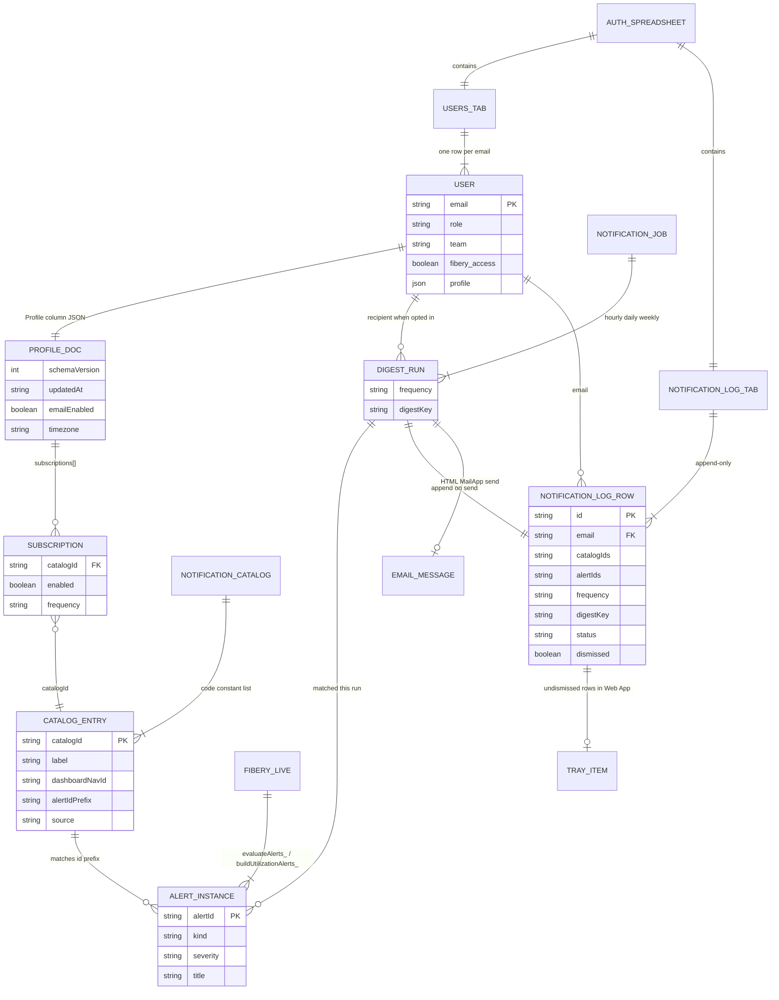
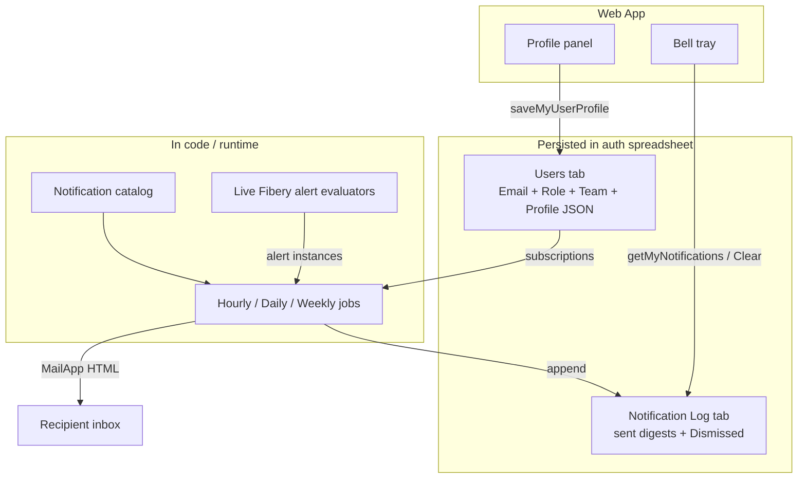
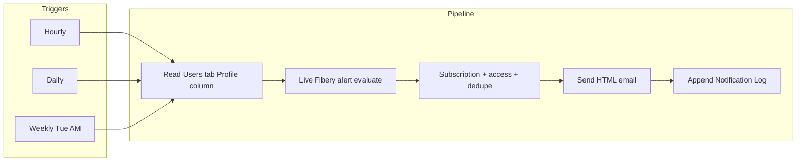

# Feature: User profile and alert email notifications

> **Status:** Shipped (**v2.25.0** feature; **v2.25.1** Users-tab Profile column; **v2.25.2** save toast; **v2.25.3** ADMIN Run hourly now).  
> **PRD version:** 2.25.3  
> **Release task (shipped):** [v2.25.3 - User profile and alert email notifications](https://win.godeap.io/app/tasks/40497529).  
> **Inbox / customer request:** [Feature Request - Notifications for users who subscribe to alerts](https://godeap.teamwork.com/app/tasks/40228889) (task id `40228889`, Inbox).  
> **Teamwork notebooks:** [Feature 033](https://win.godeap.io/app/projects/1615262/notebooks/312624) · [Implementation plan](https://win.godeap.io/app/projects/1615262/notebooks/312625).  
> **Related:** [001 - Dashboard shell](001-dashboard-shell-navigation.md); [002 - Spreadsheet auth](002-spreadsheet-user-authorization.md); [003 - Agreement dashboard / alerts](003-agreement-dashboard-fibery-client-cache.md); [005 - Utilization alerts](005-utilization-management-dashboard.md); [004 - User activity](004-user-activity-logging.md); [011 - Admin Settings](011-admin-settings-environment-panel.md); [029 - Mobile shell](029-mobile-shell-phase-ab.md); [009 - Historical snapshots](009-dashboard-historical-snapshots.md).  
> **Implementation plan:** [033-user-profile-alert-email-notifications-implementation-plan.md](033-user-profile-alert-email-notifications-implementation-plan.md)

## Goal

Let each authorized FinOps Performance Hub user manage a **personal profile** (sidebar affordance above Settings) and **opt in** to **email notifications** for **every existing in-app alert** the platform surfaces today (Agreement Attention rules and Utilization alerts), at **Hourly**, **Daily**, or **Weekly** frequency. Emails are **HTML digests** that summarize multiple subscribed alerts and include **deep links** back into the Web App. The shell also shows an **in-app notification tray** (icon upper-right) backed by a **Notification Log**, so users can review and dismiss notifications they were sent. Profile preferences live on the same auth spreadsheet **Users** tab used for authorization, in a **Profile** column (JSON per user). Profile JSON is **lazy-loaded after shell paint**.

**Primary audience:** Operators and finance/ops stakeholders who already rely on in-app Attention / alert panels and want the same signals by email and in a persistent in-app inbox without watching the Web App constantly.

**Out of scope (v1):** SMS/push/Slack; custom alert rule authoring; inventing new alert conditions not already in the product; editing another user’s profile; replacing ADMIN **Settings** (Script Properties); **Immediate** / near-real-time polling frequencies; extra non-notification profile fields; notifying on non-alert UI events; a separate **User Profiles** spreadsheet tab.

## Teamwork inbox coverage

Source description (task `40228889`):

> Provide users the ability to receive **daily** alerts when certain conditions are met; let users **pick and choose** which alerts they subscribe to via a **settings panel in their user profile**; notifications must be built from **existing alerts in the tool today**; when sending, **multiple alerts should be summarized** and a **link provided** to access the dashboard where the alert is surfaced.

| Customer requirement | Covered in this spec |
| --- | --- |
| Daily alert emails | **Yes** - `frequency: daily` + **Daily notifier** scheduled job |
| Subscribe / unsubscribe per alert | **Yes** - Profile → Notifications fine-grained catalog toggles (opt-in) |
| Settings in user profile (not admin Script Properties) | **Yes** - `#panel-profile`; ADMIN Settings unchanged |
| Built only from existing product alerts | **Yes** - catalog covers **all** current Agreement + Utilization alert rules |
| Multiple alerts summarized in one send | **Yes** - HTML digest lists titles/severities |
| Link to dashboard where alert is surfaced | **Yes** - HTML email deep links to Agreements / Ops (and related alert context) |
| Sidebar Profile placement | **Yes** - move user name above Settings; Profile link under name |
| Lazy profile load | **Yes** - background fetch after paint |
| Hourly / Weekly (product extension) | **Yes** - schema + jobs; **no Immediate** |
| In-app notification history + dismiss | **Yes** - Notification Log + header bell + slide-out tray |

## Locked product decisions

| # | Topic | Decision |
| --- | --- | --- |
| 1 | Frequencies | **`hourly`**, **`daily`**, **`weekly`** only. **No `immediate`.** |
| 2 | Immediate poll | **Removed** (do not implement). |
| 3 | v1 alert sources | **All alerts currently available in the platform** (full Agreement Attention rule set + Utilization Attention kinds, excluding `all_clear`). |
| 4 | Catalog grain | **Fine-grained** (one `catalogId` per distinct alert rule / id-prefix family, not coarse kind-only categories alone). |
| 5 | Recipient filter | Only include alerts for **dashboards the user can access** via the same nav/access model as the Web App. |
| 6 | Email format | **HTML** digests with **deep links** into the app. |
| 7 | In-app inbox | **Notification Log** + **bell icon** (upper right) → **slide-out tray**; list sent notifications; each row has **Clear** to dismiss. |
| 8 | Weekly schedule | **Tuesday mornings** (timezone = profile `timezone`, default `America/Chicago`). |
| 9 | Master email switch | **`emailEnabled` defaults to `false`** (explicit opt-in). |
| 10 | Extra profile fields | **None** in v1 (`preferences: {}` reserved only). |
| 11 | Job data source | **Always live Fibery** evaluation (not snapshot / historical UI selection). |
| 12 | Schema evolution | Whenever Profile JSON **schema changes**, run a **mandatory migration across every Users-tab row that has Profile JSON** so stored JSON stays backwards-compatible (see **Schema migration rule**). |
| 13 | Profile storage | **Users tab** on `AUTH_SPREADSHEET_ID` (same tab as authorization). Column **`Profile`** (header overridable via `AUTH_COL_PROFILE`). **No** separate User Profiles tab. |

## User stories

- As an **authorized user**, I want my **name moved to the bottom-left of the sidebar**, directly above **Settings**, so identity and account actions sit with other account controls.
- As an **authorized user**, I want a **Profile** link (with icon) under my name so I can open my personal notification settings without opening ADMIN Settings.
- As an **authorized user**, I want a **Profile** notifications panel where I **opt in** per fine-grained alert and choose **Hourly**, **Daily**, or **Weekly**.
- As an **operations lead**, I want a **daily HTML email** that summarizes all utilization alerts I subscribed to, with deep links into Operations.
- As a **delivery / finance reviewer**, I want the same for **agreement** attention alerts I already see in the Agreements Attention panel.
- As any **user**, I want a **bell icon** in the upper right that opens a **slide-out tray** of notifications I was sent, and I can **Clear** each one to dismiss it.
- As any **user**, I want the shell to load first, then my **profile JSON to load in the background**, so Profile feels ready when I open it but Home is not delayed.
- As a **mobile user**, I want Profile and the notification tray usable on a narrow viewport (not desktop-only).
- As an **admin / operator**, I want **Hourly / Daily / Weekly** scheduled jobs documented and installable so digests send without manual clicks.
- As an **engineer**, when Profile JSON schema bumps, I want a **required sheet-wide migration** so existing users’ saved JSON does not break.

## Acceptance criteria (testable)

### Sidebar identity and Profile entry

- [x] **Given** an authorized session on desktop (≥ 768px), **when** the shell renders, **then** the signed-in user display name/email is in the **sidebar footer**, **above Settings**, not in the top brand/user-chip area (or the top chip is removed/relocated per UI Notes).
- [x] **Given** the footer identity block, **when** the user views it, **then** a **Profile** control (icon + text link) appears **directly under** the user name.
- [x] **Given** the user clicks **Profile**, **when** navigation completes, **then** `#panel-profile` (or equivalent) is shown and the route/activity event is logged (for example `nav_view` / `profile_open`).
- [x] **Given** ADMIN **Settings**, **when** Profile ships, **then** Settings remains ADMIN-only and separate from Profile (non-admins still have Profile; only admins see Settings).

### Profile panel and persistence

- [x] **Given** the Profile panel, **when** the user changes notification toggles / frequency and saves, **then** the server updates the caller’s existing **Users**-tab row, writing JSON into the **Profile** column (keyed by the same Email used for authorization).
- [x] **Given** a Users-tab row with an empty Profile cell, **when** they open Profile or save defaults, **then** the system treats missing JSON as an empty/default profile (`schemaVersion` current, `emailEnabled: false`, empty subscriptions) and writes JSON into Profile on first save (does **not** create a new Users row).
- [x] **Given** an unauthorized caller, **when** they call profile read/write APIs, **then** the server denies (`NOT_AUTHORIZED` / equivalent) and does not write.
- [x] **Given** Profile → Notifications, **when** the user views the catalog, **then** **no extra profile fields** appear beyond notifications (no display name / phone / etc. in v1).
- [x] **Given** saved preferences, **when** JSON is read back, **then** it validates against **Profile JSON schema v1** below (`schemaVersion: 1`).
- [x] **Given** a later schema bump (`schemaVersion` N → N+1), **when** code ships, **then** an ops/migration path **rewrites every Users-tab Profile cell** to the new shape (see Schema migration rule).

### Lazy profile load

- [x] **Given** a successful `doGet` / first nav payload, **when** the shell paints, **then** page load is **not** blocked on reading the Users-tab Profile column.
- [x] **Given** shell init, **when** after auth nav is available, **then** the client **starts** a background `google.script.run` (or equivalent) to fetch the active user’s profile and stores it in memory (and optionally `sessionStorage` with schema version).
- [x] **Given** the user opens Profile before the lazy fetch completes, **when** the panel shows, **then** a short loading state appears and resolves from the in-flight request (no duplicate confusing writes).

### Notification schema and preference UX

- [x] **Given** Profile → Notifications, **when** the user views subscriptions, **then** they can **opt in or out** of each **fine-grained catalog entry** covering **all current platform alerts**, and set frequency to **`hourly`**, **`daily`**, or **`weekly`** only (no Immediate UI or enum value).
- [x] **Given** a new profile / defaults, **when** loaded, **then** `notifications.emailEnabled` is **`false`** until the user explicitly enables email.

### Email content

- [x] **Given** an Hourly / Daily / Weekly run finds **one or more** subscribed alerts for a user, **when** email is sent, **then** it is **one HTML summarized message** listing each alert (severity + title at minimum), not a separate email per alert.
- [x] **Given** any notification email, **when** the user reads it, **then** it includes **working deep links** into FinOps Performance Hub for the panel(s) that surface those alerts (Agreements Attention and/or Utilization Attention as applicable).
- [x] **Given** email send succeeds, **when** the job finishes the user, **then** a **Notification Log** row is written so the in-app tray can show the same send.

### In-app notification tray

- [x] **Given** an authorized shell, **when** the top chrome renders, **then** a **notification icon** appears in the **upper right**.
- [x] **Given** the user clicks the icon, **when** the tray opens, **then** a **slide-out** lists notifications from the Notification Log for that user’s email (newest first), including title/summary and sent time.
- [x] **Given** a listed notification, **when** the user clicks **Clear**, **then** that notification is marked dismissed for the user and no longer appears in the tray (soft-delete / dismissed flag; do not erase audit history unless product later requires purge).
- [x] **Given** unread or undismissed notifications, **when** the icon is shown, **then** a badge/count reflects undismissed items (exact visual TBD in UI Notes).
- [x] **Given** mobile width **&lt; 768px**, **when** the tray opens, **then** it uses a full-width sheet or equivalent (feature **029** patterns) with ≥ 44px clear targets.

### Scheduled notification jobs

- [x] **Given** Script Properties / install helpers documented in Operations, **when** operators install triggers, **then** the project can run **Hourly**, **Daily**, and **Weekly** notifiers (Tuesday morning for Weekly) without Web App interaction.
- [x] **Given** a user subscribed to an alert at frequency F, **when** the F job runs and qualifying alerts exist for them, **then** they receive an HTML email (subject to dedupe / access rules).
- [x] **Given** any notification job, **when** it evaluates alerts, **then** it uses **live Fibery** data only (not the user’s historical snapshot Data source selection).
- [x] **Given** a user without nav access to a dashboard that owns an alert family, **when** jobs run, **then** those catalog entries are **excluded** for that recipient even if toggled on in stale JSON.
- [x] **Given** an **ADMIN** session on **Settings → Notifications**, **when** they click **Run hourly now** and `NOTIFICATIONS_ENABLED` is true, **then** the same Hourly digest pipeline runs on demand and a toast reports sent/skipped counts (v2.25.3; FR-129).
- [x] **Given** `NOTIFICATIONS_ENABLED` is false, **when** ADMIN opens Notifications or attempts Run hourly now, **then** the action is disabled or returns a clear error without sending mail.

### Mobile

- [x] **Given** viewport width **&lt; 768px**, **when** the user opens the mobile sidebar / More menu, **then** user name + Profile link appear above Settings with ≥ 44px touch targets.
- [x] **Given** Profile on mobile, **when** the user edits notification preferences, **then** controls are stacked/scannable (no horizontal-only UI).

## UI Notes

### Desktop

- **Move** `#user-chip` (or equivalent identity UI) from the upper sidebar brand block into **`.fos-sidebar-footer`**, stacked above the existing Settings nav link.
- **Add** Profile link: person icon + “Profile” label; route id `profile`.
- **New panel:** `#panel-profile` - title **Profile**, section **Notifications** only in v1 (no other preference fields).
- **Header:** notification **bell** (or equivalent) in the **upper-right** chrome; click opens a **right slide-out tray** listing Notification Log entries for the session user; each row has **Clear**.
- **Do not** nest Profile inside ADMIN Settings.
- **ADMIN Settings → Notifications:** operator block **Run hourly now** (on-demand Hourly digest; v2.25.3).

### Mobile (&lt; 768px)

- Same footer stack inside the offcanvas sidebar (feature **029**).
- Profile reachable via More → sidebar (not required on primary bottom-nav tier in v1).
- Notification icon remains reachable in the mobile top bar; tray is a bottom sheet or full-height drawer; Clear targets ≥ 44px.
- Profile form: stacked toggles + frequency selects; Save with 44px height.

### Components to create/edit

| Area | Change |
| --- | --- |
| `DashboardShell.html` | Relocate user chip; Profile link; `#panel-profile`; lazy profile fetch; header bell + slide-out tray + Clear |
| `Code.js` / nav model | Route `profile` for authorized users; activity types |
| New `src/userProfileStore.js` | Read/update Users-tab **Profile** column; defaults; **schema migrate-all** helper |
| New `src/notificationCatalog.js` | Fine-grained catalog for all current alert rules |
| New `src/notificationJobs.js` | Hourly / Daily / Weekly runners; HTML email; Notification Log write |
| New `src/notificationLogStore.js` (name TBD) | Append sent rows; list for tray; mark dismissed |
| `adminSettingsRegistry.js` | `AUTH_COL_PROFILE`, job toggles, weekly Tuesday hour, daily hour |
| `userActivityLog.js` | Whitelist `profile_*`, `notification_tray_*`, `notification_dismiss` |

## Data model

### Entity relationship overview

The notification system joins **authorization identity**, **personal preferences**, a **code-defined alert catalog**, **live Fibery alert evaluations**, and an append-only **send/tray log**. Prefer this diagram when explaining how pieces fit together.



#### Relationship narrative

| From | To | Cardinality | How they connect |
| --- | --- | --- | --- |
| **User** (Users tab) | **Profile document** | 1 : 0..1 | Same row; JSON in **Profile** column. Empty cell = defaults. |
| **Profile document** | **Subscription** | 1 : 0..\* | Embedded `notifications.subscriptions[]`. Opt-in only. |
| **Subscription** | **Catalog entry** | \* : 1 | `catalogId` must exist in `notificationCatalog.js`. |
| **Catalog entry** | **Alert instance** | 1 : 0..\* | Live Fibery evaluation; alert `id` starts with catalog `alertIdPrefix`. |
| **User** + job **frequency** | **Digest run** | 1 : 0..\* | Job selects users with `emailEnabled` and matching subscription frequency; applies dashboard access gates. |
| **Digest run** | **Notification Log row** | 1 : 1 (on send) | One row per successful send (also `error` / `skipped` when logged). |
| **Notification Log row** | **In-app tray item** | 1 : 0..1 | Tray lists undismissed `sent` rows for the signed-in email; **Clear** sets `Dismissed`. |
| **Digest run** | **Email message** | 1 : 0..1 | HTML digest with deep links; not persisted except via log Summary / Subject. |

**Not stored as sheet rows:** catalog entries (code), alert instances (computed each job from Fibery), email bodies (ephemeral).



### Users tab (same workbook / tab as authorization = `AUTH_SPREADSHEET_ID` / `AUTH_USERS_SHEET_NAME`)

Profile JSON is stored **on the existing Users row**, not on a separate tab.

| Column (default header) | Type | Notes |
| --- | --- | --- |
| **Email** | string | Existing auth identity column (`AUTH_COL_EMAIL`). Trim + case-insensitive match. First matching row wins. |
| **Role** / **Team** / **fibery_access** | … | Unchanged authorization columns (feature **002**). |
| **Profile** | string (JSON) | Preference document (schema below). Empty cell = defaults. Ops must add this column before Profile save works. |

**Script Properties (proposed):**

| Property | Default | Purpose |
| --- | --- | --- |
| `AUTH_USERS_SHEET_NAME` | `Users` | Same tab used for authorization |
| `AUTH_COL_EMAIL` | `Email` | Shared with auth |
| `AUTH_COL_PROFILE` | `Profile` | Column header for Profile JSON on Users tab |
| `NOTIFICATIONS_ENABLED` | `true` | Kill switch for all notifier jobs |
| `NOTIFICATIONS_FROM_NAME` | `FinOps Performance Hub` | Email display name if supported |
| `NOTIFICATIONS_LOG_SHEET_NAME` | `Notification Log` | Sent + dismissible in-app history (separate tab) |
| `NOTIFICATIONS_DAILY_HOUR` | `8` | Local hour for Daily job |
| `NOTIFICATIONS_WEEKLY_HOUR` | `8` | Local hour for Weekly (Tuesday) |
| `NOTIFICATIONS_DEFAULT_TIMEZONE` | `America/Chicago` | Fallback when profile timezone missing |

Ops prerequisite: Users tab has a **Profile** column; create **Notification Log** tab (headers) for the tray/audit. `ensureUserProfilesSheet()` / `ensureNotificationSheets()` helpers may add the Profile header and Notification Log tab. Jobs/APIs fail soft with `console.warn` if Profile column or Notification Log is missing.

### Profile JSON schema v1

```json
{
  "schemaVersion": 1,
  "updatedAt": "2026-07-15T16:00:00.000Z",
  "notifications": {
    "emailEnabled": false,
    "timezone": "America/Chicago",
    "subscriptions": [
      {
        "catalogId": "agreement.neg_margin",
        "enabled": true,
        "frequency": "daily"
      },
      {
        "catalogId": "utilization.over_allocated",
        "enabled": true,
        "frequency": "hourly"
      },
      {
        "catalogId": "agreement.expiring",
        "enabled": false,
        "frequency": "weekly"
      }
    ]
  },
  "preferences": {}
}
```

#### Field rules

| Field | Rules |
| --- | --- |
| `schemaVersion` | Integer; v1 = `1`. |
| `updatedAt` | Server-set ISO UTC on successful save. |
| `notifications.emailEnabled` | Master switch; **default `false`**. When `false`, jobs skip the user even if subscriptions are enabled. |
| `notifications.timezone` | IANA string for digest window boundaries. Default `America/Chicago`. |
| `subscriptions[]` | Sparse OK: missing catalog entries = **not subscribed** (opt-in). |
| `subscriptions[].catalogId` | Stable id from **Notification catalog** below. |
| `subscriptions[].enabled` | Boolean. |
| `subscriptions[].frequency` | Enum: `hourly` \| `daily` \| `weekly` only. |
| `preferences` | Must remain `{}` in v1 UI; reserved for future non-notification settings. |

#### Schema migration rule (mandatory)

Whenever Profile JSON **shape or `schemaVersion` changes**:

1. Ship a server migrator (`migrateUserProfileJson_(doc) → doc`) that upgrades one document to the latest schema.
2. Ship / run **`migrateAllUserProfiles_()`** (or equivalent ops diag) that **reads every Users-tab row**, applies the migrator to non-empty **Profile** cells, and **writes the updated JSON back** under script lock.
3. Readers may still defensive-migrate a single cell on read, but **sheet-wide rewrite is required** so stored data stays compatible and diagnostics do not drift row-by-row forever.
4. Document the migration in the feature changelog / ops runbook for that release. Do **not** ship a schema bump without the migrator + all-rows pass.

### Notification catalog (v1 - all current platform alerts, fine-grained)

Stable `catalogId` values map to existing server alert evaluators. Jobs reuse `evaluateAlerts_` / `buildUtilizationAlerts_` on **live Fibery** data. **Do not** email `all_clear`.

| `catalogId` | Source rule / alert id prefix | In-app surface | Default off |
| --- | --- | --- | --- |
| `agreement.neg_margin` | `neg-margin:` | Agreements Attention | yes |
| `agreement.low_margin` | `low-margin:` | Agreements Attention | yes |
| `agreement.unsched_revenue` | `unsched:` | Agreements Attention | yes |
| `agreement.internal_labor` | `internal-labor:` | Agreements Attention | yes |
| `agreement.proposal_empty` | `proposal-empty:` | Agreements Attention | yes |
| `agreement.expiring` | `expiring:` | Agreements Attention | yes |
| `agreement.pace_behind` | `pace-behind:` | Agreements Attention | yes |
| `agreement.cost_exceeds_rec` | `cost-exceeds-rec:` | Agreements Attention | yes |
| `agreement.low_rec_near_end` | `low-rec-near-end:` | Agreements Attention | yes |
| `utilization.under_utilized` | `under_utilized` | Utilization Attention | yes |
| `utilization.over_allocated` | `over_allocated` | Utilization Attention | yes |

If the platform adds a new alert rule later, that change **must** add a catalog entry in the same release (and migrate profiles if subscription shape needs it).

### Notification Log sheet (required v1)

Append-oriented tab (same auth spreadsheet) for email audit **and** in-app tray:

| Column | Notes |
| --- | --- |
| Timestamp | ISO send time |
| Email | Recipient |
| CatalogIds | Comma/JSON list of catalog ids included in the digest |
| AlertIds | Alert ids included |
| Frequency | `hourly` \| `daily` \| `weekly` |
| DigestKey | Bucket key (hour / day / week) |
| Subject | Email subject |
| Summary | Short text/HTML snippet for tray |
| DeepLink | Primary Web App deep link |
| Status | `sent` \| `skipped` \| `error` |
| Dismissed | `false` / `true` (tray Clear) |
| DismissedAt | ISO when cleared; empty if active |

## Operations

### Queries / APIs (conceptual)

| API | Auth | Behavior |
| --- | --- | --- |
| `getMyUserProfile()` | Authorized user | Return profile JSON for session email (defaults if no row; migrate-on-read OK) |
| `saveMyUserProfile(partial)` | Authorized user | Merge/validate/upsert row for **self only** |
| `getMyNotifications(opts)` | Authorized user | List undismissed (or all) Notification Log rows for self |
| `dismissMyNotification(id)` | Authorized user | Mark row dismissed for self only |
| `migrateAllUserProfiles_()` | Ops / diag | Rewrite all profile JSON to current schema |
| `getNotificationJobStatusForSettings()` | ADMIN | Status for Settings Notifications operator panel |
| `runHourlyNotificationsForSettings()` | ADMIN | On-demand Hourly digest (same pipeline as scheduled job; respects `NOTIFICATIONS_ENABLED`) |
| Job runners (time-driven) | Script owner | Read profiles → live Fibery evaluate → HTML mail → log |

### Actions (client)

- Open Profile; toggle subscriptions; change frequency; enable master email; Save / Discard.
- Lazy `getMyUserProfile` after nav load.
- Open notification tray; Clear; optional deep-link navigation from tray row.

### Scheduled jobs

| Job | Trigger | Purpose |
| --- | --- | --- |
| **Hourly notifier** | Time-driven every hour | Digest for `frequency: hourly` |
| **Daily notifier** | Time-driven daily at `NOTIFICATIONS_DAILY_HOUR` | Digest for `frequency: daily` (customer primary) |
| **Weekly notifier** | Time-driven **Tuesday** at `NOTIFICATIONS_WEEKLY_HOUR` | Digest for `frequency: weekly` |

**Shared job requirements:**

1. Respect `NOTIFICATIONS_ENABLED` kill switch.
2. Only email users with `notifications.emailEnabled === true` and matching subscription enabled.
3. Only include alerts for dashboards the recipient **can access** (same helpers as `buildNavigationModel_`).
4. Evaluate from **live Fibery** only.
5. Compose **HTML** body with summarized alerts + deep links; never include secrets/stack traces.
6. Append Notification Log on successful send (and optionally skipped/error rows).
7. Dedupe within frequency bucket via DigestKey + AlertIds.
8. Install helpers: `installNotificationTriggers()` / `removeNotificationTriggers()`; diagnostics: `_diag_runHourlyNotifications_()`, `_diag_runDailyNotifications_()`, `_diag_runWeeklyNotifications_()`.
9. **ADMIN Settings** (Notifications group): **Run hourly now** calls `runHourlyNotificationsForSettings()` (v2.25.3; FR-129).



## Edge cases

- **Missing Profile column / Notification Log tab:** Fail soft; UI shows configuration message.
- **Corrupt JSON:** Treat as defaults; warn; do not crash shell.
- **Concurrent saves:** Last write wins; script lock on upsert.
- **Email quota exceeded:** Skip remaining sends; log errors; do not mark as sent.
- **User removed from Users tab:** Jobs skip if auth-equivalent fails for that email; Profile save refuses to create new Users rows.
- **all_clear:** Never email; never tray-list as a subscribed alert.
- **Historical snapshot UI selection:** Does not change job data source (always Fibery live).
- **Stale catalogId after product change:** Migration / ignore unknown ids; do not send.
- **Dismissed vs sent audit:** Clear hides from tray; retain row for ops unless a later purge feature is approved.

## Verification steps

1. **Desktop:** User name above Settings; Profile opens; ADMIN Settings still ADMIN-only; bell opens tray.
2. **Lazy load:** Shell appears before profile RPC returns; Profile then populates.
3. **Save:** Opt in, toggle fine-grained alerts, set frequencies → persist after reload.
4. **Defaults:** New profile has `emailEnabled: false`; no mail until opt-in.
5. **Jobs:** Diag Daily / Hourly / Weekly with test subscription; confirm HTML email + deep link + Notification Log; re-run respects dedupe.
6. **ADMIN on-demand:** Settings → Notifications → **Run hourly now** with `NOTIFICATIONS_ENABLED` true; toast shows counts; Notification Log updates.
7. **Weekly:** Confirm trigger is **Tuesday morning** in configured timezone.
8. **Access gate:** User without dashboard access does not receive that family of alerts.
9. **Tray:** Sent notification appears; Clear dismisses; badge updates.
10. **Schema migrate:** Bump migrator in a test harness; `migrateAllUserProfiles_` rewrites every non-empty Users **Profile** cell.
11. **Mobile (~390px):** Profile + tray usable with touch-sized controls; Settings Notifications **Run hourly now** remains usable (≥ 44px).

## Implementation checklist

- [x] Feature reviewed; decisions locked (this doc)
- [x] Teamwork notebook / release task intake (Feature 033)
- [x] Implementation plan phases executed (A Profile shell, B Daily + tray, C Hourly/Weekly)
- [x] Mobile UI same change set as desktop
- [x] Profile schema migration helper + all-rows ops path (Users tab Profile column)
- [x] PRD FR/AC + version bump at ship (**2.25.0**–**2.25.3**)
- [x] Docs: 000-overview shipped line; registry + Ops runbook
- [x] Commit / `clasp push` / Teamwork ship ritual + notebook sync
## Open questions (remaining)

1. **Daily send hour** exact value (property default `8` OK?) and whether all users share script timezone vs per-profile timezone for the Daily trigger (Weekly confirmed Tuesday AM).
2. **Tray retention:** retain dismissed rows forever vs TTL purge?
3. **Deep-link format:** hash routes vs query params for Agreements / Ops Attention focus?

_(All other prior open questions are resolved in **Locked product decisions**.)_

## Change requests

| Date | Request | Resolution |
| --- | --- | --- |
| 2026-07-15 | Store Profile JSON on the **Users** tab (new **Profile** column) instead of a separate User Profiles sheet | **Accepted** - specs + `userProfileStore.js` updated; column header `AUTH_COL_PROFILE` default `Profile`. |
| 2026-07-15 | Document entity relationships for the notification system | **Accepted** - added **Entity relationship overview** (ER diagram + narrative + persist/code/client flowchart) under **Data model**. |
