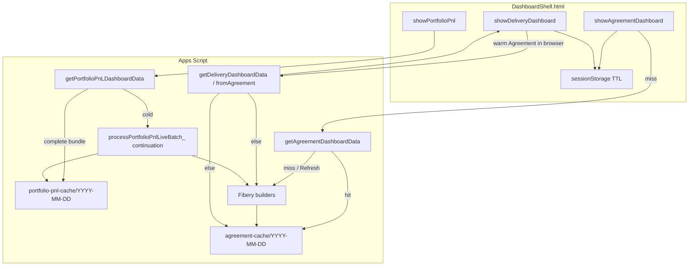

# Implementation plan: Feature 034 - Live dashboard warm cache and Portfolio batch builds

> **Status:** Implemented in code (v2.26.0); deployment verification and Teamwork ship remain.  
> **PRD version:** 2.26.0  
> **Feature spec:** [034-live-dashboard-warm-cache-and-portfolio-batching.md](034-live-dashboard-warm-cache-and-portfolio-batching.md)  
> **Teamwork notebook:** [Feature 034 - Implementation plan](https://win.godeap.io/app/projects/1615262/notebooks/312665)  
> **Release task:** [Feature 034 - Live dashboard warm cache and Portfolio batch builds](https://win.godeap.io/app/tasks/40507567)  
> **Parent patterns:** [025](025-portfolio-pnl-performance-and-load-source-ux.md), [023 AI Usage Drive cache](023-ai-usage-dashboard.md), [009 snapshot P&L batches](009-dashboard-historical-snapshots.md)  
> **PRD:** Add focused FR/AC at ship (extend **FR-120** / Agreement cache FRs; do not invent version until deploy).

## Summary

Three coordinated workstreams that reuse existing Drive-cache and snapshot-batch machinery:

| Workstream | User outcome | Primary reuse |
| --- | --- | --- |
| **A** Agreement same-day Drive warm cache | 2nd+ Live Agreement open of the day is Drive-fast | `aiUsageDashboardCache.js` / `portfolioPnlDashboardCache.js` |
| **B** Delivery list reuses Agreement | Opening Delivery after Agreements skips duplicate Fibery | `buildDeliveryDashboardPayloadFromAgreement_` |
| **C** Portfolio cold build batching | First Portfolio open of the day completes via continuations | `processSnapshotPnlBatch_` in `dashboardSnapshotJob.js` |

Ship as **one Enhancement** release when all three are done (or gate behind feature flags if a phased soft-launch is preferred). Recommended code order: **A → B → C** (B depends on A for the Drive path; C is independent but largest).

## Goals / non-goals

| In scope | Out of scope (v1) |
| --- | --- |
| Agreement Drive daily cache read/write on Live load | Utilization Drive cache / row trim (follow-on) |
| Delivery derived from browser or Drive Agreement | Parallel `google.script.run` |
| Portfolio live Drive build via continuation batches | Changing historical snapshot `agreement.json` contract |
| Load-source labels for Drive hits | CacheService full-payload store |
| Admin registry props for enable + batch size | Prefetch / idle warm of other panels |

## Architecture

## Phase A - Agreement Drive warm cache

### A1. New module (or shared helper)

**Proposed file:** `src/agreementDashboardCache.js` (mirror `portfolioPnlDashboardCache.js`).

| Constant / prop | Purpose |
| --- | --- |
| `AGREEMENT_DRIVE_CACHE_SUBFOLDER_ = 'agreement-cache'` | Under snapshot root |
| `AGREEMENT_DRIVE_CACHE_ENABLED` | Script Property; default true when Drive configured |
| Manifest + `bundle.json` | Same payload as live Agreement API |
| Schema check | `bundle.cacheSchemaVersion === AGREEMENT_DASHBOARD_CACHE_SCHEMA_VERSION_` |

### A2. Wire `getAgreementDashboardData` / builder

1. Resolve calendar date key (America/Chicago or existing snapshot timezone helper).
2. If not `forceRefresh` and enabled: `readAgreementDriveCache_(dateKey)`; on hit return with `source: 'drive'` / `fromDrive: true` for client labels.
3. Else: `buildAgreementDashboardPayload_`, then `writeAgreementDriveCache_` under LockService.
4. Preserve existing client sessionStorage write path; do not remove browser TTL.

### A3. Admin registry

Add `AGREEMENT_DRIVE_CACHE_ENABLED` to `adminSettingsRegistry.js` (Data platform / caching group), tooltip pointing at feature **034**.

### A4. Client load-source

Ensure Agreement overlay maps Drive responses to **`Drive cache · YYYY-MM-DD`** (FR-120). Revenue review, if it shares Agreement fetch, inherits the same source.

**Exit criteria:** Cold Fibery once per day per deployment; later Agreement opens Drive-hit; Refresh rebuilds.

**Estimate:** ~1–1.5 days.

## Phase B - Delivery reuses Agreement

### B1. Client-first path (fastest win)

In `DashboardShell.html` Delivery show/fetch:

1. If Live and `readAgreementCache()` is fresh (schema + TTL): call a new RPC **`getDeliveryDashboardDataFromAgreementPayload(agreementPayload)`** **or** derive Delivery entirely client-side if `buildDeliveryDashboardPayloadFromAgreement_` logic can be mirrored safely.
2. **Preferred server path:** thin RPC that **does not** call Fibery; only runs `buildDeliveryDashboardPayloadFromAgreement_(payload)` after auth + shape validation (size limits: if payload too large for `google.script.run` args, skip to B2).

### B2. Server warm path

Update `getDeliveryDashboardData()`:

1. Try browser-supplied payload (B1) if present.
2. Else try Agreement Drive cache for today (Phase A helper).
3. Else existing: `getAgreementDashboardData()` / build (which also warms Drive).

### B3. Avoid double work

When Delivery triggers a full Agreement build, write Agreement Drive cache once; return Delivery derived payload; optionally return Agreement payload so client can seed Agreement sessionStorage (nice-to-have).

**Exit criteria:** Agreements → Delivery in one session does not double Fibery Agreement time; Delivery-only cold still warms Agreement Drive for later.

**Estimate:** ~0.5–1 day after Phase A.

**Risk:** `google.script.run` argument size if posting full Agreement JSON. Mitigation: Drive-key-only server path (B2) as primary; B1 only when payload under a safe size threshold or use a server "useSessionAgreement: false, useDriveAgreement: true" flag without posting the body.

## Phase C - Portfolio live batch / continuation

### C1. Replace unbounded loop

Today: `buildPortfolioPnlBundleFromFibery_` loops all projects in one call (`portfolioPnlDashboardCache.js`).

Target:

1. **Start:** Create date-folder partial state (manifest `status: building`, `cursor`, `pnlById` so far, `projects` index).
2. **Batch:** Process `N` projects (reuse `PORTFOLIO_PNL_BATCH_SIZE` or new `PORTFOLIO_PNL_LIVE_BUILD_BATCH_SIZE`, default **3–8**).
3. **Continue:** `ScriptApp.newTrigger('processPortfolioPnlLiveBatch_').timeBased().after(1000)` (same pattern as snapshot P&L).
4. **Complete:** Write final `bundle.json`, set `status: complete`, delete trigger.

### C2. Client contract

`getPortfolioPnLDashboardData` / Drive loader returns one of:

| Response | Client behavior |
| --- | --- |
| Complete bundle (`fromDrive` or just finished) | Apply payload (today's UX) |
| `{ ok: true, building: true, done: x, total: y }` | Show progress overlay; poll every 2–3s (single sequential run) until complete or timeout message |
| Error | Existing error overlay |

Do **not** parallelize polls.

### C3. Concurrency

- LockService around start + batch write.
- Second user: read building state → same progress UI; do not spawn a second trigger storm (check existing trigger / property flag).

### C4. Force refresh

Trash or mark invalid today's bundle; start new building state; same batch path.

**Exit criteria:** Cold Portfolio never runs the old all-projects for-loop; large portfolios complete; warm day remains Drive-instant.

**Estimate:** ~1.5–2.5 days.

## File touch list (expected)

| File | Phases |
| --- | --- |
| `src/agreementDashboardCache.js` (new) | A |
| `src/fiberyAgreementDashboard.js` | A |
| `src/deliveryDashboard.js` | B |
| `src/portfolioPnlDashboardCache.js` | C |
| `src/portfolioPnlDashboard.js` | C (API surface if needed) |
| `src/DashboardShell.html` | A–C (source labels, Delivery reuse, Portfolio poll) |
| `src/adminSettingsRegistry.js` | A, C |
| `docs/features/009-*.md` / `025-*.md` (cross-links) | Ship |
| `docs/FOS-Dashboard-PRD.md` + version headers | Ship |

Snapshot job (`dashboardSnapshotJob.js`) stays the historical writer; optional later enhancement: after nightly snapshot, copy today's Agreement into `agreement-cache/` (not required for v1).

## Testing / verification matrix

| # | Scenario | Expect |
| --- | --- | --- |
| 1 | Agreement cold, Drive empty | Fibery + write Drive |
| 2 | Agreement warm Drive | Drive hit, label |
| 3 | Agreement Refresh | Fibery + rewrite |
| 4 | Delivery after Agreement (session) | No second Agreement Fibery |
| 5 | Delivery cold, Agreement Drive present | Delivery from Drive Agreement |
| 6 | Portfolio cold large set | Progress batches → complete bundle |
| 7 | Second user during Portfolio build | Shared progress / wait; one builder |
| 8 | Snapshot date selected | Unchanged historical path |
| 9 | Mobile 390px | Same behavior + overlays |

## Rollout / flags

- `AGREEMENT_DRIVE_CACHE_ENABLED` (default true when configured).
- `PORTFOLIO_PNL_LIVE_BUILD_BATCH_SIZE` controls projects per continuation (default 8, min 1, max 25). The Drive-enabled cold path always uses bounded batches; disabling `PORTFOLIO_PNL_DRIVE_CACHE_ENABLED` retains the legacy direct Fibery fallback for incident response.

## Suggested review questions

1. Is posting Agreement JSON to the Delivery RPC acceptable, or should B2 Drive-only be mandatory?
2. Should Portfolio cold build progress be **poll-only** (recommended) or also allow a user-visible "Continue" button?
3. Timezone for `YYYY-MM-DD` cache keys: confirm same helper as Portfolio / AI Usage (avoid midnight split surprises).
4. Soft-launch order: ship A+B first as a PATCH/MINOR, then C? Spec currently assumes **one** Enhancement release.

## Change log

| Date | Note |
| --- | --- |
| 2026-07-16 | Implemented Phases A-C for v2.26.0. Static syntax and contract checks complete; deployed Drive/Fibery smoke remains. |
| 2026-07-16 | Initial scoped plan for Spec Draft review (options 1, 2, 4 from responsiveness review). |
