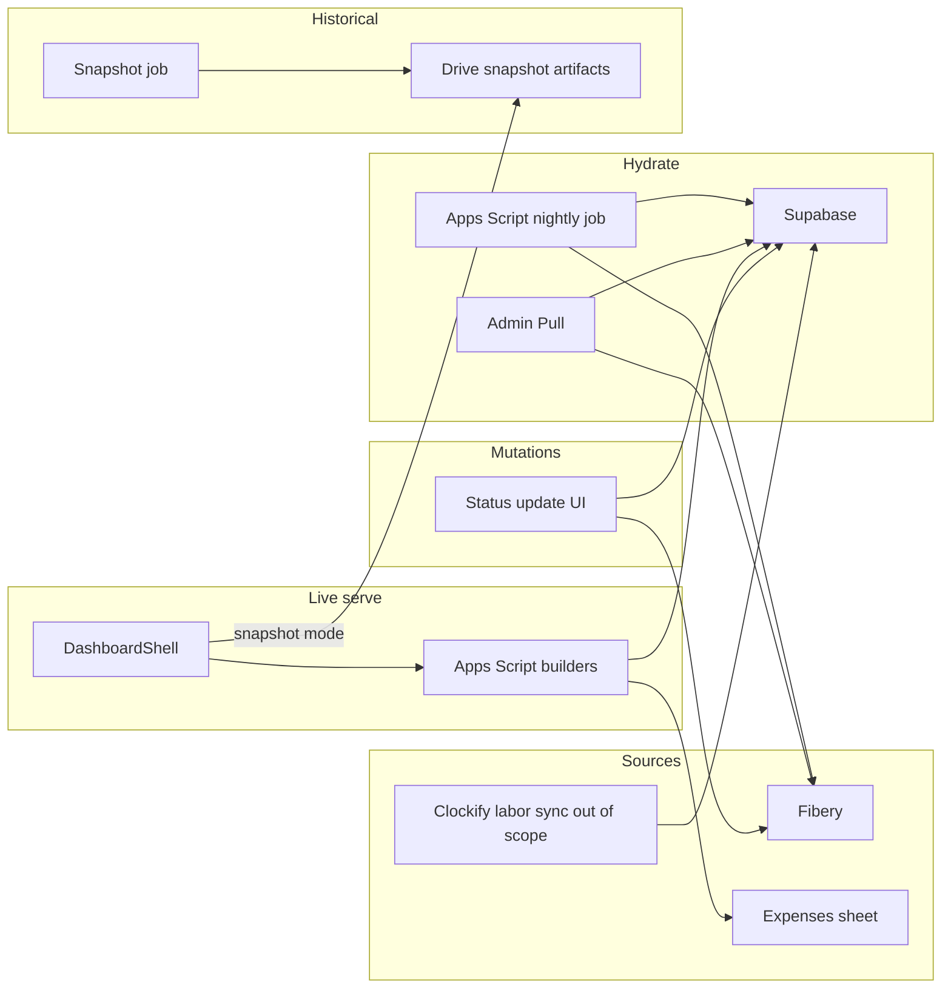

# Implementation plan: Feature 036 - Supabase dashboard data layer

> **Status:** Implemented in code (v3.0.0); staging cutover pending Supabase migration + secrets.  
> **PRD version:** 3.0.0  
> **Feature spec:** [036-supabase-dashboard-data-layer.md](036-supabase-dashboard-data-layer.md)  
> **Parent patterns:** [034 Drive warm cache](034-live-dashboard-warm-cache-and-portfolio-batching.md) (Live Drive path superseded), [017 AI usage sync](017-ai-platform-usage-fibery-sync.md), [009 snapshot batches](009-dashboard-historical-snapshots.md), [018 status updates](018-agreement-status-updates-delivery-pnl.md)  
> **PRD:** Add focused FR/AC at ship (extend **FR-120**; new Supabase serve / sync / dual-write FRs). Version chosen at deploy.
> **Teamwork notebook:** [Feature 036 - Implementation plan (Supabase data layer)](https://win.godeap.io/app/projects/1615262/notebooks/312759)  
> **Feature notebook:** [Feature 036 - Supabase dashboard data layer](https://win.godeap.io/app/projects/1615262/notebooks/312758)  
> **Release task:** [Feature 036 - Supabase dashboard data layer](https://win.godeap.io/app/tasks/40552222)

## Summary

Replace Fibery as the **Live serve** source for all Fibery-backed panels (Expenses stays on Sheets) with an indexed **Supabase (Postgres)** store. Hydrate from Fibery via an Apps Script **nightly continuation job** and an **ADMIN Pull**. Dual-write Agreement status updates to Fibery and Supabase. Retire Live same-day Drive warm caches for migrated panels. Keep historical snapshots on Drive; snapshots-in-Supabase is a follow-on.

| Workstream | User outcome | Primary reuse |
| --- | --- | --- |
| **0** Client + secrets | Safe PostgREST/RPC from GAS | Script Properties + registry |
| **1** Schema + indexes | Fast filtered joins | New SQL migrations |
| **2** Fibery hydrate job | Nightly + Pull fill Postgres | `aiUsageSyncJob` / snapshot continuation |
| **3** Builder refactor | Live panels read Supabase | Existing `build*Payload_*` shapes |
| **4** Dual-write status | Writes stay fresh in Live | `agreementStatusUpdates.js` |
| **5** Retire Live Drive caches | Simpler Live path | Stop read of `*-cache/YYYY-MM-DD` |
| **6** Admin UI + mobile | Pull + status | Settings panel patterns (033 / 017) |
| **7** Cutover | Safe flip | `DASHBOARD_READ_SOURCE` flag |

Ship as **one Enhancement** when Live Supabase serve is proven behind the flag, or soft-launch flag-on per environment. Recommended code order: **0 → 1 → 2 → 3 (Agreement first) → 4 → 5 → 6 → 7**.

## Goals / non-goals

| In scope | Out of scope (v1 / 036) |
| --- | --- |
| Postgres schema + indexes for dashboard domains | Expenses → Supabase |
| Fibery → Supabase nightly + ADMIN Pull (continuation batches) | Clockify → Labor Cost sync (separate owner) |
| Refactor Live builders to read Supabase | Client-side Supabase keys |
| Dual-write status updates | Rewriting Fibery schema |
| Retire Live Drive warm-cache reads for migrated panels | Historical snapshots in Supabase (follow-on) |
| FR-120 Supabase load-source label | Changing snapshot artifact contracts (009) |
| Kill-switch Fibery fallback during rollout | FinOps Ask LLM path |

## Architecture



**Apps Script ↔ Supabase:** `UrlFetchApp` to `{SUPABASE_URL}/rest/v1/...` and `/rpc/...` with service role (or server-only) key. Prefer RPC for multi-table panel aggregates to cut round-trips.

**Nightly sync:** Dataset registry + cursors in Script Properties or `sync_watermarks`; each execution processes one batch then schedules `processSupabaseSyncBatch_` (same idea as `processSnapshotPnlBatch_`). Record rows in `sync_runs`.

**Labor costs:** Tables exist for dashboard reads; 036 Fibery job **skips** labor cost extract. Document table ownership for the Clockify sync repo/job.

## Phase 0 - Supabase client and settings

### 0.1 New module `src/supabaseClient.js`

| Helper | Purpose |
| --- | --- |
| `supabaseConfig_()` | Read URL + key; fail closed with safe message |
| `supabaseRest_(method, path, query, body)` | PostgREST with Prefer headers for upsert |
| `supabaseRpc_(fnName, args)` | `/rpc/{fn}` |
| `supabaseOkError_(res)` | Map HTTP errors to user-safe `{ ok, message }` |

Never log the service key. Cap response sizes; paginate with `Range` / `limit`.

### 0.2 Admin registry

Add to [`src/adminSettingsRegistry.js`](src/adminSettingsRegistry.js) (new **Data platform / Supabase** group):

| Property | Notes |
| --- | --- |
| `SUPABASE_URL` | Project URL |
| `SUPABASE_SERVICE_ROLE_KEY` | Secret; write-only in UI |
| `DASHBOARD_READ_SOURCE` | `supabase` \| `fibery` (default `fibery` until cutover) |
| `SUPABASE_SYNC_ENABLED` | Kill switch for nightly |
| `SUPABASE_SYNC_BATCH_SIZE` | Entities/commands per continuation (tuned) |

**Exit criteria:** Ping RPC or `select 1` style health check callable from ADMIN diag.

**Estimate:** ~0.5–1 day.

## Phase 1 - Schema and indexes

### 1.1 Repo layout

Prefer `supabase/migrations/036_*.sql` (or `docs/sql/036/` if migrations tooling is not yet in repo). Include:

- `sync_runs`, `sync_watermarks`, `dataset_as_of`
- Dimension + fact tables per feature RD domains
- Comments marking `labor_costs` (name TBD) as **owned by Clockify sync**
- Indexes: unique `(fibery_id)` where applicable; `(agreement_id, month)`, `(user_email, date)`, status, pipeline stage, etc.

### 1.2 Serve-oriented design

- Typed columns for filters used today in builders.
- Optional `raw_jsonb` for uncommon Fibery fields.
- Views or RPCs: e.g. `rpc_agreement_dashboard_bundle()`, `rpc_utilization_range(start, end)` to keep GAS thin.

### 1.3 RLS

Service role from Apps Script bypasses RLS. Do **not** expose anon key to the Web App client in 036. Document that RLS policies may still protect human Supabase Studio access.

**Exit criteria:** Migrations applied to staging Supabase; explain plans on hot queries show index use.

**Estimate:** ~2–4 days (largest design slice; iterate with Phase 3).

## Phase 2 - Fibery → Supabase sync job

### 2.1 New module `src/supabaseSyncJob.js`

Pattern from [`src/aiUsageSyncJob.js`](src/aiUsageSyncJob.js) and [`src/dashboardSnapshotJob.js`](src/dashboardSnapshotJob.js):

1. `startSupabaseSync_(trigger)` - create `sync_runs` row, acquire lock, enqueue dataset list.
2. `processSupabaseSyncBatch_()` - Fibery query page → normalize → upsert; advance cursor; reschedule if work remains / time budget (~270s).
3. `getSupabaseSyncStatus_()` / public ADMIN API for Settings.
4. Dataset order: companies/users → agreements → delivery facts → allocations / status → pipeline deals → AI usage. **Skip labor costs.**

### 2.2 Triggers

- Nightly `ScriptApp` time-based trigger (document timezone; align with snapshot job window or stagger to reduce Fibery contention).
- ADMIN `runSupabaseSyncNow()` from Settings (same path as nightly start).

### 2.3 Observability

- Supabase `sync_runs` (primary).
- Optional append to auth spreadsheet tab (parity with AI Usage Sync Runs) if Settings already expects sheet logs; prefer Supabase-first to avoid another unbounded sheet.

**Exit criteria:** Full hydrate completes via continuations on staging; Pull from Settings works; lock prevents double full sync.

**Estimate:** ~3–5 days.

## Phase 3 - Refactor Live builders to Supabase

Keep **payload shapes** and client `cacheSchemaVersion` unless a field must change (prefer no client schema bump).

| Order | Panel | Entry / builder | Notes |
| --- | --- | --- | --- |
| 3a | Agreements (+ Revenue) | `getAgreementDashboardData` / `buildAgreementDashboardPayload_` | First cutover candidate |
| 3b | Delivery list | derive from Agreement payload as today | |
| 3c | Utilization / Labor hours | `buildUtilizationDashboardPayload_` | High Fibery cost today |
| 3d | Delivery project P&L | `buildDeliveryProjectMonthlyPnLInternal_` | |
| 3e | Portfolio P&L | portfolio builders / bundle | Prefer RPC aggregation over N+1 REST |
| 3f | Resource assignments | `buildResourceAssignmentDashboardPayload_` | |
| 3g | Pipeline HubSpot side | `buildPipelineDashboardPayload_` | Sheet merge unchanged |
| 3h | AI Usage | `buildAiUsagePayload_*` | Prefer Supabase over Fibery; skip Drive live cache |

Gate each builder:

```text
if (readSource === 'supabase') { return buildFromSupabase_(...); }
return buildFromFibery_(...); // kill-switch
```

**Exit criteria:** Each panel matches Fibery baseline fixtures within tolerance behind flag.

**Estimate:** ~5–8 days (largest code volume).

## Phase 4 - Dual-write status updates

Update [`src/agreementStatusUpdates.js`](src/agreementStatusUpdates.js):

1. Existing Fibery create + document write (unchanged success path for Fibery).
2. On Fibery success: upsert Supabase status row (and doc metadata if stored).
3. **Failure policy (locked):** Fibery success is user-success; if Supabase fails, log + enqueue retry (Script Properties queue or `sync_runs` note) and surface non-blocking warning to ADMIN logs / optional toast. Do not roll back Fibery.
4. Snapshot mode: still read-only (no write).

**Exit criteria:** Fresh status appears in Fibery and in Live Supabase-backed P&L without waiting for nightly.

**Estimate:** ~1–1.5 days.

## Phase 5 - Retire Live Drive warm caches

For migrated panels when `DASHBOARD_READ_SOURCE=supabase`:

- Bypass read/write of Live `agreement-cache/`, `portfolio-pnl-cache/`, `ai-usage-cache/` in [`agreementDashboardCache.js`](src/agreementDashboardCache.js), [`portfolioPnlDashboardCache.js`](src/portfolioPnlDashboardCache.js), [`aiUsageDashboardCache.js`](src/aiUsageDashboardCache.js).
- Keep modules usable if kill-switch is `fibery` during rollout, or delete Live paths once Fibery fallback is removed.
- **Do not** change [`dashboardSnapshotJob.js`](src/dashboardSnapshotJob.js) historical artifact writers.

**Exit criteria:** Live Supabase path never waits on Drive warm cache; snapshot mode still works.

**Estimate:** ~0.5–1 day.

## Phase 6 - Admin UI and mobile

### 6.1 Settings (`DashboardShell.html` + settings API)

- Group: Supabase connection (masked), last sync, **Pull from Fibery**, read-source selector (ADMIN only).
- Progress: poll status while sync `building` (sequential `google.script.run`, same as Portfolio cold build).
- Activity: `supabase_sync_start`, `supabase_sync_done`, `supabase_sync_error` (or equivalent) whitelisted in [`userActivityLog.js`](src/userActivityLog.js).

### 6.2 Mobile

- Settings controls usable at &lt; 768px; Pull ≥ 44px; no new bottom-nav item.
- Load-source labels on panel overlays work on mobile unchanged structurally.

**Exit criteria:** ADMIN can Pull and see status on desktop and ~390px.

**Estimate:** ~1–1.5 days.

## Phase 7 - Cutover, PRD, verification

1. Staging: hydrate → flag `supabase` → full smoke matrix.
2. Production: deploy with default `fibery`; enable `supabase` after first successful nightly.
3. Remove or deprecate Live Drive dependency once stable.
4. PRD bump (**MAJOR 3.0.0**): FR for Supabase serve, sync job, dual-write; extend FR-120 / AC-79 vocabulary; update feature **034** notes that Live Drive path is superseded.
5. Update [`docs/features/000-overview.md`](000-overview.md) Planned → Shipped at ship time.

**Exit criteria:** Production Live panels on Supabase; snapshots still Drive; Expenses Sheets.

## File touch list (expected)

| File | Phases |
| --- | --- |
| `src/supabaseClient.js` (new) | 0 |
| `src/supabaseSyncJob.js` (new) | 2, 6 |
| `supabase/migrations/` or `docs/sql/036/` (new) | 1 |
| `src/adminSettingsRegistry.js` | 0, 6 |
| `src/adminSettingsApi.js` | 6 |
| `src/fiberyAgreementDashboard.js` | 3a |
| `src/agreementDashboardCache.js` | 5 |
| `src/deliveryDashboard.js` | 3b, 3d |
| `src/fiberyUtilizationDashboard.js` | 3c |
| `src/portfolioPnlDashboard.js` / `portfolioPnlDashboardCache.js` | 3e, 5 |
| `src/resourceAssignmentDashboard.js` | 3f |
| `src/pipelineDashboard.js` | 3g |
| `src/aiUsageDashboard.js` / `aiUsageDashboardCache.js` | 3h, 5 |
| `src/agreementStatusUpdates.js` | 4 |
| `src/DashboardShell.html` | 3, 6 (labels, Settings) |
| `src/userActivityLog.js` | 6 |
| `docs/features/036-*.md`, `009`/`010`/`034` cross-links | 7 |
| `docs/FOS-Dashboard-PRD.md` + `src/*` headers | 7 (ship) |

## Testing / verification matrix

| # | Scenario | Expect |
| --- | --- | --- |
| 1 | Health check with valid secrets | ok |
| 2 | Nightly / Pull full hydrate | Continuations complete; watermarks set |
| 3 | Agreement Live `supabase` | Supabase source; no Fibery query |
| 4 | Utilization / Delivery P&L / Portfolio / RA / Pipeline / AI | Same |
| 5 | Expenses | Spreadsheet unchanged |
| 6 | Status dual-write | Fibery + Supabase |
| 7 | Supabase fail after Fibery status write | User Fibery success; retry logged |
| 8 | Labor tables empty | Hydrate ok; costs empty |
| 9 | Snapshot date | Drive artifacts |
| 10 | Kill-switch `fibery` | Live Fibery path works |
| 11 | Mobile 390px Settings Pull | Usable |
| 12 | Concurrent Pull + nightly | One winner; no corrupt upsert storm |

## Rollout / flags

| Property | Default | Purpose |
| --- | --- | --- |
| `DASHBOARD_READ_SOURCE` | `fibery` | Flip to `supabase` per env when ready |
| `SUPABASE_SYNC_ENABLED` | `true` when configured | Disable nightly without undeploying |
| `SUPABASE_SYNC_BATCH_SIZE` | Tuned (start conservative) | Continuations per execution |

## Dual-write and staleness notes

- Sync order skips Labor; Clockify sync must populate before cost-sensitive UIs look complete.
- Partial sync: prefer source line `Supabase · synced {asOf}` over blocking the whole app.
- Pipeline sheet merge remains authoritative for stage/ACV (FR-124).

## Suggested review questions (Spec Draft)

1. Confirm nightly window vs snapshot job (stagger vs same hour).
2. Confirm whether end users see a staleness banner or only ADMIN Settings + source line.
3. Confirm Supabase project (staging vs prod) and who applies migrations.
4. Confirm Labor Cost table names/contracts with the Clockify sync owners before Phase 1 freeze.

## Change log

| Date | Note |
| --- | --- |
| 2026-07-21 | Release renumbered **MAJOR 3.0.0** (was drafted as 2.28.0). |
| 2026-07-21 | Implemented Phases 0–7 in Apps Script + SQL migration (v3.0.0). |
| 2026-07-21 | Initial Spec Draft implementation plan (Phases 0–7) per locked product decisions. |
