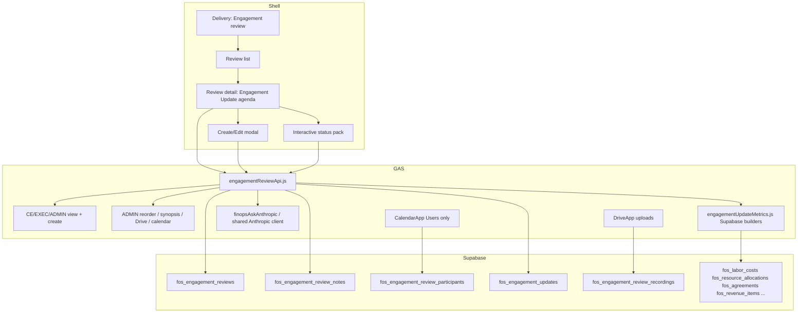

# Implementation plan: Feature 037 - Engagement Review

> **Feature spec:** [037-engagement-review.md](037-engagement-review.md)  
> **Status:** Implemented in `src/` (**v3.5.0**); Teamwork Spec Draft pending approval / ship  
> **Feature ID:** **037**  
> **Task list:** Delivery  
> **Ship type:** Enhancement (MINOR at deploy)  
> **Depends on:** Auth (**002**); Agreement alerts (**003**); Delivery P&L (**006**); Mobile (**029**); Supabase layer (**036**); Anthropic / FinOps Ask path for synopsis  
> **Teamwork notebook:** [Feature 037 - Implementation plan (Engagement Review)](https://win.godeap.io/app/projects/1615262/notebooks/312851)  
> **Feature notebook:** [Feature 037 - Engagement Review](https://win.godeap.io/app/projects/1615262/notebooks/312850)  
> **Release task:** [Feature 037 - Engagement Review](https://win.godeap.io/app/tasks/40579193)  
> **Template:** DEAP Monthly Project Status Report HTML (customer reference)

## Summary

| Item | Choice |
| --- | --- |
| **Product** | Engagement Reviews under Delivery; agenda = reorderable **Engagement Updates** (status packs) |
| **Storage** | **Supabase only** (reviews, notes, participants, recordings metadata, updates + snapshots, AI synopsis JSON) |
| **Access (view)** | `CLIENT-ENGAGEMENT` **or** `EXEC` **or** `ADMIN` |
| **Access (create review / update)** | CE / EXEC / ADMIN |
| **Access (reorder, calendar mutate, Drive upload, AI synopsis)** | **ADMIN** only (calendar/Drive may stay Admin as today; synopsis Admin-only locked) |
| **Metrics** | Snapshot from Supabase builders; Refresh + `metrics_pulled_at`; never Fibery at render |
| **Update pill** | Overall RAG: `on_track` \| `at_risk` \| `off_track` |
| **Assigned owner** | From `fos_agreements` |
| **Notes** | Many `fos_engagement_review_notes`; migrate `call_summary_html` |
| **Export** | HTML download + Print/PDF |
| **AI synopsis** | Persist JSON; inputs = notes + updates + review meta; reuse Anthropic |
| **Review statuses** | `draft` \| `scheduled` \| `in_progress` \| `completed` |
| **PRD at ship** | Extend FR-135 / AC-97 (or add FR/AC rows); MINOR bump |

## Goals / non-goals

| In scope | Out of scope |
| --- | --- |
| Agenda-first Engagement Updates (create/edit/view/reorder) | Auto-create monthly reviews |
| Large qualitative modal + read-only quant snapshot | Fibery calls for update metrics |
| Refresh metrics + pulled-at display | Standalone updates outside a review |
| RAG auto-suggest with margin tolerance | Draft/publish workflow beyond RAG |
| Many meeting notes + calendar + Drive | Guest invitees |
| Interactive viewer + HTML / Print PDF | Portfolio analytics over updates |
| Admin AI synopsis JSON on completed reviews | Dual-write to feature **018** |
| Mobile accommodations same release | Historical snapshot artifact for this module |

## Recommended release strategy

| Release slice | Scope | User-visible outcome |
| --- | --- | --- |
| **R1 - Foundation (exists)** | DDL 039; review CRUD; participants; early questionnaire updates; calendar/Drive modules | Review shell in Hub |
| **R5 - Data model extension** | Additive migration: notes, update columns (period, sort_order, RAG, qualitative, snapshot, uniqueness), synopsis columns; backfill notes from `call_summary_html` | Schema ready |
| **R6 - Metrics + CRUD APIs** | Supabase metric builders; create/update/refresh/reorder APIs; picker rules; auth gates | Server-complete status packs |
| **R7 - UI agenda + modal + viewer** | Reorderable list; large modal; binoculars viewer; refresh; RAG suggest display | Authors and facilitators use packs |
| **R8 - Notes + export + synopsis** | Multi-note UI; HTML/Print; Admin Generate synopsis; mobile polish | Full Spec Draft scope |

Prefer one MINOR shipping R5–R8 together if capacity allows; R1 code is refactored in place rather than duplicated.

## Architecture



### Module split

| Module | Responsibility |
| --- | --- |
| `supabase/migrations/0NN_engagement_updates_status_pack.sql` | Additive DDL (number at implement) |
| `src/engagementReviewAuth.js` | View + create gates; Admin-only reorder/synopsis/calendar/Drive |
| `src/engagementReviewStore.js` | Supabase CRUD including notes, reorder, synopsis |
| `src/engagementUpdateMetrics.js` | **New:** build quantitative snapshot from Supabase; RAG suggest helpers |
| `src/engagementReviewSuggest.js` | Alert suggest; Agreement Owner ∩ Users |
| `src/engagementReviewCalendar.js` | Calendar event; Users only |
| `src/engagementReviewDrive.js` | Recording uploads |
| `src/engagementReviewSynopsis.js` | **New:** assemble prompt context; call Anthropic; validate/store JSON |
| `src/engagementReviewApi.js` | `google.script.run` surface |
| `src/engagementReviewQuestions.js` | Legacy questionnaire; retire or map into qualitative if still referenced |
| `src/DashboardShell.html` | Agenda, modal, viewer, notes, export, mobile |
| `src/userActivityLog.js` | Whitelist |
| `src/adminSettingsRegistry.js` | Drive/calendar/synopsis toggles |
| `docs/supabase-data-model.md` | Catalog update |

Reuse:

- `fos_labor_costs`, allocations, revenue items, `fos_agreements` (036 AM mirror)
- FinOps Ask Anthropic client / quota patterns
- `openMobileFilterSheet_` (**029**)
- Rich-text editor patterns already in shell
- DEAP template structure for viewer CSS (port tokens, not live Fibery)

## Data model (DDL sketch)

Authoritative SQL lands in a new migration. Sketch:

```sql
-- Additive; do not recreate 039 tables

alter table public.fos_engagement_reviews
  add column if not exists ai_synopsis_json jsonb,
  add column if not exists ai_synopsis_generated_at timestamptz,
  add column if not exists ai_synopsis_generated_by text;

create table if not exists public.fos_engagement_review_notes (
  id uuid primary key default gen_random_uuid(),
  review_id uuid not null references public.fos_engagement_reviews(id) on delete cascade,
  title text,
  body_html text not null default '',
  sort_order integer not null default 0,
  created_by_email text not null,
  updated_by_email text,
  created_at timestamptz not null default now(),
  updated_at timestamptz not null default now()
);

create index if not exists fos_engagement_review_notes_review_idx
  on public.fos_engagement_review_notes (review_id, sort_order);

alter table public.fos_engagement_updates
  add column if not exists reporting_period date,
  add column if not exists sort_order integer not null default 0,
  add column if not exists overall_rag text,
  add column if not exists assigned_owner_email text,
  add column if not exists assigned_owner_name text,
  add column if not exists agreement_name text,
  add column if not exists company_name text,
  add column if not exists qualitative jsonb not null default '{}'::jsonb,
  add column if not exists quantitative_snapshot jsonb not null default '{}'::jsonb,
  add column if not exists metrics_pulled_at timestamptz,
  add column if not exists updated_by_email text,
  add column if not exists updated_at timestamptz not null default now();

-- Uniqueness for status packs (after backfill of reporting_period)
-- create unique index ... on (review_id, agreement_fibery_id, reporting_period);

alter table public.fos_engagement_updates
  drop constraint if exists fos_engagement_updates_overall_rag_chk;
alter table public.fos_engagement_updates
  add constraint fos_engagement_updates_overall_rag_chk
  check (overall_rag is null or overall_rag in ('on_track', 'at_risk', 'off_track'));
```

### Legacy questionnaire rows

Early 037 wrote `executive_summary`, `answers`, `traffic_light`, `question_set_version`. At implement:

1. Prefer mapping display of legacy rows into a read-only banner or one-time migrate `executive_summary` → `qualitative.key_developments[0]` when `reporting_period` is null.
2. New creates MUST use status-pack columns and set `reporting_period`.
3. Do not require Fibery for migration.

### Backfill notes

```sql
insert into public.fos_engagement_review_notes (review_id, title, body_html, sort_order, created_by_email)
select id, 'Call summary', call_summary_html, 0, created_by_email
from public.fos_engagement_reviews
where call_summary_html is not null and length(trim(call_summary_html)) > 0
  and not exists (
    select 1 from public.fos_engagement_review_notes n where n.review_id = fos_engagement_reviews.id
  );
```

## Engagement Update metrics builder

`buildEngagementUpdateQuantitativeSnapshot_(agreementFiberyId, reportingPeriod)` returns JSON:

| Block | Logic (Supabase) |
| --- | --- |
| Hours/cost MTD | Sum `fos_labor_costs` for agreement/project mapping in period; planned from allocations for that month |
| EAC hours/dollars | Actuals-to-date + remaining resource allocation (template decision: plan remaining, not run-rate) |
| Charts | Monthly buckets from engagement start (or trailing N months) through reporting period close |
| Margin series | Planned margin vs projected (actuals-to-date + remaining plan) |
| Revenue | Invoiced MTD/FYTD from revenue/invoice mirrors; next milestone from open invoice/revenue items |
| Resources | Per-person allocated vs logged for the month; billable vs not-on-SOW flag |
| Missing data | Emit `null` / empty arrays; UI shows N/A |

**Agreement mapping:** resolve Clockify project / agreement keys using existing Hub join conventions from Delivery P&L / labor builders (do not invent a Fibery round-trip).

### RAG auto-suggest (v1 rules)

Configurable constants (Script Properties or code defaults; expose in Settings if needed):

| Dimension | Green | Amber | Red |
| --- | --- | --- | --- |
| Cost / Hours | abs variance ≤ 5% of plan | ≤ 10% | > 10% |
| Margin | within ±3 percentage points of planned margin | ≤ 6 pts | > 6 pts |
| Schedule | placeholder: green if no overdue milestone signal in Supabase; amber/red when milestone/date risk flags exist; else default green with subtext "On plan" | | |
| Client sentiment | default green "Assumed strong" or leave prior user value on refresh | | |
| Overall | worst of dimension RAGs mapped to on_track / at_risk / off_track | | |

User overrides in `qualitative` and `overall_rag` win on Save; Refresh re-suggests only fields marked `auto: true` OR re-suggests all with a confirm (product default: refresh metrics + re-suggest dimensions that user has not dirty-edited in the open modal).

## AI synopsis

**Gate:** `status === 'completed'` and caller is Admin.

**Input assembly:**

1. Review name, target date, status
2. All notes (`title`, `body_html` stripped/truncated safely)
3. Each Engagement Update: agreement name, period, overall RAG, qualitative, quantitative summary KPIs (not full raw labor rows if token-heavy; include resource exception flags)

**Output JSON schema (store as `ai_synopsis_json`):**

```json
{
  "version": 1,
  "headline": "…",
  "themes": ["…"],
  "decisions": ["…"],
  "risks": ["…"],
  "actions": ["…"],
  "per_engagement": [
    { "agreement_fibery_id": "…", "name": "…", "summary": "…" }
  ]
}
```

Reuse `finopsAskAnthropic.js` (or shared Anthropic helper) with a dedicated system prompt; apply existing quota/logging patterns; never return API keys or stack traces to the client.

## UI implementation notes

### Agenda row

- Drag handle (Admin)
- Title: `{company or agreement} - {Mon YYYY}` or agreement name
- RAG pill
- Assigned owner name/email
- Actions: binoculars (view), pencil (edit); optional overflow delete (Admin)

### Large modal

- Full-viewport-friendly dialog (≥ desktop); mobile full-screen sheet
- Qualitative editors: rich text or structured lists for bullets/risks
- Assigned Owner read-only from agreement denorm
- Quant panel: tiles + mini charts from snapshot; Refresh button; "Metrics pulled at {local datetime}"
- Save validates unique period/project

### Interactive viewer

- Port DEAP layout/CSS into shell (scoped class prefix `fos-eu-rpt-`)
- Bind snapshot + qualitative
- Toolbar: Download HTML (Blob), Print (window.print + print CSS)
- Mobile: single column stack; charts simplify or progressive disclosure

### Meeting notes

- List + add/edit/delete
- Rich text field (existing editor)
- Sort order optional (Admin)

## Auth matrix

| Action | CE | EXEC | ADMIN |
| --- | --- | --- | --- |
| View module / reviews | Y | Y | Y |
| Create / edit review | Y | Y | Y |
| Create / edit Engagement Update | Y* | Y* | Y |
| Refresh metrics | Y* | Y* | Y |
| Reorder updates | N | N | Y |
| Manage participants / calendar | N | N | Y |
| Upload Drive recording | N | N | Y |
| Generate AI synopsis | N | N | Y |
| Delete review | N | N | Y |

\*Non-Admin create/edit limited to picker-eligible projects (owner_email match + Delivery In Progress). Editing an update the user did not create but owns via agreement: **allowed** if they pass picker rules for that agreement. Editing others' packs: **Admin only** (lock this in API).

## Activity events

| Event id | When |
| --- | --- |
| `engagement_review_nav` | Open panel |
| `engagement_review_create` | Create review |
| `engagement_review_update` | Edit review fields/status |
| `engagement_update_create` | Create update |
| `engagement_update_edit` | Save qualitative |
| `engagement_update_reorder` | Admin reorder |
| `engagement_update_refresh_metrics` | Refresh |
| `engagement_update_view` | Binoculars |
| `engagement_update_export` | HTML or print |
| `engagement_review_note_save` | Note add/edit |
| `engagement_review_calendar_invite` | Calendar |
| `engagement_review_recording_upload` | Drive |
| `engagement_review_ai_synopsis` | Generate synopsis |

## Implementation checklist

### R5 - Schema

- [ ] Author migration; apply to project; update `supabase/build/schema_all.sql` if used
- [ ] Update `docs/supabase-data-model.md`
- [ ] Backfill notes from `call_summary_html`
- [ ] Unique index on updates after period backfill strategy chosen

### R6 - APIs / metrics

- [ ] `engagementUpdateMetrics.js` builders + RAG suggest
- [ ] Store methods: create/update/reorder/refresh/notes/synopsis
- [ ] Auth matrix enforced server-side
- [ ] Picker query: Delivery In Progress (+ owner filter)

### R7 - Shell UI

- [ ] Agenda list + Admin drag-drop
- [ ] Large create/edit modal
- [ ] Interactive viewer
- [ ] Refresh + pulled-at
- [ ] Mobile cards / sheets

### R8 - Notes, export, AI, polish

- [ ] Multi-note CRUD UI
- [ ] HTML download + print CSS
- [ ] Admin synopsis button + JSON renderer
- [ ] Activity whitelist + settings registry
- [ ] Verification steps from feature RD
- [ ] PRD FR/AC + `FOS_PRD_VERSION` header sweep at ship
- [ ] Teamwork ship via `teamwork_ship_command.py --feature-id 037`

## Risk register

| Risk | Mitigation |
| --- | --- |
| Clockify↔agreement join incomplete | N/A tiles; document mapping; reuse Delivery P&L join helpers |
| Token limits on synopsis | Summarize quant to KPIs; truncate note HTML |
| Drag-drop on mobile | Up/down controls for Admin on small viewports |
| Legacy questionnaire confusion | Hide legacy form; migrate or banner |
| Create permission expansion (was Admin-only) | Explicit auth tests for CE/EXEC create |

## Open engineering items (not product blockers)

1. Exact `fos_agreements` column for Delivery In Progress filter (`status` vs `state` vs enum name) - confirm against AM mirror row shape at implement.
2. Labor row → agreement_fibery_id join path (Clockify project name vs Fibery id on `fos_labor_costs`).
3. Whether CE/EXEC may delete their own updates (default: soft-hide; Admin hard delete).
4. Print CSS page breaks for long resource tables.

## Changelog (plan doc)

| Date | Note |
| --- | --- |
| 2026-07-23 | Initial plan R1-R4 (foundation, suggest, questionnaire, calendar/Drive). |
| 2026-08-04 | Extended plan R5-R8: Engagement Update status packs, notes, metrics snapshot/refresh, HTML/Print, Admin AI synopsis JSON; create open to CE/EXEC/ADMIN; Admin-only reorder. |
