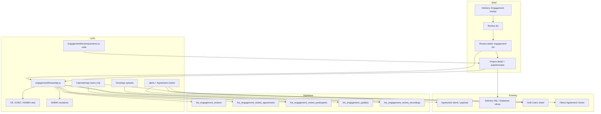

# Implementation plan: Feature 037 - Engagement Review

> **Feature spec:** [037-engagement-review.md](037-engagement-review.md)  
> **Status:** Implemented in `src/` (**v3.2.0**); Teamwork ship pending  
> **Feature ID:** **037**  
> **Task list:** Delivery  
> **Ship type:** Enhancement (MINOR at deploy)  
> **Depends on:** Auth (**002**); Agreement alerts (**003**); Delivery P&L (**006**); Mobile (**029**); Supabase layer (**036**)  
> **Teamwork notebook:** [Feature 037 - Implementation plan (Engagement Review)](https://win.godeap.io/app/projects/1615262/notebooks/312851)  
> **Feature notebook:** [Feature 037 - Engagement Review](https://win.godeap.io/app/projects/1615262/notebooks/312850)  
> **Release task:** [Feature 037 - Engagement Review](https://win.godeap.io/app/tasks/40579193)

## Summary

| Item | Choice |
| --- | --- |
| **Product** | Engagement Reviews under Delivery; Admin-created; CE/EXEC/Admin view; owner prep via code questionnaire |
| **Storage** | **Supabase only** for reviews / updates / participants / recording metadata |
| **Access (view)** | `CLIENT-ENGAGEMENT` **or** `EXEC` **or** `ADMIN` |
| **Access (create/mutate review)** | **ADMIN** only |
| **Owner suggest** | Fibery **Agreement Owner** ∩ auth **Users** sheet |
| **Questions** | **Code** constants + version; **responses** in `fos_engagement_updates` |
| **Reporting** | Follow-on |
| **018 Status Updates** | Separate; no dual-write from Engagement Updates |
| **Recordings** | **Google Drive** uploads + metadata rows |
| **Invites** | Calendar events; **Users sheet emails only** |
| **Statuses** | `draft` \| `scheduled` \| `in_progress` \| `completed` |
| **UX** | Review engagement list → project detail (latest executive summary + collapsible prior owner updates + project info) |
| **Snapshots / deck export** | Out of scope v1 |
| **PRD at ship** | New FR/AC; MINOR bump |

## Goals / non-goals

| In scope (v1) | Out of scope (v1) |
| --- | --- |
| Nav + access gate (CE / EXEC / ADMIN) | Auto-create monthly reviews |
| Supabase DDL + Apps Script CRUD | Fibery Engagement Review database |
| Admin create/edit agenda, alert suggest, owner suggest | Non-Users / guest invitees |
| Calendar invites to auth Users | Response analytics / reporting UI |
| Code question set + Supabase responses | Dual-write to Fibery Status Updates |
| Project detail: latest summary + collapsible history + Datastore project slices | PCL-style PDF/deck export |
| Drive recording uploads + call summary rich text | Historical Drive snapshot artifact for this module |
| Mobile list / detail / questionnaire | FinOps Ask grounding (follow-on) |

## Recommended release strategy

| Release | Scope | User-visible outcome |
| --- | --- | --- |
| **R1 - Foundation** | DDL; ADMIN list/create/edit; manual engagements; statuses; call summary | Admins build agendas in Hub |
| **R2 - Suggest + browse UX** | Alert suggest; owner participant suggest (Users only); CE/EXEC read; engagement list | Faster agenda; reviewers browse |
| **R3 - Project detail + updates** | Project detail subview; code questions; `fos_engagement_updates`; latest summary + collapsible history | Owners submit prep; facilitators read history |
| **R4 - Calendar + Drive** | Calendar event (Users only); Drive recording upload + metadata | Meeting invite + retained recordings |

Prefer one MINOR shipping R1–R4 together if capacity allows; keep modules separable for test.

## Architecture



### Module split

| Module | Responsibility |
| --- | --- |
| `supabase/migrations/039_engagement_reviews.sql` | DDL, indexes, privilege revoke |
| `src/engagementReviewAuth.js` | View gate (CE/EXEC/ADMIN); Admin mutation gate |
| `src/engagementReviewStore.js` | Supabase CRUD |
| `src/engagementReviewSuggest.js` | Alert suggest; Agreement Owner ∩ Users |
| `src/engagementReviewCalendar.js` | Create/update calendar event; invite Users only |
| `src/engagementReviewDrive.js` | Upload recordings; folder resolve |
| `src/engagementReviewQuestions.js` | Versioned question definitions + answer validation |
| `src/engagementReviewApi.js` | `google.script.run` surface |
| `src/Code.js` | Nav child + access flag |
| `src/DashboardShell.html` | List, review detail, project detail, mobile |
| `src/userActivityLog.js` | Whitelist |
| `src/adminSettingsRegistry.js` | `ENGAGEMENT_REVIEW_DRIVE_FOLDER_ID`, calendar id, toggles |
| `docs/supabase-data-model.md` | Catalog update |
| Hydrate / `fos_agreements` | Persist Agreement Owner email/id when field path confirmed |

Reuse:

- `evaluateAlerts_` / Agreement panel payload
- Datastore `fos_delivery_pnl` / agreement dimensions for project info
- Toast / rich-text patterns (**018** UI patterns only; no Fibery write)
- `openMobileFilterSheet_` (**029**)
- Notification deep-link hash patterns (**033**)

## Data model (DDL sketch)

```sql
-- Sketch; authoritative SQL in supabase/migrations/039_engagement_reviews.sql

create table public.fos_engagement_reviews (
  id uuid primary key default gen_random_uuid(),
  name text not null,
  target_date date not null,
  status text not null default 'draft', -- draft|scheduled|in_progress|completed
  call_summary_html text,
  notes text,
  question_set_version integer not null default 1,
  created_by_email text not null,
  updated_by_email text,
  created_at timestamptz not null default now(),
  updated_at timestamptz not null default now(),
  constraint fos_engagement_reviews_status_chk
    check (status in ('draft', 'scheduled', 'in_progress', 'completed'))
);

create table public.fos_engagement_review_agreements (
  id uuid primary key default gen_random_uuid(),
  review_id uuid not null references public.fos_engagement_reviews(id) on delete cascade,
  agreement_fibery_id text not null,
  agreement_name text,
  company_name text,
  owner_email text,
  owner_name text,
  suggested_from_alert boolean not null default false,
  alert_snapshot jsonb,
  sort_order integer not null default 0,
  created_at timestamptz not null default now(),
  unique (review_id, agreement_fibery_id)
);

create table public.fos_engagement_review_participants (
  id uuid primary key default gen_random_uuid(),
  review_id uuid not null references public.fos_engagement_reviews(id) on delete cascade,
  email text not null,
  display_name text,
  participant_role text not null default 'owner', -- owner|facilitator|observer
  suggested boolean not null default false,
  invite_status text not null default 'pending', -- pending|invited
  invite_sent_at timestamptz,
  created_at timestamptz not null default now(),
  unique (review_id, email)
);

create table public.fos_engagement_updates (
  id uuid primary key default gen_random_uuid(),
  review_id uuid not null references public.fos_engagement_reviews(id) on delete cascade,
  agreement_fibery_id text not null,
  submitted_by_email text not null,
  executive_summary text not null,
  traffic_light text, -- green|yellow|red|null
  answers jsonb not null default '{}'::jsonb,
  question_set_version integer not null,
  submitted_at timestamptz not null default now(),
  created_at timestamptz not null default now()
);

create table public.fos_engagement_review_recordings (
  id uuid primary key default gen_random_uuid(),
  review_id uuid not null references public.fos_engagement_reviews(id) on delete cascade,
  drive_file_id text not null,
  file_name text,
  mime_type text,
  byte_size bigint,
  uploaded_by_email text not null,
  uploaded_at timestamptz not null default now()
);
```

Indexes (minimum):

- `fos_engagement_reviews (target_date desc)`, `(status)`
- `fos_engagement_review_agreements (agreement_fibery_id)`, `(owner_email)`
- `fos_engagement_updates (review_id, agreement_fibery_id, submitted_at desc)`
- `fos_engagement_review_participants (email)`
- `fos_engagement_review_recordings (review_id)`

Privileges: revoke `anon` / `authenticated` (match **036**).

**No** question-bank tables in v1.

## Questions module (code)

`src/engagementReviewQuestions.js`:

- Export `ENGAGEMENT_REVIEW_QUESTION_SET_VERSION` (integer).
- Export ordered array: `{ key, label, helpText, inputType, required, options? }`.
- `inputType`: `textarea` | `text` | `single_select` | `traffic_light` | `number`.
- Designate which field feeds **`executive_summary`** (dedicated required textarea, or explicit mapping).
- `validateEngagementUpdateAnswers_(answers, version)` server-side before insert.

Exact labels: draft from Google requirements doc during R3; bump version on any breaking change.

## Suggest algorithms

### Agreements from alerts

1. Load Agreement dashboard alerts (Datastore panel payload preferred).
2. Distinct `agreementId` where severity in (`critical`, `warning`), exclude `all_clear`.
3. Upsert link rows with `suggested_from_alert = true`; copy name/customer/owner when known.
4. Do not delete admin-added rows.

### Participants from Agreement Owner

1. For each linked agreement, resolve Fibery **Agreement Owner** → email (via hydrate column or live Fibery read Admin-only).
2. Keep emails that exist on auth **Users** sheet (case-insensitive).
3. Upsert participants with `suggested = true`, `participant_role = 'owner'`.
4. Skip / warn for owners missing from Users (never calendar-invite them).

## Project detail DTO (R3)

```text
{
  reviewId, agreementId, agreementName, customerName, ownerEmail,
  updates: {
    latest: { id, executiveSummary, trafficLight, answers, submittedByEmail, submittedAt, questionSetVersion } | null,
    history: [ /* older updates, newest first */ ]
  },
  projectInfo: {
    state, type, alerts[],
    pnlKpis: { /* from fos_delivery_pnl / builder */ },
    resources?: { /* optional */ },
    milestones?: { /* optional */ }
  },
  questionSet: { version, questions: [...] },
  canSubmitUpdate: boolean
}
```

UI contract:

1. Render **latest.executiveSummary** at top (or empty state).
2. **history** in a **collapsed** `<details>` / accordion labeled previous updates from Agreement Owner.
3. Project information section below.
4. Questionnaire when `canSubmitUpdate`.

Deep link: `route=engagement-review&reviewId=…&agreementId=…`.

## Calendar invites (R4)

- Script Property for calendar id (or default script calendar).
- Event title/body: review name, target date, Hub deep link, engagement count.
- Attendees: participant emails after Users-sheet filter only.
- Idempotent: store `calendar_event_id` on review (add column if needed) for update/reschedule.
- Activity: `engagement_review_calendar_invite`.

## Drive recordings (R4)

- Folder: `ENGAGEMENT_REVIEW_DRIVE_FOLDER_ID` or subfolder under `FOS_SNAPSHOT_DRIVE_FOLDER_ID` named `engagement-review-recordings/`.
- Upload via `DriveApp`; persist `fos_engagement_review_recordings` row.
- List/download via Drive file id (open in Drive for v1; no streaming through Apps Script).
- Reject empty files; cap size with clear error.

## UI implementation notes

### Nav

- `{ id: 'engagement-review', label: 'Engagement review' }` under `delivery-group`.
- Gate identical membership to Resource assignments (**CE / EXEC / ADMIN**).
- Expose `engagementReviewAccess` on nav model; create button client-gated by `isAdmin`.

### Views

| View | Purpose |
| --- | --- |
| Reviews list | Filter upcoming/past/all |
| Review detail | Header, participants, call summary, recordings, **engagement list** |
| Project detail | Latest summary, collapsible history, project info, questionnaire |

### Mobile

- Cards; sticky **Add update**; filter sheet; ≥ 44px targets.
- Collapsible history default closed.

## Activity events

| Event type | When |
| --- | --- |
| `engagement_review_nav` | Open panel |
| `engagement_review_create` | Admin creates |
| `engagement_review_update` | Admin saves header/status/summary |
| `engagement_review_suggest_alerts` | Suggest agreements |
| `engagement_review_suggest_owners` | Suggest participants |
| `engagement_review_calendar_invite` | Calendar send |
| `engagement_review_recording_upload` | Drive upload |
| `engagement_review_project_detail` | Open project detail |
| `engagement_update_submit` | Questionnaire save |

## Testing / verification plan

1. Apply migration; confirm revokes.
2. Admin: create review, suggest alerts, suggest owners (Users only), upload recording, set `scheduled`, create calendar.
3. Owner: open engagement → project detail → submit update → latest summary on top; second submit → first moves into collapsible history.
4. EXEC: see nav; cannot create.
5. CE non-Admin: same.
6. Finance-only: no nav / FORBIDDEN.
7. Mobile 390px path.
8. Non-Users owner email never appears on calendar attendees.

## Risks and mitigations

| Risk | Mitigation |
| --- | --- |
| Fibery Owner field path unclear / MCP host drift | Confirm on `harpin-ai` before R2; add hydrate column; implementation note in spec |
| Apps Script upload limits | Cap file size; document supported types |
| Calendar quota / permissions | Shared calendar id via Settings; fail soft per attendee |
| Question churn | Integer `question_set_version` on review + update rows |
| Accidental Fibery status dual-write | No calls into `createAgreementStatusUpdate` from this module |
| Stale Datastore for alerts/P&L | Label “as of last Pull”; Admin can refresh Datastore separately |

## PRD / Teamwork ship hooks

1. Bump PRD (MINOR), `FOS_PRD_VERSION`, all `src/*` headers.
2. Add FR/AC for Engagement Review.
3. Update `docs/features/000-overview.md`.
4. Sync notebooks; ship command:

```bash
python3 scripts/teamwork_ship_command.py --feature-id 037
```

## Phase checklist

### R1 - Foundation

- [x] Product decisions locked
- [ ] Migration + data model doc
- [ ] Auth (view CE/EXEC/ADMIN; mutate ADMIN) + nav
- [ ] Admin CRUD review + manual engagements + statuses + call summary
- [ ] Activity: nav/create/update

### R2 - Suggest + browse

- [ ] Confirm Agreement Owner Fibery path + hydrate
- [ ] Suggest from alerts
- [ ] Suggest participants (Owner ∩ Users)
- [ ] CE/EXEC read review + engagement list
- [ ] Mobile list/review detail

### R3 - Project detail + updates

- [ ] Code question set v1
- [ ] Project detail DTO + UI (latest summary + collapsible history + project info)
- [ ] `createEngagementUpdate`
- [ ] Deep link
- [ ] Mobile questionnaire

### R4 - Calendar + Drive

- [ ] Calendar event (Users only); optional `calendar_event_id` column
- [ ] Drive upload + recordings table UI
- [ ] Settings registry keys

## Changelog (plan)

| Date | Note |
| --- | --- |
| 2026-07-23 | Initial plan: R1–R4, schema sketch, open questions. |
| 2026-07-23 | Locked decisions applied: EXEC access; Admin-only create; code questions / DB responses; Supabase-only reviews; Drive recordings; Users-only calendar; four statuses; project detail UX with executive summary + collapsible owner history; dropped question DB tables. |
