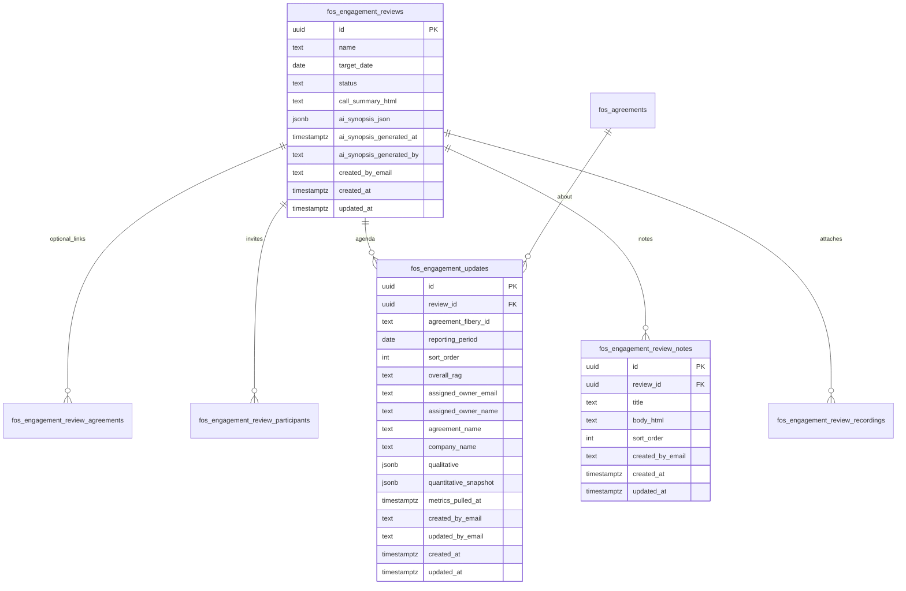

# Feature: Engagement Review (Delivery)

> **Status:** Shipped (**v3.5.2**; foundation **v3.2.0**)  
> **PRD version:** **3.5.2** (`FR-135`, `FR-136`, `AC-97`, `AC-98`) (extends prior **v3.2.x** Engagement Review foundation in `src/`)  
> **Feature ID:** **037**  
> **Release type:** Enhancement  
> **Task list:** Delivery  
> **Depends on:** Spreadsheet auth (**002**); Delivery nav group (**008** / **035**); Agreement alerts (**003**); Delivery P&L (**006**); Supabase Live data layer (**036**); Mobile shell (**029**); FinOps Ask / Anthropic (**032** family) for AI synopsis  
> **Implementation plan:** [037-engagement-review-implementation-plan.md](037-engagement-review-implementation-plan.md)  
> **Inbox source:** [Idea - View for Monthly Financial Health Check](https://win.godeap.io/app/tasks/40478571) (Jess Williams)  
> **Teamwork notebook:** [Feature 037 - Engagement Review](https://win.godeap.io/app/projects/1615262/notebooks/312850)  
> **Implementation plan notebook:** [Feature 037 - Implementation plan (Engagement Review)](https://win.godeap.io/app/projects/1615262/notebooks/312851)  
> **Release task:** [v3.5.2 - Engagement Review](https://win.godeap.io/app/tasks/40579193)  
> **Teamwork workflow:** See `docs/teamwork-workflow.md`.  
> **Template reference:** DEAP Monthly Project Status Report (`deap-monthly-status-template.html`)

---

## Origin / source request

Customer inbox idea: **Deck for Monthly Financial Health Check** (priority High). Requestor: Jess Williams.

- Inbox task: https://win.godeap.io/app/tasks/40478571
- Requirements doc (Google): https://docs.google.com/document/d/108I6WRIVS88tqGovoTnwIX-gTb3jOAn0HWU25y3kFD4/edit
- Sample artifact: **PCL Monthly Financial Review (July 2026)** PDF
- Status pack visual: **DEAP Monthly Project Status Report** HTML template (Aug 2026)

This RD covers the Hub **Engagement Review** workspace: schedule reviews, invite participants, attach Drive recordings, capture many meeting notes, and manage **Engagement Updates** (monthly status packs) as the reorderable agenda. Persistence is **Supabase only**. Quantitative metrics for Engagement Updates are built from **Supabase** mirrors (no Fibery calls at read/render time). Automated AI synopsis on completed reviews reuses the Hub Anthropic path.

---

## Goal

Give **Client Engagement**, **Execs**, and **Admins** a Delivery-module workspace to run recurring engagement reviews: create a review for a target date, build an agenda of **Engagement Updates** (one per project/reporting period), invite auth Users via calendar, attach Drive recordings, capture multiple rich-text meeting notes, view/edit interactive status packs aligned to the DEAP template, export HTML / print PDF, and (when the review is completed) generate an Admin-only AI synopsis from notes + associated update data.

**Primary audience:** Client Engagement leads, Execs, and Admins who facilitate monthly project / financial health reviews; agreement owners who author Engagement Updates for their Delivery In Progress projects.

**Terminology:**

| Term | Meaning |
| --- | --- |
| **Engagement Review** | Scheduled review event (target date, status, participants, recordings, notes, synopsis) |
| **Engagement Update** | Monthly status pack for one agreement + reporting period, attached to a review (agenda line item) |
| **Agreement / Engagement** | Interchangeable; UI prefers **Engagement**; storage may use `agreement_*` + `fos_agreements.fibery_id` |
| **Assigned Owner** | Owner from `fos_agreements` (`owner_email` / `owner_name`); shown on update line items and report header (replaces template "PM" label) |

---

## Problem today

| Pain | Today |
| --- | --- |
| Monthly health packs are assembled by hand | Static PDFs / HTML mix narrative and metrics outside the Hub |
| Agenda selection is tribal | Facilitators lack a Hub-native reorderable list of status packs under review |
| Prep is ad hoc | Questionnaire-only updates (early 037) do not match the DEAP status pack structure |
| Outcomes leave the Hub | Notes and recordings scatter across email / Docs |
| Metrics drift | Status packs need frozen Supabase snapshots with an explicit pull timestamp and refresh |
| Completed reviews lack synthesis | Facilitators manually summarize notes + packs after the call |

---

## Locked product decisions

| # | Topic | Decision |
| --- | --- | --- |
| 1 | Feature scope | **Extend Feature 037** (same feature id, notebooks, release task). Do not split into 038/039 for this work. |
| 2 | Naming | Use **Engagement Update** (not "Monthly Status Report") for the status pack entity and UI. |
| 3 | Nav placement | Delivery child route **`engagement-review`**, label **Engagement review**, panel `#panel-engagement-review`. |
| 4 | Access (view module) | Visible when **team = `CLIENT-ENGAGEMENT`**, **role = `EXEC`**, or **role = `ADMIN`** (case-insensitive). |
| 5 | Create reviews / updates | **ADMIN, EXEC, and CLIENT-ENGAGEMENT** MAY create Engagement Reviews and create/edit Engagement Updates (subject to project picker rules). |
| 6 | Reorder agenda | **ADMIN only** MAY drag-and-drop reorder Engagement Update line items. |
| 7 | Persistence | **Supabase-only** for reviews, participants, notes, recordings metadata, Engagement Updates (qualitative + quantitative snapshots), AI synopsis. No Fibery Engagement Review type. No Fibery calls when building or viewing update metrics (read Supabase mirrors only). |
| 8 | Cadence | Reviews are scheduled events with a **target date**. No auto-create of monthly reviews in this release. |
| 9 | Agenda shape | Review detail agenda is the **reorderable list of Engagement Updates** (name, overall RAG pill, assigned owner). Projects are implied by each update. |
| 10 | Update membership | Every Engagement Update **MUST** belong to an Engagement Review. No standalone updates. |
| 11 | Uniqueness | Unique **`(review_id, agreement_fibery_id, reporting_period)`**. |
| 12 | Project picker (non-Admin) | Agreements where **`owner_email`** matches the signed-in user **and** agreement status / state is **`Delivery In Progress`**. |
| 13 | Project picker (Admin) | Any agreement in **`Delivery In Progress`**. |
| 14 | Assigned owner display | From **`fos_agreements.owner_email` / `owner_name`** (denormalized onto the update at create/refresh). Header label: **Assigned Owner** (not "PM"). |
| 15 | Update status pill | **Overall RAG only**: `on_track` \| `at_risk` \| `off_track` (UI: On Track / At Risk / Off Track). No separate draft/publish workflow in this release. |
| 16 | Qualitative (editable) | Overall RAG; Schedule / Cost-Hours / Margin / Client Sentiment RAG chips + subtext; Key Developments (period); Priorities (next period); Risks & Issues (severity + text); Revenue context callout; Margin footnote; Reporting period. |
| 17 | Quantitative (read-only) | Hours/cost MTD + planned deltas; EAC hours/dollars; hours & cost planned vs actual charts; margin planned vs projected; revenue invoiced MTD/FYTD; next invoice milestone; resource detail table. Not editable in the modal. |
| 18 | Metrics freeze | **Snapshot** quantitative payload into the Engagement Update at create. **Refresh** button re-pulls from Supabase and updates `metrics_pulled_at`. UI shows pull date/time. |
| 19 | RAG auto-suggest | On create and on metrics refresh, **auto-suggest** overall + Schedule / Cost-Hours / Margin dimension RAG from snapshot variance rules (tolerance band for margin). Client Sentiment defaults to a neutral suggestion or last known; user may override all RAG fields. |
| 20 | Create / edit UX | **Create new Engagement Update** opens a **large modal**: editable qualitative sections; read-only quantitative sections. Pencil icon reopens edit modal. Binoculars icon opens the **full interactive** status pack view. |
| 21 | Export | Interactive view supports **HTML download** and **Print / PDF** (browser print stylesheet). |
| 22 | Meeting notes | **Many** rich-text notes per review (`fos_engagement_review_notes`). Migrate legacy `call_summary_html` into the first note when present. |
| 23 | Calendar + Drive | Keep **calendar invites** (auth Users only) and **Drive recordings** as already specified for 037. |
| 24 | Review statuses | Unchanged: **`draft` \| `scheduled` \| `in_progress` \| `completed`**. |
| 25 | AI synopsis | When status is **`completed`**, **Admin only** may generate a synopsis. Persist as **JSON** on the review. Inputs: all meeting notes + all Engagement Updates (qualitative + quantitative snapshots) + review metadata. Reuse Hub Anthropic / FinOps Ask infrastructure. Regeneratable. |
| 26 | Suggest from alerts | Retain Admin **Suggest from active alerts** as a way to seed candidate projects; creating an Engagement Update still requires picker + reporting period (alerts do not auto-create updates). |
| 27 | Participants | Seed from Agreement Owners ∩ auth Users; Admins manage list; calendar invites Users only. |
| 28 | Relation to feature 018 | Fibery/Delivery Status Updates remain separate. No dual-write. |
| 29 | Historical snapshots | Out of scope for this release (Live Supabase only). |
| 30 | Mobile | Full mobile accommodation in the same release (cards, sheets, ≥ 44px targets). |
| 31 | Incomplete metrics | If a Supabase source is missing, show **N/A** (or empty chart) for that tile; do not call Fibery. |

---

## User stories

- As an **Admin, Exec, or Client Engagement** user, I want to **create an Engagement Review** with a target date so the team has a scheduled review event.
- As an **Admin, Exec, or Client Engagement** user, I want to **create an Engagement Update** on a review for a Delivery In Progress project and reporting period so the agenda holds a status pack.
- As a **non-Admin** author, I want the project picker limited to **my assigned** Delivery In Progress engagements so I only author packs I own.
- As an **Admin**, I want to pick **any** Delivery In Progress engagement and **reorder** update line items by drag-and-drop so the call agenda matches facilitation order.
- As a **facilitator**, I want each agenda row to show **engagement name, overall RAG pill, and assigned owner** so I can scan the room quickly.
- As an **author**, I want a **large edit modal** where I can edit qualitative sections while quantitative tiles stay read-only from the Supabase snapshot.
- As an **author**, I want a **Refresh metrics** action that re-pulls Supabase data and shows **when metrics were pulled**.
- As a **reviewer**, I want the **binoculars** control to open the full interactive status pack and **pencil** to edit.
- As a **reviewer**, I want **HTML download** and **Print / PDF** from the interactive view for offline sharing.
- As a **facilitator**, I want **many rich-text meeting notes** plus **Drive recordings** and **calendar invites** so outcomes and logistics stay on the review.
- As an **Admin**, when a review is **completed**, I want to **generate an AI synopsis** (JSON) from notes + updates so the team has a durable synthesis.
- As a **mobile user**, I want list → review agenda → create/edit/view update usable under **768px**.

---

## Acceptance Criteria (testable)

### Navigation and access

- [ ] **Given** a user with team `CLIENT-ENGAGEMENT` or role `EXEC` or role `ADMIN`, **when** the shell loads, **then** Delivery includes **Engagement review** and `#panel-engagement-review` is reachable.
- [ ] **Given** a user without that access, **when** the nav model is built, **then** the route is omitted and APIs return a safe **FORBIDDEN** message.
- [ ] **Given** mobile width **&lt; 768px**, **when** the user opens Engagement review, **then** the panel is usable with ≥ 44px targets.

### Engagement Reviews (create / status / logistics)

- [ ] **Given** an Admin, Exec, or CLIENT-ENGAGEMENT user, **when** they create a review, **then** they can set name/title, target date, status (`draft` default), and save to Supabase.
- [ ] **Given** a user outside that set, **when** they attempt create, **then** UI hides create and API returns FORBIDDEN.
- [ ] **Given** review statuses, **when** set, **then** only `draft` \| `scheduled` \| `in_progress` \| `completed` are accepted.
- [ ] **Given** an Admin, **when** they manage participants and send a calendar event, **then** only auth **Users** sheet emails are invited.
- [ ] **Given** an Admin, **when** they upload a Drive recording, **then** the file is stored in the configured folder and metadata is saved on the review.
- [ ] **Given** an authorized user, **when** they add multiple rich-text meeting notes, **then** each persists independently and reloads; legacy `call_summary_html` (if any) appears as the first migrated note.

### Agenda = Engagement Updates

- [ ] **Given** a review, **when** an authorized user opens it, **then** the primary agenda is the list of Engagement Updates (not a separate agreement-only list as the main UX).
- [ ] **Given** that list, **when** rendered, **then** each row shows engagement/report name, overall RAG pill, and assigned owner.
- [ ] **Given** an Admin, **when** they drag-and-drop rows, **then** `sort_order` persists and non-Admins cannot reorder (UI + API).
- [ ] **Given** Create new Engagement Update, **when** opened by a non-Admin, **then** the project dropdown lists only their `owner_email` matches in **Delivery In Progress**.
- [ ] **Given** Create new Engagement Update, **when** opened by an Admin, **then** the dropdown lists all **Delivery In Progress** agreements from Supabase.
- [ ] **Given** an existing `(review, agreement, reporting_period)`, **when** create is attempted again, **then** the API rejects with a clear uniqueness error.
- [ ] **Given** create, **when** saved, **then** quantitative snapshot is written and `metrics_pulled_at` is set.

### Edit modal / view / export

- [ ] **Given** create or pencil edit, **when** the large modal opens, **then** qualitative sections are editable and quantitative sections are read-only.
- [ ] **Given** Refresh metrics, **when** clicked, **then** snapshot fields update from Supabase and `metrics_pulled_at` advances; UI shows the pull timestamp.
- [ ] **Given** binoculars, **when** clicked, **then** the full interactive status pack opens (template structure: scorecard, performance to plan, revenue, resources, this/next month).
- [ ] **Given** the interactive view, **when** the user chooses HTML download or Print/PDF, **then** a faithful export/print of the pack is produced.
- [ ] **Given** RAG auto-suggest, **when** create or refresh runs, **then** Schedule / Cost-Hours / Margin (and overall) suggestions are populated from variance rules; user overrides persist on save.

### AI synopsis

- [ ] **Given** review status `completed` and an Admin, **when** they click Generate synopsis, **then** the system reads meeting notes + Engagement Updates + review metadata via the Hub Anthropic path and stores **JSON** on the review.
- [ ] **Given** a non-Admin, **when** they attempt generate, **then** API returns FORBIDDEN.
- [ ] **Given** a review not in `completed`, **when** generate is attempted, **then** the action is blocked with a clear message.
- [ ] **Given** a stored synopsis, **when** the review is opened, **then** the synopsis renders from persisted JSON (regenerate overwrites with new JSON + timestamp).

### Data model / platform

- [ ] **Given** migrations applied, **when** schema is inspected, **then** notes table, update snapshot columns / uniqueness, sort_order, and synopsis JSON fields exist; grants align with Hub service-role pattern.
- [ ] **Given** metric builders, **when** an Engagement Update is created or refreshed, **then** no Fibery HTTP calls are made for those metrics.
- [ ] **Given** ship, **when** PRD is bumped, **then** FR/AC, `FOS_PRD_VERSION`, and all `src/*` headers match.

### Activity logging

- [ ] Whitelist events include (final ids in implementation plan): `engagement_review_nav`, `engagement_review_create`, `engagement_review_update`, `engagement_update_create`, `engagement_update_edit`, `engagement_update_reorder`, `engagement_update_refresh_metrics`, `engagement_update_view`, `engagement_update_export`, `engagement_review_note_save`, `engagement_review_calendar_invite`, `engagement_review_recording_upload`, `engagement_review_ai_synopsis`.

---

## UI Notes

### Routes / panels

| Surface | Change |
| --- | --- |
| `src/Code.js` `buildNavigationModel_` | Delivery child **Engagement review** + access flags (`engagementReviewAccess`, create vs admin-reorder) |
| `src/DashboardShell.html` | Review list; review detail with reorderable Engagement Update agenda; large create/edit modal; interactive viewer; notes list; AI synopsis panel; HTML/print export; mobile |
| Server modules | Auth, store, metrics builders (Supabase), suggest, calendar, Drive, AI synopsis, APIs |
| `src/userActivityLog.js` | Whitelist |
| `src/adminSettingsRegistry.js` | Drive folder id, calendar id, synopsis model/toggles as needed |

### Desktop (≥ 768px)

```text
Delivery > Engagement review
┌─ Reviews list ─────────────────────────────────────────────────────────────┐
│ [New review] (CE / EXEC / ADMIN)   filters: upcoming / past / all            │
│ Target date | Name | #Updates | Status | Updated                           │
└────────────────────────────────────────────────────────────────────────────┘

Review detail
┌─ Header: name, target date, status [Edit] [Calendar] [Generate synopsis*]   ┐
│ Participants │ Meeting notes (many) │ Drive recordings                       │
├─ Engagement Updates (agenda) ──────────────────────────────────────────────┤
│ [Create new Engagement Update]                                              │
│ ≡ Name | RAG pill | Assigned owner | [binoculars] [pencil]   (Admin drag) │
└────────────────────────────────────────────────────────────────────────────┘
* Generate synopsis visible when status=completed and user is Admin

Large modal (create / edit)
┌─ Left / top: qualitative editors ── Right / below: read-only quant tiles ──┐
│ Period | Overall RAG | dimension RAGs | developments | priorities | risks │
│ Revenue callout | margin footnote | Assigned Owner (read-only from agr.) │
│ Quant snapshot + [Refresh metrics] + "Pulled at …"                        │
│ [Save] [Cancel]                                                            │
└────────────────────────────────────────────────────────────────────────────┘

Interactive viewer (binoculars)
┌─ DEAP-structured status pack (interactive) + [Download HTML] [Print/PDF] ──┐
```

### Mobile (&lt; 768px)

- Reviews as cards; agenda as tappable cards with RAG + owner.
- Create/edit uses full-screen sheet/modal; quant sections stacked read-only.
- Reorder: Admin-only; use explicit up/down or a mobile-friendly sort sheet if drag is unreliable.
- Filters via **`openMobileFilterSheet_`**.
- No new bottom-nav slot (More → Delivery).

### Branding

Match Delivery chrome (`.fos-agreement-root`, section cards, FinOps theme). Status pack viewer may use the DEAP template token set for the document surface.

---

## Data Model

Supabase (Postgres). Foundation: `supabase/migrations/039_engagement_reviews.sql` (+ grants). This extension adds notes, expands Engagement Updates into status packs with snapshots, and stores AI synopsis JSON. New DDL ships in a follow-on migration (number assigned at implement).



### Table responsibilities

| Table | Purpose |
| --- | --- |
| `fos_engagement_reviews` | Review event; statuses; optional legacy `call_summary_html`; AI synopsis JSON |
| `fos_engagement_review_notes` | Many rich-text meeting notes |
| `fos_engagement_review_agreements` | Optional alert-suggest / legacy links (agenda UX is updates-first) |
| `fos_engagement_review_participants` | Calendar invite list (auth Users only) |
| `fos_engagement_updates` | Status packs: RAG, qualitative JSON, quantitative snapshot, sort order |
| `fos_engagement_review_recordings` | Drive file metadata |

### `qualitative` JSON (illustrative)

```json
{
  "schedule": { "rag": "green", "subtext": "On plan" },
  "cost_hours": { "rag": "amber", "subtext": "Slightly over plan" },
  "margin": { "rag": "green", "subtext": "Tracking to plan" },
  "client_sentiment": { "rag": "green", "subtext": "Strong engagement" },
  "key_developments": ["…"],
  "priorities_next": ["…"],
  "risks": [{ "severity": "med", "text": "…" }],
  "revenue_callout_html": "…",
  "margin_footnote": "…"
}
```

### `quantitative_snapshot` JSON (illustrative)

Frozen at create/refresh from Supabase builders:

- Hours/cost MTD actual vs planned; EAC hours/dollars
- Monthly series for hours and cost planned vs actual
- Margin planned vs projected series
- Revenue invoiced MTD / FYTD; next invoice milestone
- Resource rows: name, role, allocated hrs, logged hrs, % allocated, cost, billable flag

### Field notes

- **`status` (review):** `draft` \| `scheduled` \| `in_progress` \| `completed` only.
- **`overall_rag`:** `on_track` \| `at_risk` \| `off_track`.
- **`reporting_period`:** First day of the reported month (`date`), unique with review + agreement.
- **`metrics_pulled_at`:** Timestamp shown in UI; updated on Refresh.
- Soft refs via `agreement_fibery_id` → `fos_agreements.fibery_id`.

### Metric sources (Supabase only)

| Template section | Primary sources |
| --- | --- |
| Hours / cost actuals | `fos_labor_costs` (Clockify mirror) |
| Planned hours / remaining allocation / EAC inputs | `fos_resource_allocations`, `fos_estimated_allocations` |
| Margin / revenue context | `fos_revenue_items`, `fos_invoice_requests`, Delivery P&L facts already in Supabase (`fos_delivery_pnl` / agreement mirrors) |
| Resource table | Allocations + labor joined to `fos_clockify_users` / roles |
| Assigned owner | `fos_agreements.owner_email`, `owner_name` |
| Delivery In Progress filter | Agreement status/state = `Delivery In Progress` on `fos_agreements` |

### Migration notes

- Additive migration: notes table; expand `fos_engagement_updates` (period, sort_order, RAG, qualitative, snapshot, metrics_pulled_at, owner denorm, unique constraint); synopsis columns on reviews.
- One-time backfill: copy non-empty `call_summary_html` into a note row.
- Legacy questionnaire columns (`answers`, `executive_summary`, `question_set_version`) MAY be retained for back-compat or migrated into `qualitative` / retired in the same migration (decide in implementation plan Technical appendix).
- Update `docs/supabase-data-model.md` when DDL ships.
- Grants: service_role preferred; align with Hub sibling tables / `040_engagement_reviews_grants.sql` pattern.

---

## Operations

### Queries

- `listEngagementReviews(filter)`
- `getEngagementReview(reviewId)` - updates agenda (ordered), participants, notes, recordings, synopsis
- `getEngagementUpdate(updateId)` - qualitative + snapshot for modal/viewer
- `listProjectsForEngagementUpdatePicker()` - Delivery In Progress; owner-scoped unless Admin
- `suggestAgreementsFromActiveAlerts(reviewId)` - ADMIN
- `suggestParticipantsForReview(reviewId)` - ADMIN

### Actions

- `createEngagementReview` / `updateEngagementReview` / `deleteEngagementReview` (CE / EXEC / ADMIN create; tighten delete to Admin unless product says otherwise)
- `createEngagementUpdate` / `updateEngagementUpdate` (CE / EXEC / ADMIN; picker rules)
- `reorderEngagementUpdates(reviewId, orderedIds)` (**ADMIN only**)
- `refreshEngagementUpdateMetrics(updateId)` - rebuild snapshot; set `metrics_pulled_at`
- `createEngagementReviewCalendarEvent` (ADMIN; Users only)
- `addEngagementReviewNote` / `updateEngagementReviewNote` / `deleteEngagementReviewNote`
- `uploadEngagementReviewRecording` (ADMIN)
- `generateEngagementReviewSynopsis(reviewId)` (**ADMIN**; status must be `completed`)
- Export helpers: server may return HTML string for download; print is client print CSS

### Jobs

- No required scheduled job (reminder digests follow-on).

---

## Edge Cases

| Case | Expected behavior |
| --- | --- |
| No Delivery In Progress projects for user | Empty picker with guidance |
| Duplicate period/project on same review | Block with clear error |
| Missing labor or allocation rows | N/A tiles / empty series; save still allowed |
| Non-Admin attempts reorder | API FORBIDDEN; UI hides handles |
| Synopsis before completed | Blocked |
| Legacy call summary present | Migrated to first note; field may remain read-only legacy |
| Agreement owner changes after create | Line shows denormalized owner; Refresh may update owner denorm from current `fos_agreements` |
| Snapshot data source mode | Live-only banner; module still uses Supabase |
| Drive upload failure | Safe error; no orphan metadata without file id |

---

## Verification Steps

1. **Desktop CE/EXEC/ADMIN:** Create review (`draft`), add meeting notes, participants, calendar invite, Drive recording.
2. **Create Engagement Update:** Pick Delivery In Progress project + period; confirm snapshot + pulled-at; edit qualitative; save.
3. **Non-Admin picker:** Only owned projects; Admin sees all Delivery In Progress.
4. **Uniqueness:** Second create same review/project/period fails cleanly.
5. **Reorder:** Admin drag-drop persists; non-Admin cannot.
6. **Binoculars / pencil / Refresh / HTML / Print:** All work on a sample pack matching DEAP sections.
7. **RAG auto-suggest:** Over-plan hours → Cost-Hours amber/red per rules; margin within tolerance stays green.
8. **AI synopsis:** Set `completed`; Admin generates; JSON persists and renders; non-Admin forbidden.
9. **Mobile (~390px):** Agenda cards, create/edit sheet, viewer usable.
10. **Schema:** Migration applied; no Fibery calls in metrics path (log/trace smoke).

---

## Implementation Checklist

- [x] Lock product decisions from customer answers (2026-07-23 foundation; **2026-08-04** Engagement Update status pack extension)
- [ ] Sync Spec Draft notebooks ↔ this git file
- [ ] Additive Supabase migration + data model doc
- [ ] Metrics builders from Supabase (snapshot + refresh)
- [ ] Auth: create for CE/EXEC/ADMIN; reorder + synopsis Admin-only
- [ ] DashboardShell: agenda, modal, viewer, notes, export, mobile
- [ ] Calendar + Drive retained/verified
- [ ] AI synopsis via existing Anthropic path
- [ ] Activity logging + Settings keys
- [ ] PRD FR/AC + version sweep at ship
- [ ] Teamwork ship checklist (`teamwork_ship_command.py --feature-id 037`)

---

## Follow-on (explicitly out of this release)

- Response analytics / portfolio reporting over Engagement Updates
- Auto-create monthly reviews
- Guest / non-Users invitees
- Dual-write to Fibery Status Updates (**018**)
- Historical Drive snapshot artifact for this module
- Draft/publish workflow for updates (beyond RAG)

---

## Change requests

*(Post-approval customer edits only. Leave empty until Spec Approved.)*

---

## Changelog (feature doc)

| Date | Note |
| --- | --- |
| 2026-07-23 | Spec Draft: initial RD + open questions. |
| 2026-07-23 | Intake: Inbox Financial Health Check + PCL sample; Teamwork notebooks + release task. |
| 2026-07-23 | Locked decisions: Agreement Owner participants; EXEC access; Admin-only create; questions in code / responses in Supabase; review Supabase-only; Drive recordings; Users-only calendar invites; statuses draft/scheduled/in_progress/completed; review engagement list → project detail with latest executive summary + collapsible owner history. |
| 2026-07-23 | **v3.2.2:** Fix Admin **New review** visibility (`navState.isAdmin`, not missing `navState.model`). |
| 2026-08-04 | **Extended Spec Draft:** Engagement Updates become DEAP-aligned status packs (agenda-first, drag-drop Admin-only, qualitative modal + quantitative snapshot/refresh, HTML/Print export, many meeting notes, Admin AI synopsis JSON). Create reviews/updates allowed for CE/EXEC/ADMIN. Keep review status model and calendar/Drive. Terminology: Engagement Update (not Monthly Status Report). Assigned Owner from `fos_agreements`. |
| 2026-08-04 | **v3.5.0 client implementation:** `src/DashboardShell.html` `#panel-engagement-review` rebuilt with the Engagement Updates agenda (`#er-updates-list`, drag-drop + mobile up/down reorder), `#erUpdateModal` (create/edit status pack: RAGs, qualitative fields, read-only quantitative snapshot + Refresh metrics), `#erViewerModal` (interactive report, Download HTML, Print), Meeting notes list (`#er-notes-list`) replacing the single call summary, and `#er-synopsis-panel` (Admin, completed reviews). See **FR-136** / **AC-98**. |
| 2026-08-04 | **v3.5.1:** Engagement Update / create / viewer modals use opaque `--surface` (fix undefined transparent `--ag-card`) plus form control contrast. |
| 2026-08-04 | **v3.5.2:** Create and edit Engagement Update modal (`#erUpdateModal`) forced to solid opaque hex surfaces, form/select/option contrast, and darker backdrop. |
