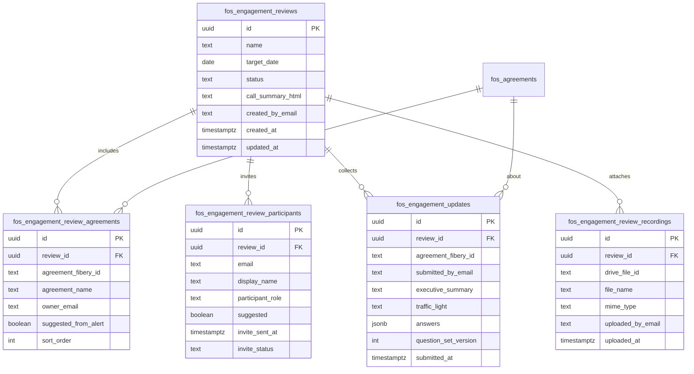

# Feature: Engagement Review (Delivery)

> **Status:** Implemented in code (**v3.2.0**); Teamwork ship / notebook sync pending  
> **PRD version:** **3.2.2** (`FR-135`, `AC-97`)  
> **Feature ID:** **037**  
> **Release type:** Enhancement  
> **Task list:** Delivery  
> **Depends on:** Spreadsheet auth (**002**); Delivery nav group (**008** / **035**); Agreement alerts (**003**); Delivery P&L (**006**); Supabase Live data layer (**036**); Mobile shell (**029**)  
> **Implementation plan:** [037-engagement-review-implementation-plan.md](037-engagement-review-implementation-plan.md)  
> **Inbox source:** [Idea - View for Monthly Financial Health Check](https://win.godeap.io/app/tasks/40478571) (Jess Williams)  
> **Teamwork notebook:** [Feature 037 - Engagement Review](https://win.godeap.io/app/projects/1615262/notebooks/312850)  
> **Implementation plan notebook:** [Feature 037 - Implementation plan (Engagement Review)](https://win.godeap.io/app/projects/1615262/notebooks/312851)  
> **Release task:** [Feature 037 - Engagement Review](https://win.godeap.io/app/tasks/40579193)  
> **Teamwork workflow:** See `docs/teamwork-workflow.md`.  
> **Fibery SoT for Agreements:** `harpin-ai.fibery.io` / **Agreement Management** (Hub app types). Owner field recently added on Agreements; exact Fibery field path confirmed at implement.

---

## Origin / source request

Customer inbox idea: **Deck for Monthly Financial Health Check** (priority High). Requestor: Jess Williams.

- Inbox task: https://win.godeap.io/app/tasks/40478571
- Requirements doc (Google): https://docs.google.com/document/d/108I6WRIVS88tqGovoTnwIX-gTb3jOAn0HWU25y3kFD4/edit
- Sample artifact: **PCL Monthly Financial Review (July 2026)** PDF

This RD ships a Hub **Engagement Review** workspace for the monthly ritual (agenda, calendar invites to auth users, owner prep updates, call recordings on Drive, call notes). Automated customer deck/PDF export matching the PCL sample is **follow-on**. Analytics / reporting over questionnaire responses is **follow-on**.

---

## Goal

Give the **Client Engagement** team, **Execs**, and **Admins** a Delivery-module workspace to run **recurring engagement (agreement) reviews**: schedule a review for a target date, select the engagements under review, invite agreement owners (auth Users only) via calendar, collect standardized pre-review feedback, open a project detail page per engagement, and capture Drive-stored call recordings plus rich-text summary notes.

**Primary audience:** Client Engagement leads, Execs, and Admins who facilitate monthly project / financial health reviews; agreement owners who prepare status for engagements assigned to them.

**Terminology:** **Agreement** and **Engagement** are interchangeable. UI copy SHOULD prefer **Engagement** in this module; storage keys MAY use `agreement_*` columns that reference `fos_agreements.fibery_id`.

---

## Problem today

| Pain | Today |
| --- | --- |
| Monthly health packs are assembled by hand | Example: PCL July pack mixes portfolio KPIs, per-SOW margin/status, and remedy plans into a static PDF |
| Agenda selection is tribal | Facilitators decide which engagements need airtime without a Hub-native "under review" list |
| PM / owner prep is ad hoc | Pre-reads and status answers are not collected through a standardized Hub questionnaire tied to a review date |
| Outcomes leave the Hub | Call notes and recordings live in email / Docs / decks instead of on the review record |
| Alert signal is unused at facilitation time | Agreement Critical/Warning alerts exist in Hub but are not a one-click way to seed a review agenda |

---

## Locked product decisions

| # | Topic | Decision |
| --- | --- | --- |
| 1 | Nav placement | Delivery child route **`engagement-review`**, label **Engagement review**, panel `#panel-engagement-review`. |
| 2 | Access (view module) | Visible when **team = `CLIENT-ENGAGEMENT`**, **role = `EXEC`**, or **role = `ADMIN`** (case-insensitive). Same gate family as Resource assignments / Pipeline. |
| 3 | Create / edit reviews | **ADMIN only** may create a new review. Admin-only for edit, delete, suggest-from-alerts, participant management, calendar invites, and call-artifact uploads. CE / EXEC may view reviews, open project detail, and (when invited as participants / owners) submit Engagement Updates. |
| 4 | Persistence | **Supabase-only** system of record for Engagement Reviews, participants, agreement links, Engagement Updates, and recording metadata. No Fibery Engagement Review type. No dual-write to Fibery Status Updates (**018**). |
| 5 | Cadence | Reviews are scheduled events with a **target date**; typical cadence monthly. No auto-create of monthly reviews in v1. |
| 6 | Agreements on a review | A review MAY include **zero or many** agreements. Admins add/remove freely. |
| 7 | Suggest from alerts | Admin **Suggest from active alerts** adds agreements with Critical/Warning Agreement alerts (exclude `all_clear`). Dedupes; does not remove existing links. |
| 8 | Participant suggestions | Seed from Fibery **Agreement Owner** on each linked agreement (newly added column). Map owner email to auth **Users** sheet. Admins may add/remove. Only auth Users may be participants / calendar invitees. |
| 9 | Engagement Updates | Per **(review, agreement)** there MAY be **zero, one, or many** Engagement Updates in Supabase. Each stores submitter (server session), answers JSON, executive summary, timestamps. |
| 10 | Question bank | **Standardized questions live in code** (versioned constant module). **Responses live in Supabase** (`answers` jsonb + summary fields). Changing questions = code deploy + question-set version bump. |
| 11 | Reporting | Portfolio / analytics reporting over questionnaire content is **out of scope** (follow-on). |
| 12 | Invites | When calendar events are created for a review, invite **only** emails present on the auth **Users** sheet. Deep link into the Hub review / project detail. |
| 13 | Call recordings | Allow **file attachments stored in Google Drive** (dedicated review folder under snapshot/Drive root). Metadata (file id, name, mime, uploaded_by, uploaded_at) persisted on the review in Supabase. Optional URL paste MAY also be supported as a secondary attachment type. |
| 14 | Review statuses | Exactly: **`draft`**, **`scheduled`**, **`in_progress`**, **`completed`**. |
| 15 | Review-day UX | Review detail shows the **list of engagements being reviewed** (for that review / target date). **Clicking an engagement** opens the **project detail** page for that engagement. |
| 16 | Project detail layout | Top: **Engagement Updates** with the **latest executive summary** prominent. Underneath: **collapsible list of previous updates** submitted by the Agreement Owner. Below / alongside: project information slices (alerts, P&L KPIs, margin, resources, milestones / revenue items as available from Datastore). Questionnaire entry for a new update when the signed-in user is allowed. |
| 17 | Relation to feature 018 | Fibery/Delivery **Status Updates** remain separate. Engagement Updates do not create or sync 018 rows. Project detail MAY *display* latest 018 status as read-only context if useful, but owner prep answers are Engagement Updates only. |
| 18 | Historical snapshots | Out of scope for v1. |
| 19 | Mobile | Full mobile accommodation in the same release. |
| 20 | Deck / PDF export | Follow-on (not v1). |

---

## Remaining implementation notes (not product blockers)

1. Confirm exact Fibery field path for **Agreement Owner** on `harpin-ai.fibery.io` / `Agreement Management/Agreements` (relation vs user vs text/email) and hydrate into `fos_agreements` (or read at suggest time).
2. Finalize v1 question labels/types in `engagementReviewQuestions.js` (align with Google requirements doc where practical).
3. Calendar provider: Apps Script `CalendarApp` (script calendar) vs Workspace shared calendar id via Script Property.
4. Drive folder property name (e.g. `ENGAGEMENT_REVIEW_DRIVE_FOLDER_ID`) and upload size limits under Apps Script.

---

## User stories

- As an **Admin**, I want to **create an Engagement Review** with a target date so the team has a scheduled review event.
- As an **Admin**, I want to **suggest agreements with active alerts** so at-risk engagements are easy to put on the agenda.
- As an **Admin**, I want to **add or remove any agreements** from a review so the agenda matches facilitation needs.
- As an **Admin**, I want **suggested participants from Agreement Owners** (auth Users only) so calendar invites are accurate.
- As an **Admin**, I want to **create a calendar event** inviting auth Users on the participant list so owners know when to prepare.
- As an **agreement owner**, I want to open an engagement from the review list, see project detail, and **submit a standardized update** with an executive summary so facilitators have prep material.
- As a **Client Engagement or Exec reviewer**, I want the **latest executive summary at the top** of project detail and **prior owner updates collapsible underneath** so the call stays focused.
- As a **facilitator**, I want to **upload call recordings to Drive** and **paste rich-text summary notes** on the review so outcomes stay with the agenda.
- As a **mobile user**, I want list → engagement → project detail → questionnaire usable under **768px**.
- As **security / ops**, I want server-side ADMIN vs participant gates and no Supabase keys in the browser.

---

## Acceptance Criteria (testable)

### Navigation and access

- [ ] **Given** a user with team `CLIENT-ENGAGEMENT` or role `EXEC` or role `ADMIN`, **when** the shell loads, **then** Delivery includes **Engagement review** and `#panel-engagement-review` is reachable.
- [ ] **Given** a user without that access, **when** the nav model is built, **then** the route is omitted and APIs return a safe **FORBIDDEN** message.
- [ ] **Given** mobile width **&lt; 768px**, **when** the user opens Engagement review, **then** the panel is usable with ≥ 44px targets.

### Admin: create / edit review

- [ ] **Given** an Admin, **when** they create a review, **then** they can set name/title, target date, status (`draft` default), optional notes, and save to Supabase.
- [ ] **Given** a non-Admin (including EXEC / CLIENT-ENGAGEMENT), **when** they attempt create, **then** UI hides create and API returns FORBIDDEN.
- [ ] **Given** an Admin editing a review, **when** they click **Suggest from active alerts**, **then** Critical/Warning agreements are added (deduped).
- [ ] **Given** an Admin, **when** they add or remove agreements or participants, **then** changes persist.
- [ ] **Given** an Admin suggesting participants, **when** linked agreements have Agreement Owners who exist on the Users sheet, **then** those emails are suggested; owners not on Users are skipped or warned and **not** invited.

### Review list → project detail

- [ ] **Given** a review with linked engagements, **when** an authorized user opens the review, **then** they see the list of engagements on that review.
- [ ] **Given** that list, **when** the user clicks an engagement, **then** the **project detail** view opens for that engagement in the Engagement Review module.
- [ ] **Given** project detail, **when** updates exist, **then** the **latest update’s executive summary** is shown at the top.
- [ ] **Given** older updates from the Agreement Owner, **when** the user expands the collapsible history, **then** prior updates are listed newest-first without overwriting history.
- [ ] **Given** project detail, **when** data is available, **then** project information includes at least: identity (name, customer, type, state), attention alerts for that agreement, Delivery P&L KPI slice (margin / rev / cost as available), and resource or milestone context when Datastore payloads provide them.

### Engagement Updates (questionnaire)

- [ ] **Given** the code question set version N, **when** an allowed user submits answers, **then** a Supabase `fos_engagement_updates` row stores `review_id`, `agreement_fibery_id`, `submitted_by_email` (server session), `question_set_version`, `answers` jsonb, executive summary, and `submitted_at`.
- [ ] **Given** zero updates, **when** project detail loads, **then** an empty/prep-needed state is shown (not an error).
- [ ] **Given** a user who is not Admin and not an invited participant / owner for that review engagement, **when** they attempt submit, **then** the server rejects the write.

### Calendar invites

- [ ] **Given** an Admin creates/sends the review calendar event, **when** participants are resolved, **then** only auth **Users** sheet emails are invited.
- [ ] **Given** a non-Users email on a Fibery owner field, **when** invites run, **then** that address is not added to the calendar event.

### Call artifacts

- [ ] **Given** an Admin, **when** they upload a recording attachment, **then** the file is stored in the configured Google Drive folder and metadata is saved on the review in Supabase.
- [ ] **Given** an Admin, **when** they save rich-text call summary notes, **then** the value persists and reloads.
- [ ] **Given** empty recording/summary fields, **when** the review is viewed, **then** empty states render cleanly.

### Data model / platform

- [ ] **Given** the engagement-review migration applied, **when** schema is inspected, **then** tables exist for reviews, review↔agreement links, participants, engagement updates, and recording metadata; question definitions are **not** required as DB tables (code-owned).
- [ ] **Given** Apps Script service role, **when** CRUD runs, **then** `anon` / `authenticated` cannot read or write these tables.
- [ ] **Given** ship, **when** PRD is bumped, **then** new FR/AC rows, `FOS_PRD_VERSION`, and all `src/*` headers match.

### Activity logging

- [ ] Whitelist events include: `engagement_review_nav`, `engagement_review_create`, `engagement_review_suggest_alerts`, `engagement_review_calendar_invite`, `engagement_review_recording_upload`, `engagement_update_submit`, `engagement_review_project_detail` (final ids in implementation plan).

---

## UI Notes

### Routes / panels

| Surface | Change |
| --- | --- |
| `src/Code.js` `buildNavigationModel_` | Delivery child **Engagement review** + `engagementReviewAccess` |
| `src/DashboardShell.html` | Review list, review detail (engagement list), project detail subview, questionnaire, upload UI |
| Server modules | Auth, store, suggest, calendar invites, Drive upload, questions (code), APIs |
| `src/userActivityLog.js` | Whitelist |
| `src/adminSettingsRegistry.js` | Drive folder id, calendar id, invite toggles |

### Desktop (≥ 768px)

```text
Delivery > Engagement review
┌─ Reviews list ─────────────────────────────────────────────────────────────┐
│ [New review] (ADMIN)   filters: upcoming / past / all                      │
│ Target date | Name | #Engagements | #Participants | Status | Updated       │
└────────────────────────────────────────────────────────────────────────────┘

Review detail (engagements being reviewed)
┌─ Header: name, target date, status [Edit] [Suggest alerts] [Calendar] …    ┐
│ Participants │ Call summary │ Drive recordings                             │
├─ Engagements on this review ───────────────────────────────────────────────┤
│ row: Engagement | Customer | Owner | Alerts | Latest summary | Updated     │
│ (click row → project detail)                                               │
└────────────────────────────────────────────────────────────────────────────┘

Project detail (one engagement)
┌─ Latest Engagement Update ─────────────────────────────────────────────────┐
│ Executive summary (latest) · traffic light · by owner · submitted_at       │
│ [Add update] / questionnaire (when allowed)                                │
├─ Previous updates (collapsed by default) ──────────────────────────────────┤
│ · prior owner updates, expandable                                          │
├─ Project information ──────────────────────────────────────────────────────┤
│ Alerts · P&L KPIs · resources / milestones (Datastore slices)              │
└────────────────────────────────────────────────────────────────────────────┘
```

### Mobile (&lt; 768px)

- Reviews as cards; engagement list as tappable cards.
- Project detail stacked: latest summary → collapsible history → project info → questionnaire sheet/form.
- Filters via **`openMobileFilterSheet_`**.
- No new bottom-nav slot in v1 (More → Delivery).

### Branding

Match Delivery chrome (`.fos-agreement-root`, section cards, dark FinOps theme).

---

## Data Model

Supabase (Postgres). DDL: `supabase/migrations/039_engagement_reviews.sql` (number may shift). Questions are **code constants**, not DB rows.



### Table responsibilities

| Table | Purpose |
| --- | --- |
| `fos_engagement_reviews` | Review event: target date, status, call summary |
| `fos_engagement_review_agreements` | M:N review ↔ engagement; denormalized name / owner_email |
| `fos_engagement_review_participants` | Calendar invite list (auth Users only) |
| `fos_engagement_updates` | Questionnaire responses + executive summary |
| `fos_engagement_review_recordings` | Drive file metadata for call recordings |

### Field notes

- **`status`:** `draft` | `scheduled` | `in_progress` | `completed` only.
- **`answers`:** `{ questionKey: value }` validated against code question set version.
- **`executive_summary`:** Short narrative shown at top of project detail (required or derived from a designated question; finalize in questions module).
- **`owner_email`:** Copied from Fibery Agreement Owner when linking / suggesting; used for participant suggest and history labeling.
- Soft refs to Fibery via `agreement_fibery_id` (aligned with `fos_agreements.fibery_id`).

### Migration notes

- Follow **036**: `gen_random_uuid()`, indexes, revoke `anon`/`authenticated`.
- Update `docs/supabase-data-model.md` when DDL ships.
- Hydrate job does **not** own review tables; **does** need Agreement Owner on `fos_agreements` (or equivalent) once Fibery field path is confirmed.
- No `fos_engagement_questions` tables in v1.

---

## Operations

### Queries

- `listEngagementReviews(filter)`
- `getEngagementReview(reviewId)` - engagements, participants, recordings, call summary
- `getEngagementReviewProjectDetail(reviewId, agreementId)` - updates (latest + history) + project info slices
- `suggestAgreementsFromActiveAlerts(reviewId)` - ADMIN
- `suggestParticipantsForReview(reviewId)` - ADMIN; Agreement Owner ∩ Users sheet

### Actions

- `createEngagementReview` / `updateEngagementReview` / `deleteEngagementReview` (ADMIN)
- `setEngagementReviewAgreements` (ADMIN)
- `setEngagementReviewParticipants` (ADMIN; auth Users only)
- `createEngagementReviewCalendarEvent` (ADMIN; invite Users only)
- `createEngagementUpdate` (Admin or invited owner/participant)
- `updateEngagementReviewCallSummary` (ADMIN)
- `uploadEngagementReviewRecording` (ADMIN; Drive write + metadata row)

### Jobs

- No required scheduled job in v1 (reminder digests follow-on).

---

## Edge Cases

| Case | Expected behavior |
| --- | --- |
| Suggest alerts when none fire | Inline empty; review unchanged |
| Agreement Owner missing or not on Users | Skip for calendar; warn Admin; allow manual participant add only if on Users |
| Agreement removed from Fibery | Show denormalized name; project detail soft-fails missing slices |
| Duplicate suggest-from-alerts | Idempotent unique `(review_id, agreement_fibery_id)` |
| Snapshot data source mode | Live-only banner; module still uses Supabase + Datastore reads |
| Empty engagement list | Allowed in `draft`; warn before moving to `scheduled` / sending calendar |
| Drive upload failure | Surface safe error; no orphan metadata row without file id |
| Question set version bump | New submits store new version; old rows keep prior version for display |

---

## Verification Steps

1. **Desktop Admin:** Create review (`draft`), suggest from alerts, add/remove engagements, suggest owners, upload Drive recording, save call summary, set `scheduled`, create calendar event (Users only).
2. **As Agreement Owner (auth User):** Open review → click engagement → see project detail → submit questionnaire with executive summary → confirm latest summary at top and prior updates in collapsible list.
3. **As EXEC / CLIENT-ENGAGEMENT:** Nav visible; cannot create review; can open project detail.
4. **Unauthorized team:** Route hidden; API FORBIDDEN.
5. **Mobile (~390px):** List → engagement → project detail → submit update.
6. **Schema:** Apply migration; privilege revoke; smoke CRUD.

---

## Implementation Checklist

- [x] Lock product decisions from customer answers (2026-07-23)
- [ ] Confirm Fibery Agreement Owner field path + hydrate
- [ ] Sync approved notebook ↔ this git file
- [ ] Ship DDL migration + data model doc update
- [ ] Server APIs + access gates (include EXEC)
- [ ] DashboardShell: review list, engagement list, project detail, questionnaire, Drive upload (desktop + mobile)
- [ ] Calendar invite (Users only)
- [ ] Code question set module + versioning
- [ ] Activity logging + Settings keys
- [ ] PRD FR/AC + version sweep at ship
- [ ] Teamwork ship checklist (`teamwork_ship_command.py --feature-id 037`)

---

## Follow-on (explicitly out of v1)

- Response analytics / reporting dashboards
- Customer pack PDF/deck export (PCL-style)
- Auto-create monthly reviews
- Guest / non-Users invitees
- Dual-write Engagement Updates to Fibery Status Updates (**018**)

---

## Change requests

*(Post-approval customer edits only. Leave empty until Spec Approved.)*

---

## Changelog (feature doc)

| Date | Note |
| --- | --- |
| 2026-07-23 | Spec Draft: initial RD + open questions. |
| 2026-07-23 | Intake: Inbox Financial Health Check + PCL sample; Teamwork notebooks + release task. |
| 2026-07-23 | Locked decisions: Agreement Owner participants; EXEC access; Admin-only create; questions in code / responses in Supabase; review Supabase-only; Drive recordings; Users-only calendar invites; statuses draft/scheduled/in_progress/completed; review engagement list → project detail with latest executive summary + collapsible owner history. |
| 2026-07-23 | **v3.2.2:** Fix Admin **New review** visibility (`navState.isAdmin`, not missing `navState.model`). |
