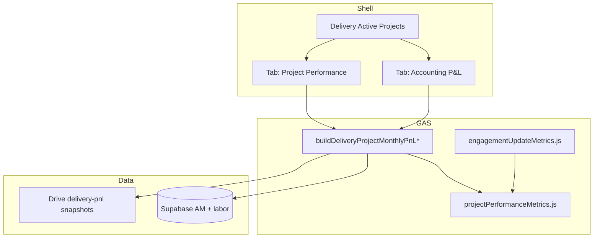

# Implementation plan: Feature 040 - Project Performance layer

> **Feature spec:** [040-project-performance-layer.md](040-project-performance-layer.md)  
> **Status:** Implemented in `src/` (**v3.6.0**)  
> **Feature ID:** **040**  
> **Task list:** Delivery  
> **Ship type:** Enhancement (single MINOR **3.6.0**; one Teamwork release)  
> **Depends on:** Delivery P&L (**006**); allocation overlays (**019** / **024**); person hours modal (**v3.4.11+**); Mobile (**029**); Supabase (**036**); Engagement Update metrics (**037**)  
> **Source feedback:** Performance Hub Requested Changes 2026-08-04  

## Summary

| Item | Choice |
| --- | --- |
| **Product** | Add **Project Performance** beside **Accounting P&L** on the Delivery selected-project card |
| **Default tab** | CE → Performance; Finance → Accounting; else last-used / Accounting |
| **Projected margin** | **Project-level** projected margin (actuals + remaining plan) to smooth lumpy milestones |
| **EAC $** | Labor + expenses/ODC actuals to date + remaining planned cost |
| **Timing badge** | Period GP &lt; 0 **and** revenue planned later (no $ floor) |
| **Formulas** | Shared module with **037** |
| **Data** | Extend Delivery P&L JSON; bump `DELIVERY_PNL_CACHE_SCHEMA_VERSION_` |
| **Persistence** | No new Supabase tables |
| **Access** | Same as Delivery; Engagement Review CTA gated by **037** access |
| **Ship** | **One** Feature **040**, **one** release task, R1–R4 in one MINOR |
| **Mobile** | Same release |
| **Out of scope** | Percentage-of-completion accounting; Clockify SOW ops follow-ups |

## Goals / non-goals

| In scope | Out of scope |
| --- | --- |
| Planned + projected margin KPIs | Full PoC revenue layer |
| Timing / engagement-review badge | Auto-create Engagement Reviews |
| EAC hours and dollars | New Delivery nav route |
| Hours view + lifetime hours per resource | Changing list filters (already exist) |
| Shared metrics with **037** | Divergent one-off formulas per surface |
| Cache / snapshot alignment | Portfolio-wide Performance rollup (follow-on) |

## Recommended release strategy

**One Feature ID 040, one Teamwork release, one MINOR ship** covering all build slices below.

| Slice | Scope | User-visible outcome | Est. effort |
| --- | --- | --- | --- |
| **R1 - Margin + flag** | Shared metrics extract; `performance` on P&L payload; Planned + **project** Projected margin; timing badge | CSMs see plan context for timing anomalies | M |
| **R2 - Hours** | $ / Hours toggle; `resourcesLifetime[]`; Performance resource table | Hours sit beside dollars; lifetime burn visible | S–M |
| **R3 - EAC** | EAC hours + EAC $ (labor + expenses/ODC) | Forward-looking completion view | S |
| **R4 - Tab UX** | Hard tab split; CE/Finance defaults; Engagement Review CTA | Accounting vs performance split | S |

Build in R1→R4 order; do not open separate release tasks per slice.

## Architecture



### Shared metrics module

Extract from `src/engagementUpdateMetrics.js` (keep thin wrappers for **037**):

| Function | Responsibility |
| --- | --- |
| `ppPlannedMarginPct_(agreementCtx)` | Target margin |
| `ppRemainingPlanHoursCost_(months, allocations, asOfMonthKey)` | Remaining planned hours/cost after as-of |
| `ppEacHours_(actualToDate, remaining, budgeted)` | EAC hours block |
| `ppEacDollars_(laborToDate, expensesToDate, remainingPlanCost, budgeted)` | EAC $ = labor + expenses/ODC + remaining plan (+ variance %) |
| `ppProjectedMargin_(revenueToDate, remainingRev, costToDate, remainingCost)` | **Project-level** projected margin % / $ (smoothing) |
| `ppTimingReviewFlag_(periodGp, remainingPlannedRevenue, opts)` | Badge: period GP &lt; 0 and later planned revenue |
| `ppResourcesLifetime_(months, assignments)` | Lifetime hours/cost per person |

**As-of month:** Delivery Live uses **current calendar month** (or last month with data). Engagement Update continues to pass **reporting period**.

### Payload extension

Attach on existing P&L success payload:

```js
performance: {
  asOfMonthKey: 'YYYY-MM',
  plannedMarginPct: number|null,
  projectedMarginPct: number|null,
  projectedGrossProfit: number|null,
  actualMarginPctToDate: number|null,
  eacHours: { value, budgeted },
  eacDollars: { value, budgeted, variancePct },
  timingReview: { recommended, reasonCode, message },
  resourcesLifetime: [ /* ... */ ]
}
```

Bump **`DELIVERY_PNL_CACHE_SCHEMA_VERSION_`** (server) and client `_vN` / schema constant in `DashboardShell.html`. Confirm `dashboardSnapshotJob.js` still calls the shared builder (**009**).

### Client UI

| Area | Work |
| --- | --- |
| Toolbar | Tabs `Accounting P&L` / `Project Performance`; persist last tab in `sessionStorage` key e.g. `fos_delivery_pnl_view_v1` |
| Performance panel | KPI chips; timing badge; hours toggle; resource table/cards |
| Accounting panel | Existing table/chart/modals unchanged |
| Mobile | Tab targets ≥ 44px; KPI 2-col; resource cards; optional sheet for view mode |
| Activity | Whitelist new events in `userActivityLog.js` |

### Engagement Review CTA

When `timingReview.recommended` and `canAccessEngagementReview_`:

- Button: **Open Engagement review** → navigate to `engagement-review` (prefill agreement id in query/state if **037** already supports deep link; otherwise navigate to list with toast "Create an Engagement Update for {project}").

Do not auto-create reviews in v1.

## Formula notes (implementer contract)

Locked 2026-08-10:

1. **Planned margin %** = `agreement.targetMargin` (already percent-scaled in builders).
2. **Projected margin %** = **project-level**  
   `(revToDate + remainingPlannedRev - costToDate - remainingPlannedCost) / (revToDate + remainingPlannedRev)`  
   when denominator &gt; 0. Use this project margin to smooth lumpy invoice timing; do not substitute single-month margin as the primary Performance KPI.
3. **EAC hours** = actual hours with `monthKey <= asOf` + planned allocation hours for `monthKey > asOf`; budgeted = sum allocation hours.
4. **EAC dollars** = `(labor actuals + expenses/ODC actuals) to date` + remaining planned allocation cost (+ remaining planned ODC when on the P&L). Budgeted = planned labor (allocations) + planned expenses/ODC when available. **Not labor-only.** Align **037** snapshot EAC $ to this definition when extracting the shared module.
5. **Timing flag** = as-of month `grossProfit < 0` **AND** sum of planned/projected revenue for months after as-of **> 0**. No absolute $ floor. Copy should say revenue is planned later / timing.

## Client default tab

```text
if sessionStorage has fos_delivery_pnl_view_v1 → use it
else if team is CLIENT-ENGAGEMENT → Project Performance
else if team is FINANCE → Accounting P&L
else → Accounting P&L
```

Persist on every tab change.

## File touch list (expected)

| File | Change |
| --- | --- |
| `src/projectPerformanceMetrics.js` | **New** shared builders |
| `src/engagementUpdateMetrics.js` | Call shared builders |
| `src/deliveryDashboard.js` / `src/supabasePanelBuilders.js` | Attach `performance` |
| `src/DashboardShell.html` | Tabs, Performance UI, mobile, activity |
| `src/userActivityLog.js` | Whitelist events |
| `docs/features/009-...` | Note payload fields if dataset contract docs mention P&L shape |
| `docs/FOS-Dashboard-PRD.md` | FR/AC + version at ship |
| All `src/*` headers | Version sweep at ship |

## Test plan

| # | Case | Expect |
| --- | --- | --- |
| 1 | Project with target margin + allocations | Planned, projected, EAC populated |
| 2 | Timing: neg GP + later revenue | Badge on |
| 2b | Timing: neg GP + no later revenue | Badge off |
| 3 | No allocations | Graceful N/A / actuals-only EAC |
| 4 | EAC $ components | Includes labor + expenses/ODC |
| 5 | Lifetime hours | Sum equals Σ month modal person hours |
| 6 | CE vs Finance default tab | Performance vs Accounting |
| 7 | Schema bump | Old session cache ignored |
| 8 | Snapshot mode | Performance renders offline |
| 9 | Mobile 390px | Tabs + KPIs usable |
| 10 | Regression | Chart, month modal, orange rows, assignments modal |

## Risks

| Risk | Mitigation |
| --- | --- |
| Remaining planned revenue hard to derive | Prefer projected P&L months + contract remaining; document edge N/A only when both missing |
| **037** EAC $ was labor-leaning | Shared module updates both surfaces in the same ship |
| Tab clutter on Accounting users | Finance default Accounting; session persistence |
| Payload size | Cap `resourcesLifetime` fields; defer optional series if needed |

## Teamwork intake

1. Create Teamwork notebook from the RD (Feature **040**).
2. Create **one** release task `Feature 040 - Project Performance layer` on **Delivery**; link notebook.
3. Set Feature ID **040**, Release Type **Enhancement**; move to **Spec Draft**.
4. Customer review → **Spec Approved** → sync notebook to `docs/features/040-*.md` before coding.
5. At ship: bump `FOS_PRD_VERSION`, rename task to `vX.Y.Z - ...`, run ship helpers per workflow.

## Open decisions checklist

*(None. Locked 2026-08-10.)*

- [x] Default tab by role (CE Performance / Finance Accounting)
- [x] Project-level projected margin for smoothing
- [x] EAC $ = labor + expenses/ODC
- [x] Timing badge = negative period GP with later planned revenue
- [x] One Feature / one ship

## Changelog (plan doc)

| Date | Note |
| --- | --- |
| 2026-08-10 | Initial Spec Draft plan from Aug 4 feedback. |
| 2026-08-10 | Locked product decisions; single-ship R1–R4. |
