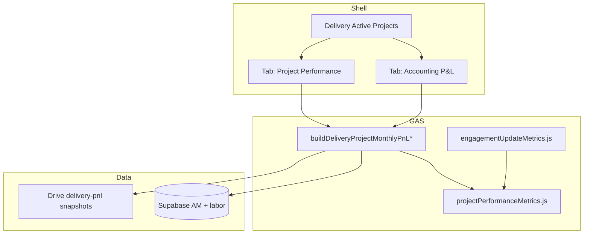

# Implementation plan: Feature 040 - Project Performance layer

> **Feature spec:** [040-project-performance-layer.md](040-project-performance-layer.md)  
> **Status:** Shipped (**v3.6.0**; patched through **v3.8.2**). R1-R6 in product.  
> **Feature ID:** **040**  
> **Task list:** Delivery  
> **Ship type:** Enhancement (single MINOR **3.6.0**; one Teamwork release; patches through **v3.8.2**)  
> **Depends on:** Delivery P&L (**006**); allocation overlays (**019** / **024**); person hours modal (**v3.4.11+**); Mobile (**029**); Supabase (**036**); Engagement Update metrics (**037**)  
> **Source feedback:** Performance Hub Requested Changes 2026-08-04  
> **Teamwork notebook:** [Feature 040 - Implementation plan (Project Performance)](https://win.godeap.io/app/projects/1615262/notebooks/313387)  
> **Feature notebook:** [Feature 040 - Project Performance layer](https://win.godeap.io/app/projects/1615262/notebooks/313386)  
> **Release task:** [v3.6.0 - Project Performance layer](https://win.godeap.io/app/tasks/40848294)

## Summary

| Item | Choice |
| --- | --- |
| **Product** | Add **Project Performance** beside **Accounting P&L** on the Delivery selected-project card |
| **Default tab** | CE → Performance; Finance → Accounting; else last-used / Accounting |
| **Projected margin** | **Project-level** projected margin (actuals + remaining plan) to smooth lumpy milestones |
| **EAC $** | Labor + expenses/ODC actuals to date + remaining planned cost |
| **Timing badge** | Period GP &lt; 0 **and** revenue planned later (no $ floor) |
| **Formulas** | Shared module with **037** |
| **Data** | Extend Delivery P&L JSON; bump `DELIVERY_PNL_CACHE_SCHEMA_VERSION_` |
| **Persistence** | No new Supabase tables |
| **Access** | Same as Delivery; Engagement Review CTA gated by **037** access |
| **Ship** | **One** Feature **040**, **one** release task, R1–R4 in one MINOR |
| **Mobile** | Same release |
| **Out of scope** | Percentage-of-completion accounting; Clockify SOW ops follow-ups |

## Goals / non-goals

| In scope | Out of scope |
| --- | --- |
| Planned + projected margin KPIs | Full PoC revenue layer |
| Timing / engagement-review badge | Auto-create Engagement Reviews |
| EAC hours and dollars | New Delivery nav route |
| Hours view + lifetime hours per resource | Changing list filters (already exist) |
| Shared metrics with **037** | Divergent one-off formulas per surface |
| Cache / snapshot alignment | Portfolio-wide Performance rollup (follow-on) |

## Recommended release strategy

**One Feature ID 040, one Teamwork release, one MINOR ship** covering all build slices below.

| Slice | Scope | User-visible outcome | Est. effort |
| --- | --- | --- | --- |
| **R1 - Margin + flag** | Shared metrics extract; `performance` on P&L payload; Planned + **project** Projected margin; timing badge | CSMs see plan context for timing anomalies | M |
| **R2 - Hours** | $ / Hours toggle; `resourcesLifetime[]`; Performance resource table | Hours sit beside dollars; lifetime burn visible | S–M |
| **R3 - EAC** | EAC hours + EAC $ (labor + expenses/ODC) | Forward-looking completion view | S |
| **R4 - Tab UX** | Hard tab split; CE/Finance defaults; Engagement Review CTA | Accounting vs performance split | S |
| **R5 - Variances, tooltips, CSV** | Allocated cost + hours/cost variance columns; KPI formula tooltips; Performance Copy CSV | PMs see plan vs actual $ and hours; can explain KPIs and paste the table | S |

Build R1→R4 first (shipped). **R5** is a follow-on PATCH. Do not open a new Feature ID.

## Architecture



### Shared metrics module

Extract from `src/engagementUpdateMetrics.js` (keep thin wrappers for **037**):

| Function | Responsibility |
| --- | --- |
| `ppPlannedMarginPct_(agreementCtx)` | Target margin |
| `ppRemainingPlanHoursCost_(months, allocations, asOfMonthKey)` | Remaining planned hours/cost after as-of |
| `ppEacHours_(actualToDate, remaining, budgeted)` | EAC hours block |
| `ppEacDollars_(laborToDate, expensesToDate, remainingPlanCost, budgeted)` | EAC $ = labor + expenses/ODC + remaining plan (+ variance %) |
| `ppProjectedMargin_(revenueToDate, remainingRev, costToDate, remainingCost)` | **Project-level** projected margin % / $ (smoothing) |
| `ppTimingReviewFlag_(periodGp, remainingPlannedRevenue, opts)` | Badge: period GP &lt; 0 and later planned revenue |
| `ppResourcesLifetime_(months, assignments)` | Lifetime hours/cost per person |

**As-of month:** Delivery Live uses **current calendar month** (or last month with data). Engagement Update continues to pass **reporting period**.

### Payload extension

Attach on existing P&L success payload:

```js
performance: {
  asOfMonthKey: 'YYYY-MM',
  plannedMarginPct: number|null,
  projectedMarginPct: number|null,
  projectedGrossProfit: number|null,
  actualMarginPctToDate: number|null,
  eacHours: { value, budgeted },
  eacDollars: { value, budgeted, variancePct },
  timingReview: { recommended, reasonCode, message },
  resourcesLifetime: [ /* ... */ ]
}
```

Bump **`DELIVERY_PNL_CACHE_SCHEMA_VERSION_`** (server) and client `_vN` / schema constant in `DashboardShell.html`. Confirm `dashboardSnapshotJob.js` still calls the shared builder (**009**).

### Client UI

| Area | Work |
| --- | --- |
| Toolbar | Tabs `Accounting P&L` / `Project Performance`; persist last tab in `sessionStorage` key e.g. `fos_delivery_pnl_view_v1` |
| Performance panel | KPI chips; date range; timing badge; resource table/cards |
| Accounting panel | Existing table/chart/modals unchanged |
| Mobile | Tab targets ≥ 44px; KPI 2-col; resource cards; optional sheet for view mode |
| Activity | Whitelist new events in `userActivityLog.js` |

### Engagement Review CTA

When `timingReview.recommended` and `canAccessEngagementReview_`:

- Button: **Open Engagement review** → navigate to `engagement-review` (prefill agreement id in query/state if **037** already supports deep link; otherwise navigate to list with toast "Create an Engagement Update for {project}").

Do not auto-create reviews in v1.

## Formula notes (implementer contract)

Locked 2026-08-10:

1. **Planned margin %** = `agreement.targetMargin` (already percent-scaled in builders).
2. **Projected margin %** = **project-level**  
   `(revToDate + remainingPlannedRev - costToDate - remainingPlannedCost) / (revToDate + remainingPlannedRev)`  
   when denominator &gt; 0. Use this project margin to smooth lumpy invoice timing; do not substitute single-month margin as the primary Performance KPI.
3. **EAC hours** = actual hours with `monthKey <= asOf` + planned allocation hours for `monthKey > asOf`; budgeted = sum allocation hours.
4. **EAC dollars** = `(labor actuals + expenses/ODC actuals) to date` + remaining planned allocation cost (+ remaining planned ODC when on the P&L). Budgeted = planned labor (allocations) + planned expenses/ODC when available. **Not labor-only.** Align **037** snapshot EAC $ to this definition when extracting the shared module.
5. **Timing flag** = as-of month `grossProfit < 0` **AND** sum of planned/projected revenue for months after as-of **> 0**. No absolute $ floor. Copy should say revenue is planned later / timing.

## Client default tab

```text
if sessionStorage has fos_delivery_pnl_view_v1 → use it
else if team is CLIENT-ENGAGEMENT → Project Performance
else if team is FINANCE → Accounting P&L
else → Accounting P&L
```

Persist on every tab change.

## File touch list (expected)

| File | Change |
| --- | --- |
| `src/projectPerformanceMetrics.js` | **New** shared builders |
| `src/engagementUpdateMetrics.js` | Call shared builders |
| `src/deliveryDashboard.js` / `src/supabasePanelBuilders.js` | Attach `performance` |
| `src/DashboardShell.html` | Tabs, Performance UI, mobile, activity |
| `src/userActivityLog.js` | Whitelist events |
| `docs/features/009-...` | Note payload fields if dataset contract docs mention P&L shape |
| `docs/FOS-Dashboard-PRD.md` | FR/AC + version at ship |
| All `src/*` headers | Version sweep at ship |

## Test plan

| # | Case | Expect |
| --- | --- | --- |
| 1 | Project with target margin + allocations | Planned, projected, EAC populated |
| 2 | Timing: neg GP + later revenue | Badge on |
| 2b | Timing: neg GP + no later revenue | Badge off |
| 3 | No allocations | Graceful N/A / actuals-only EAC |
| 4 | EAC $ components | Includes labor + expenses/ODC |
| 5 | Lifetime hours | Sum equals Σ month modal person hours |
| 6 | CE vs Finance default tab | Performance vs Accounting |
| 7 | Schema bump | Old session cache ignored |
| 8 | Snapshot mode | Performance renders offline |
| 9 | Mobile 390px | Tabs + KPIs usable |
| 10 | Regression | Chart, month modal, orange rows, assignments modal |

## Risks

| Risk | Mitigation |
| --- | --- |
| Remaining planned revenue hard to derive | Prefer projected P&L months + contract remaining; document edge N/A only when both missing |
| **037** EAC $ was labor-leaning | Shared module updates both surfaces in the same ship |
| Tab clutter on Accounting users | Finance default Accounting; session persistence |
| Payload size | Cap `resourcesLifetime` fields; defer optional series if needed |

## Teamwork intake

1. Create Teamwork notebook from the RD (Feature **040**).
2. Create **one** release task `Feature 040 - Project Performance layer` on **Delivery**; link notebook.
3. Set Feature ID **040**, Release Type **Enhancement**; move to **Spec Draft**.
4. Customer review → **Spec Approved** → sync notebook to `docs/features/040-*.md` before coding.
5. At ship: bump `FOS_PRD_VERSION`, rename task to `vX.Y.Z - ...`, run ship helpers per workflow.

## Open decisions checklist

*(None. Locked 2026-08-10.)*

- [x] Default tab by role (CE Performance / Finance Accounting)
- [x] Project-level projected margin for smoothing
- [x] EAC $ = labor + expenses/ODC
- [x] Timing badge = negative period GP with later planned revenue
- [x] One Feature / one ship
- [x] **R5:** Hours variance = logged - allocated; cost variance $ = logged cost - allocated cost
- [x] **R5:** KPI tooltips on project-summary and Performance chips
- [x] **R5:** Performance Copy CSV of visible table rows

## R5 implementation plan (follow-on PATCH)

> **Spec:** Feature 040 Change request 2026-08-19 (allocated cost, variances, KPI tooltips, Performance Copy CSV).
> **Ship:** PATCH after **v3.7.5** (version chosen at ship, not intake).
> **Surface:** `#panel-pm-overview` Project Performance tab plus project-summary KPI strip.

### Problem

The resource table shows allocated hours, logged hours, and **logged** cost only. PMs cannot see allocated cost or plan-vs-actual variance without the month modal. KPI chips have short sublabels but not a full formula on hover. Accounting P&amp;L already has Copy CSV; Performance does not.

### Locked formulas

```text
hoursVariance  = loggedHours  - allocatedHours
costVariance$  = loggedCost   - allocatedCost
```

Positive = over plan. Missing allocated cost/hours treat allocated as 0 (variance = logged).

**Allocated cost source**

| Date range | Source |
| --- | --- |
| All time | `performance.resourcesLifetime[].allocatedCostLife` (already built from Fibery assignments in `ppBuildResourcesLifetime_`) |
| Custom months | Sum month-prorated **allocated cost** on `laborByPerson` (same join as allocated hours). Today `laborByPerson` has `allocatedHours` but not `allocatedCost`. |

### Work items

| ID | Work | Files |
| --- | --- | --- |
| R5.1 | When enriching `laborByPerson` with allocations, add month-prorated `allocatedCost` next to `allocatedHours` (use existing assignment `allocatedCost` / role agg). Include allocated-only people. | `src/deliveryDashboard.js` |
| R5.2 | Confirm `ppBuildResourcesLifetime_` still fills `allocatedCostLife` from assignments. Variances may be client-derived. | `src/projectPerformanceMetrics.js` |
| R5.3 | Payload shape change (`laborByPerson.allocatedCost`) requires **`DELIVERY_PNL_CACHE_SCHEMA_VERSION_`** 15 → **16** (server, `DashboardShell.html`, snapshot map). | `deliveryDashboard.js`, `DashboardShell.html`, `dashboardSnapshotStore.js` |
| R5.4 | Table columns: Name, Role, Allocated hrs, Logged hrs, Hours variance, Allocated cost, Logged cost, Cost variance $. Hours via `formatHours`; money via `formatExpense_`; over-plan variance prefixed `+` or existing negative helper. | `DashboardShell.html` |
| R5.5 | Date-range builder `buildDeliveryPerfResourcesFromMonths_` / `ensureDeliveryPerfResourceRow_`: accumulate allocated cost from `p.allocatedCost` using the same max-within-month then sum-across-months pattern as hours. | `DashboardShell.html` |
| R5.6 | Mobile cards: allocated cost, hours variance, cost variance $ under existing lines. | `DashboardShell.html` |
| R5.7 | KPI tooltips: native `title` plus `aria-describedby` on visually hidden formula text so mobile focus works. Project-summary chips and Performance chips. Copy from the RD tooltip table. Skip Status update chip. | `DashboardShell.html` |
| R5.8 | Copy CSV: keep `#delivery-pnl-csv-btn` visible on both tabs (remove `fos-delivery-accounting-only` from that button only). Performance serializes visible resource rows (date filter applied). Reuse `writeTextToClipboard_` / `flashDeliveryCsvStatus_`. Activity `delivery_pnl_perf_copy_csv`. Accounting stays `delivery_pnl_copy_csv`. | `DashboardShell.html`, `src/userActivityLog.js` |
| R5.9 | At ship: extend PRD **FR-137** / **AC-99**; PATCH changelog; `src/*` header sweep; feature 009 if schema bump; overview shipped line. | docs |

### Client helpers

```js
function perfHoursVariance_(row) {
  return Number(row.loggedHoursLife || 0) - Number(row.allocatedHoursLife || 0);
}
function perfCostVariance_(row) {
  return Number(row.loggedCostLife || 0) - Number(row.allocatedCostLife || 0);
}
```

CSV headers (stable): `Name,Role,Allocated hrs,Logged hrs,Hours variance,Allocated cost,Logged cost,Cost variance $`

Numeric cells: two-decimal hours and dollars (same as Accounting CSV), unformatted so paste is sortable.

### Month-prorate allocated cost (R5.1)

Reuse the hours prorate already on role aggregates. Assignment rows have `allocatedHours` and `allocatedCost`. Carry **cost** the same way as hours (chart allocation line already uses this cost). Do not invent a blended Clockify rate.

If a month has allocated hours but zero allocated cost, show **$0** allocated cost.

### Cache / snapshots

- New `laborByPerson.allocatedCost` → schema **16**.
- Older snapshots: date-range allocated cost and cost variance fall back to 0; all-time still uses `allocatedCostLife` when present. Do not hide the Performance tab.
- Confirm `dashboardSnapshotJob.js` still calls `buildDeliveryProjectMonthlyPnLInternal_`.

### Mobile

Same PR as desktop R5. Cards required. Copy CSV in toolbar (≥ 44px). KPI explanations via focus, not hover-only.

### Test plan (R5)

| # | Case | Expect |
| --- | --- | --- |
| 1 | Person with allocation + logged time (all time) | Allocated cost matches assignment; variances = logged - allocated |
| 2 | Logged with no allocation (orange) | Allocated hrs/cost 0; variances = logged amounts |
| 3 | Custom date range | Hours, allocated cost, and variances follow selected months only |
| 4 | KPI hover/focus | Each summary + Performance chip shows locked formula text |
| 5 | Copy CSV Performance | Clipboard matches visible table including new columns |
| 6 | Copy CSV Accounting | Unchanged monthly P&amp;L CSV |
| 7 | Empty resources | Nothing to copy; no throw |
| 8 | Mobile 390px | Cards show new fields; Copy CSV + KPI focus work |
| 9 | Schema 16 | Old session P&amp;L cache ignored |
| 10 | Snapshot pre-16 | Tab still renders; missing allocatedCost treated as 0 on filtered rows |

### Risks

| Risk | Mitigation |
| --- | --- |
| Date-range allocated cost uses lifetime assignment totals | Keep the same aggregation as allocated hours |
| Wide table | Existing `.fos-financial-scroll`; mobile cards required |
| Dual-mode Copy CSV | Branch on `deliveryState.cardMode`; never mix month-grid rows into Performance CSV |

### Effort

Small (S): mostly `DashboardShell.html` plus `laborByPerson` enrich and schema bump.

## Changelog (plan doc)

| Date | Note |
| --- | --- |
| 2026-08-10 | Initial Spec Draft plan from Aug 4 feedback. |
| 2026-08-10 | Locked product decisions; single-ship R1–R4. |
| 2026-08-19 | **R5** shipped **v3.7.6**: allocated cost + variances, KPI formula tooltips, Performance Copy CSV. |
