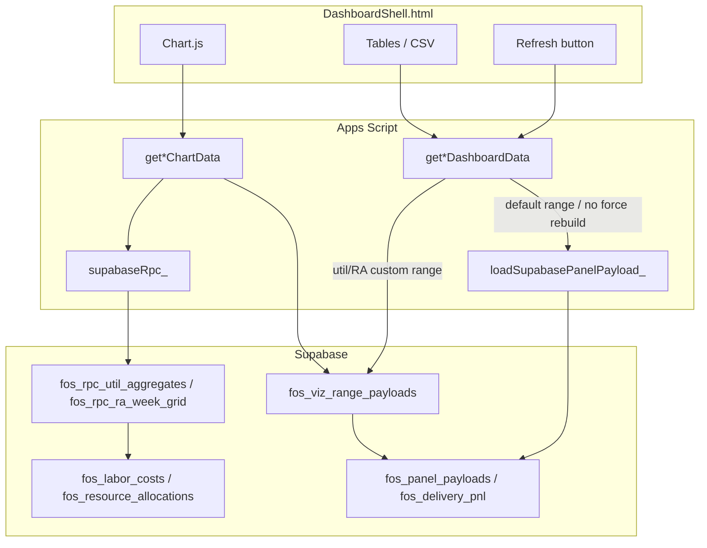

# Implementation plan: Feature 044 - Live visualization serve performance

> **Status:** **SUPERSEDED** by [047 implementation plan](047-dashboard-performance-and-responsiveness-implementation-plan.md) on 2026-08-24. Never implemented. Kept for history; do not implement from this document.  
> **PRD version:** 3.8.0  
> **Feature spec:** [044-live-visualization-serve-performance.md](044-live-visualization-serve-performance.md)  
> **Parent patterns:** [036 Supabase data layer](036-supabase-dashboard-data-layer.md), [034 warm cache](034-live-dashboard-warm-cache-and-portfolio-batching.md), [005 Utilization](005-utilization-management-dashboard.md), [027 Resource assignments](027-resource-assignment-dashboard.md)  
> **PRD:** Add **FR-141** / **AC-102** at ship (extend FR-120 labels; version chosen at deploy).
> **Teamwork notebook:** [Feature 044 - Implementation plan (Live viz serve)](https://win.godeap.io/app/projects/1615262/notebooks/313367)  
> **Feature notebook:** [Feature 044 - Live visualization serve performance](https://win.godeap.io/app/projects/1615262/notebooks/313366)  
> **Release task:** [Feature 044 - Live visualization serve performance](https://win.godeap.io/app/tasks/40839335)

## Summary

Five workstreams that match the product spec. Ship **A-C** together as the first Enhancement; include **D** in that release if the cache table is ready. **E** is a later release on the same feature id.

| Phase | User outcome | Primary reuse |
| --- | --- | --- |
| **A** Utilization + RA RPCs | Date-range viz without paging facts in GAS | `supabaseRpc_`, `fos_labor_costs`, `fos_resource_allocations` |
| **B** Slim chart endpoints | Chart.js paints from tens of KB | Existing `data.charts` / `aggregates` shapes |
| **C** Refresh = blob re-read | Reload does not rebuild AM typed panels | `loadSupabasePanelPayload_`, `serveLivePanelFromSupabaseOrFail_` |
| **D** Range-keyed cache | Second From/To hit is one-row PostgREST | New `fos_viz_range_payloads` |
| **E** Browser-direct charts | Skip GAS hop for slim reads | Follow-on: RLS + short-lived token |

Recommended code order: **A → D (table + watermark) → B → C**. D's table can land with A so Utilization/RA writes cache on first RPC. C is independent and small; do not ship C alone without A for Operations panels (Refresh on Utilization would still be slow).

## Goals / non-goals

| In scope (A-D) | Out of scope (first ship) |
| --- | --- |
| SQL RPCs for util aggregates + RA week grid | Changing KPI formulas |
| Slim `google.script.run` APIs for charts | Parallel full-panel `google.script.run` |
| Refresh re-read of `fos_panel_payloads` / `fos_delivery_pnl` | Fibery Live fallback |
| Range cache invalidate on Pull / labor watermark | Expenses → Datastore |
| `_diag_` RPC vs cache vs rebuild | Historical snapshots in Postgres |
| Mobile same-release timing (slim-first) | IndexedDB required (optional stretch) |
|  | Phase E browser keys (follow-on) |
|  | CacheService as full-payload store (100 KB/key too small for tables) |

## Architecture

**Serve rules (Live):**

1. If range cache hit and watermark current: return cached JSON.
2. Else if panel is date-agnostic (Agreements, Pipeline, ...): return `fos_panel_payloads` blob.
3. Else: RPC → optional upsert range cache → return.
4. Refresh never means Fibery. Refresh + schema miss may typed-rebuild (C).

## Phase A - Utilization and Resource assignment RPCs

### A1. Migration `046_viz_serve_rpcs.sql` (number if 046 is taken: next free)

Idempotent. `security definer` functions owned by postgres; `grant execute` to `service_role` only for first ship (anon execute is Phase E).

**`fos_rpc_util_aggregates(p_start date, p_end date)`**  
Returns `jsonb` matching the client aggregates Chart.js already consumes (names aligned to `aggregates` in `fiberyUtilizationDashboard.js`):

- `byWeek[]`: `{ weekStart, hours, billableHours, cost }`
- `byCustomer[]`, `byProject[]`, `byPerson[]`: `{ name, hours, billableHours, cost }` with Top-N applied in SQL or a `p_top_n` arg (default from current thresholds)
- `byRole[]`: donut slices
- `kpis`: hours, cost, billablePct, unique persons/projects as today
- `partial`: boolean if a statement timeout or cap tripped

Source: `fos_labor_costs` (Clockify hub mirror), **not** `fos_am_labor_costs`. Honor the same work-status / exclusion rules as `buildUtilizationPayloadFromFosLaborCosts_` (document any rule that cannot be expressed in SQL in a follow-on; do not silently drop exclusions).

**`fos_rpc_ra_week_grid(p_start date, p_end date)`**  
Returns jsonb:

- allocations overlapping `[p_start, p_end]` (SQL range overlap on `duration_start` / `duration_end`)
- joined person / project / customer / role **display fields only** (no full dim table dumps)
- optional actual hours by project-week from `fos_labor_costs` in the same window (today's `aggregateResourceAssignmentLaborByProjectFromSupabase_`)

Prefer computing ISO week buckets in SQL (`date_trunc` / `to_char` ISO) so GAS does not explode every allocation into days.

### A2. GAS wrappers

| Helper | File | Role |
| --- | --- | --- |
| `rpcUtilAggregates_(startIso, endIso)` | `supabasePanelBuilders.js` or new `src/supabaseVizRpc.js` | `supabaseRpc_('fos_rpc_util_aggregates', { p_start, p_end })` |
| `rpcRaWeekGrid_(startYmd, endYmd)` | same | RA RPC |
| `buildUtilizationPayloadFromRpc_(range, thresholds, now)` | `fiberyUtilizationDashboard.js` | Map RPC jsonb onto existing payload envelope (`ok`, `cacheSchemaVersion`, `range`, `aggregates`, `kpis`, `dimensions` stubs) |
| `buildResourceAssignmentDashboardPayloadFromRpc_(...)` | `resourceAssignmentDashboard.js` / panel builders | Map to persons/projects/weeks shape |

`getUtilizationDashboardData` / `getResourceAssignmentDashboardData`: prefer RPC (or Phase D cache) **before** `buildUtilizationPayloadFromFosLaborCosts_` / `supabaseSelectAll_` on allocations.

Keep the old GAS aggregators as **`_diag_utilBuildFromFacts_`** / fallback only if RPC returns `ok: false` **and** a Script Property `VIZ_RPC_FALLBACK_FACTS=true` (default **false** so we do not hide RPC failures in prod).

### A3. Golden compare

Add `_diag_compareUtilRpcVsFacts_(start, end)` and `_diag_compareRaRpcVsFacts_(start, end)` that run both paths and return max abs hour delta. Exit criterion: delta **&lt; 0.05h** (or documented rounding) on last-90-days staging data.

**Estimate:** 2-3 days SQL + mapping + diag.

## Phase B - Slim chart endpoints

### B1. Payload contracts (do not reuse full panel keys)

New client constants, e.g. `UTIL_CHART_CACHE_SCHEMA_VERSION = 1`.

| API | Returns (conceptually) | Must omit |
| --- | --- | --- |
| `getAgreementChartData()` | `charts` (status/type donuts, recognition stack, customer bar) + `fetchedAt` + Datastore tags | `financialTable`, `revenueItemsByAgreement`, `sankey`, `customerCards`, `forwardPipeline`, `alerts` detail lists if bulky |
| `getUtilizationChartData(rangeStart, rangeEnd)` | `aggregates` + `kpis` + `range` | `rows[]` |
| `getPipelineChartData()` | forecast + vertical chart series | full deal arrays |
| Optional `getDeliveryPnlChartData(agreementId)` | month series for the P&L chart only | status updates, assignment modal dumps |

Auth: same `requireAuthForApi_` / panel gates as the full APIs.

### B2. Client (`DashboardShell.html`)

For Agreements, Utilization, Pipeline (Live only):

1. Show existing loading overlay.
2. `google.script.run` slim API first; `render*Charts` as soon as it returns.
3. Then full `get*DashboardData` for tables/CSV/Ask (sequential after slim success, or start full immediately after firing slim if product accepts overlapping runs **only** for this pair).

**Locked exception to 034:** one slim + one full on the **same** panel is allowed. Do not fire two full panel payloads in parallel.

Mobile: **Show charts** reads slim payload from memory; do not refetch full payload to open charts.

sessionStorage: store slim under distinct keys (`fos_util_charts_v1`) so quota pressure on full blobs does not drop charts.

### B3. Ask AI / activity

FinOps Ask should keep using **full** panel context (existing). Slim APIs are UI-only unless Ask is later pointed at aggregates.

Whitelist `*_chart_load` events only if we add them.

**Estimate:** 1.5-2 days client + server slice.

## Phase C - Refresh re-reads blobs

### C1. Server

| Today | After |
| --- | --- |
| `serveLiveAgreementFamilyOrRebuild_(..., forceRefresh=true)` always typed-rebuilds Agreement **and** Delivery | `forceRefresh` only **re-reads** blob; rebuild iff missing or `cacheSchemaVersion` mismatch |
| `serveLiveDeliveryPnLOrRebuildFull_(..., forceRefresh=true)` always rebuilds | Same: re-read full P&L row; rebuild iff not `isFullDeliveryPnLPayload_` |
| Portfolio / Pipeline / AI Usage `forceRefresh` ignored or blob re-read | Confirm all `get*DashboardData(forceRefresh)` Live paths only `loadSupabasePanelPayload_` |
| Utilization / RA Refresh | Re-read range cache (D) or re-RPC; **not** Fibery; **not** AM typed Agreement rebuild |

Split `rebuildAgreementDeliveryPanelsFromTyped_`: if a schema-miss rebuild is required, rebuild **only the requested** `panelKey` when possible (Delivery list may still need Agreement payload; derive Delivery from Agreement blob without a second AM scan if Agreement blob is schema-current).

### C2. Pull invalidation

`supabaseSyncJob.js` after successful panel hydrate: upsert blobs as today. If D exists, `delete` or watermark-bump `fos_viz_range_payloads` for `utilization` and `resource-assignments`.

### C3. Copy / overlay

Refresh overlay stays **Reloading from Datastore**. Do not imply Fibery. Optional tooltip on the Refresh button (desktop + mobile 44px control).

**Estimate:** 0.5-1 day.

## Phase D - Range-keyed cache

### D1. Table `fos_viz_range_payloads`

| Column | Type | Notes |
| --- | --- | --- |
| `panel_key` | text | `utilization`, `resource-assignments` (extensible) |
| `range_start` | date | Inclusive |
| `range_end` | date | Exclusive or inclusive; **document and match** `resolveRange_` |
| `cache_schema_version` | int | Slim or full envelope version |
| `payload` | jsonb | Full util/RA payload **or** slim-only; pick one per `panel_key` and stick to it (recommend **full** util/RA envelope so tables share the cache; slim API can project fields) |
| `built_at` | timestamptz | |
| `source_watermark` | timestamptz | Copy of labor `max(synced)` / allocation hydrate `synced_at` used to build |
| Primary key | `(panel_key, range_start, range_end, cache_schema_version)` | |

RLS: revoke anon/authenticated; grant service_role only (Phase E revisits).

### D2. Watermark

Helper `fosVizSourceWatermark_(panelKey)`:

- Utilization: `max(fos_labor_costs` updated/synced column if present, else panel `fos_dataset_as_of` for labor)
- RA: `greatest(allocation mirror synced_at, labor watermark)`

Cache hit iff stored `source_watermark` equals current watermark (or `>=` if watermarks are strictly increasing).

### D3. Wire-up

On Live util/RA get:

1. Normalize range (existing clamp).
2. Select cache row; if watermark match, `tagPayloadFromSupabase_` and return.
3. Else RPC (A), upsert cache, return.

Default lookback/lookahead for RA: still a cache key (not a magic blob-only path). Hydrate job MAY pre-warm that default key after Pull.

**Estimate:** 1-1.5 days.

## Phase E - Browser-direct chart reads (follow-on)

Do **not** implement in the first 044 release.

### E1. Security design (required before code)

- New Supabase role or `anon` policies that **only** `execute` `fos_rpc_util_aggregates` / `fos_rpc_ra_week_grid` / chart RPCs. **No** `select` on `fos_labor_costs`, `fos_panel_payloads`, or AM tables.
- Apps Script mints a **short-lived JWT** (or returns a scoped `supabase.auth` session) via `getDashboardVizReadToken()` after `requireAuthForApi_`. Token TTL minutes, not hours.
- Never embed `SUPABASE_SERVICE_ROLE_KEY` in HtmlService.

### E2. Client

`fetch(SUPABASE_URL/rest/v1/rpc/...)` with the minted token for slim charts. On 401/403, fall back to GAS `get*ChartData`.

### E3. Threats

- Token theft: short TTL + panel-gate claims in JWT if using a custom signer.
- RPC data leak: functions must not take unbounded ranges (reuse RA 52-week and util clamp).
- CORS: Supabase project allowlist for the Web App origin.

**Estimate:** 2-3 days after security review.

## Files (A-D)

| File | Phase |
| --- | --- |
| `supabase/migrations/046_viz_serve_rpcs.sql` (name at implement) | A, D |
| `docs/supabase-data-model.md` | A, D |
| `src/supabaseVizRpc.js` (new, optional) | A, B, D |
| `src/supabaseClient.js` | A: drop `count=exact` on single-row blob reads (small win) |
| `src/fiberyUtilizationDashboard.js` | A, B, C, D |
| `src/resourceAssignmentDashboard.js` | A, C, D |
| `src/supabasePanelBuilders.js` | A, C |
| `src/supabaseDashboard.js` | C |
| `src/fiberyAgreementDashboard.js`, `src/deliveryDashboard.js`, `src/pipelineDashboard.js`, `src/portfolioPnlDashboard.js`, `src/aiUsageDashboard.js` | B and/or C |
| `src/supabaseSyncJob.js` | C, D invalidate |
| `src/DashboardShell.html` | B, C tooltip, mobile Show charts |
| `src/adminSettingsRegistry.js` | Optional `VIZ_RPC_FALLBACK_FACTS` |
| `src/userActivityLog.js` | Only if new events |
| Feature 009 mapping | Only if a new snapshot artifact is added (not planned) |

## Cache / snapshot sync

- Do **not** bump Agreement/Utilization **full** `cacheSchemaVersion` unless `rows` / table JSON changes.
- Slim and range envelopes are **new** versions, independent.
- Snapshot job still writes full `utilization.json` / `resource-assignments.json` from existing builders (or from RPC with default snapshot range). If Live util payload shape for tables is unchanged, 009 stays as-is.
- Client snapshot path must not call slim Live RPCs.

## Admin / diag

| Diag | Purpose |
| --- | --- |
| `_diag_vizRpcHealth_()` | Execute both RPCs on a 7-day window; return ms + row counts |
| `_diag_compareUtilRpcVsFacts_` | Golden delta |
| `_diag_compareRaRpcVsFacts_` | Golden delta |
| `_diag_vizRangeCache_(panel, start, end)` | Hit/miss + watermark |

## Verification (engineering)

1. Apply migration on staging; `grant execute` to service_role.
2. `_diag_compareUtilRpcVsFacts_` last 90 days; `_diag_compareRaRpcVsFacts_` default RA window.
3. Chrome DevTools: slim response size vs full `getUtilizationDashboardData`.
4. Apps Script executions: Refresh Agreement duration vs pre-change (should track blob GET, not AM `selectAll`).
5. Pull then Refresh: `synced_at` moves; range cache empty or rebuilt.
6. Mobile 390px: Operations + Agreements Show charts.
7. Snapshot date: no RPC.

## Implementation checklist

- [ ] Phase A RPCs + GAS switch + golden diag
- [ ] Phase D table + watermark + Pull invalidate
- [ ] Phase B slim APIs + chart-first client (desktop + mobile)
- [ ] Phase C Refresh = re-read
- [ ] Data model doc + admin optional flag
- [ ] Feature spec AC checkboxes
- [ ] Ship: PRD FR-141 / AC-102, version bump, Teamwork

## Changelog

| Date | PRD | Notes |
| --- | --- | --- |
| 2026-08-19 | 3.8.0 | Spec Draft implementation plan for Phases A-E. |
