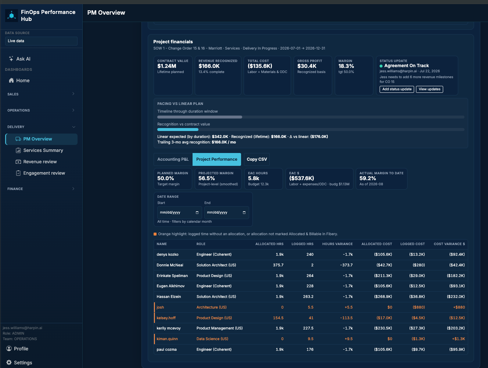

# Feature: PM Overview — resource time-entry drill-down

> **Status:** In development (**v3.9.0**)  
> **PRD version:** **3.9.0** (**FR-142**, **AC-103**)  
> **Feature ID:** **045**  
> **Release type:** Enhancement  
> **Task list:** Delivery  
> **Inbox source:** [Feature Request](https://win.godeap.io/app/tasks/40850291) (form 2026-08-20; requestor **jess.williams@harpin.ai**; priority **High**)  
> **Extends:** [040 — Project Performance layer](040-project-performance-layer.md), month-modal person hours ([006](006-delivery-project-pnl.md) / FR-114), daily cell modal ([042](042-resource-assignments-by-person-variances.md))  
> **Depends on:** PM Overview ([041](041-pm-overview-rebrand.md)), Datastore labor (`fos_labor_costs`, [036](036-supabase-dashboard-data-layer.md)), Mobile shell ([029](029-mobile-shell-phase-ab.md))  
> **Teamwork notebook:** [Feature 045 - PM Overview resource time-entry drill-down](https://win.godeap.io/app/projects/1615262/notebooks/313416)  
> **Release task:** [Feature 045 - PM Overview resource time-entry drill-down](https://win.godeap.io/app/tasks/40857619)
> **Template reference:** `docs/FEATURE_TEMPLATE.md`

---

## Origin / source request

Inbox title: **See time entry data on table in project performance table.**

> As a PM on the PM Overview project performance table, I want to click into a record and see the time entries that go with the summary.
>
> See how Josh = orange? I want to click into his record to see when he logged time against my project and how many hours per day.

Attached screenshot (Marriott SOW 1 / CO 15 & 16): orange rows **josh**, **kelsey.hoff**, **kiman.quinn** on the Project Performance resource table.

---

## Goal

On **PM Overview → Project Performance**, let a PM **click a resource row** (including **orange** unallocated / non-billable people) and see **that person’s logged time on this project, by day**, so they can explain the summary hours/cost without leaving the project or opening Resource assignments.

**Primary audience:** PMs / Client Engagement on a single engagement.

**Non-goals:**

- Editing Clockify or Fibery time from the Hub.
- Portfolio-wide person search (that remains Resource assignments **By person variances**, feature **042**).
- Replacing the Accounting P&L **month** modal (FR-114) — this drill-down is **person × project**, not **all people × one month**.
- Full Clockify task/description dump in v1 (hours + date is the request; description is a follow-on if Jess wants it).

---

## Problem today

| Pain | Today |
| --- | --- |
| Lifetime / range totals hide *when* time landed | Project Performance shows allocated vs logged hours and cost per person, not a daily series |
| Orange people are unexplained | Legend says unallocated or not Allocated & Billable; PM cannot see the days that created the orange row |
| Daily detail lives on another dashboard | Feature **042** daily modal is on Resource assignments, not on the project table Jess is using |

---

## Locked product decisions (review)

| # | Topic | Decision | Review with Jess |
| --- | --- | --- | --- |
| 1 | Surface | **Project Performance** resource table (desktop) and resource **cards** (mobile). Not Accounting P&L. | Confirm |
| 2 | Trigger | Click / tap the **row** (name or any cell). Cursor **pointer**; keyboard: Enter/Space on focused row. | Confirm (vs name-only link) |
| 3 | Overlay | Reuse Hub **modal** pattern (same family as **042** daily cell / **024** assignments). Title: **`{Person} — time on this project`**. | Confirm |
| 4 | Grain | One row per **calendar day** with **hours > 0** in the **active Project Performance date range** (default **all time**). Columns: **Date**, **Hours**, **Cost $** (when cost is on the labor row). Footer **Total hours** (and total cost). Sort date **desc** (newest first). | Confirm newest-first |
| 5 | Orange | Same person, same modal. Banner restates the orange rule (unallocated or not Allocated & Billable). | Confirm |
| 6 | Empty | If the person has **allocated** hours but **0 logged** in range: modal still opens with “No time logged in this date range.” | Confirm |
| 7 | Data | Live: `fos_labor_costs` for the selected agreement + person alias (same person-key rules as **040** / **042**). Snapshot: include a compact `byDay` map on the P&L payload (or a dedicated RPC) so historical mode does not Fibery-round-trip. | Engineering |
| 8 | Payload size | Do **not** ship every day for every person on first P&L load. Prefer **on-demand** fetch for the clicked person (Live) with a small loading state; snapshot may embed days for people already in `resourcesLifetime`. | Engineering |
| 9 | Cache | Bump Delivery P&L `cacheSchemaVersion` if snapshot shape changes. | Engineering |
| 10 | Activity | `delivery_pnl_perf_time_drill` (Route `pm-overview`). | — |
| 11 | Descriptions | Clockify **task / notes** out of scope unless Jess asks in review. | **Ask Jess** |

---

## User stories

- As a **PM**, I want to click **josh** (orange) on Project Performance so I can see **which days** he logged time on this project and **hours per day**.
- As a **PM**, I want the drill-down to respect the **Start / End** date filter so a custom range matches the table totals.
- As a **PM**, I want allocated (white) people to use the same click path so I can audit burn for the whole team.
- As a **mobile user**, I want tapping a resource card to open the same daily list in a full-width sheet/modal (≥ 44px close control).

---

## Acceptance criteria (testable)

- [x] **Given** Project Performance shows a resource row, **when** the user clicks the row, **then** a modal lists that person’s **days with hours** on the selected project within the active date range, with a **total**.
- [x] **Given** an **orange** row (e.g. josh), **when** the modal opens, **then** daily hours still appear and the orange reason is visible in the modal.
- [x] **Given** a custom Start/End range, **when** the modal opens, **then** days outside that range are omitted and the modal total matches the row’s **Logged hrs** for that range (within rounding).
- [x] **Given** all-time range, **when** the modal opens, **then** days span the project’s logged history for that person.
- [x] **Given** a person with allocations and **no** logged time in range, **when** the row is clicked, **then** the modal opens with an empty-state message (no crash).
- [x] **Given** **No Resource Plan Found** (feature **040** R6), **when** the empty plan panel is showing, **then** this drill-down is N/A (no resource rows).
- [x] **Given** Accounting P&L is selected, **when** the user works the month modal, **then** that modal is unchanged (**006** / FR-114).
- [x] **Given** viewport **&lt; 768px**, **when** the user taps a resource card, **then** the daily list is usable (scroll, close, 44px targets); not desktop-table-only.
- [x] Activity `delivery_pnl_perf_time_drill` is whitelisted. Tests / smoke named `AC-103` at ship.

---

## UI notes

- **Desktop:** keep the current resource table; add hover/focus affordance that the row is clickable. Modal: date table + totals; Close / backdrop / Escape.
- **Mobile:** card tap → same content in modal or bottom sheet per **029**.
- Do not add a new sidebar route.

---

## Data model

- Read-only. Source: Datastore **`fos_labor_costs`** (Clockify-owned Hub mirror), joined with the same person-key aliases as Project Performance (so **josh** matches Clockify/Fibery variants).
- Optional payload field on Live on-demand: `{ personKey, days: [{ date, hours, cost }], totalHours, totalCost, orangeReason }`.
- Snapshot: store per-person `byDay` only for people already on the performance table, or document that snapshot drill-down is Live-only — **prefer including days in snapshot** so historical review still works.

## Edge cases

- Person appears twice today (should already be de-duped by **040** v3.7.3); drill-down uses the **row’s person key**, not display-name collision.
- Truncated labor fetch: show warning in modal, do not invent days.
- Cost missing: show hours only; do not display $0 as if confirmed.

## Verification steps

1. Desktop Live: open PM Overview → Marriott (or any project with an orange row) → Project Performance → click **josh** → confirm days and hours.
2. Change Start/End → click again → days match filtered Logged hrs.
3. Click a white allocated row with time → days appear; orange banner absent.
4. Mobile ~390px: tap card → list usable.
5. Snapshot date (if in scope): same person still opens days.

## Implementation checklist

- [x] Jess review of this RD (especially decision 11 - task descriptions)
- [x] Teamwork notebook + `Feature 045 - …` release task → Spec Draft
- [x] Update `docs/FOS-Dashboard-PRD.md` FR/AC at ship
- [x] Mobile in the same release as desktop
- [x] Activity whitelist + smoke

## Change requests

(Post-approval customer edits only; merge into the main body at ship.)
