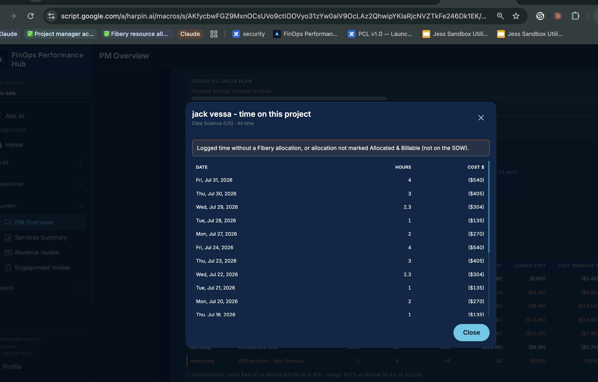

# Feature: PM Overview - resource allocation info on Project Performance drill-down

> **Status:** Spec Approved (Jess review 2026-08-28)  
> **PRD version:** TBD at ship  
> **Feature ID:** **050**  
> **Release type:** Enhancement  
> **Task list:** Delivery  
> **Inbox source:** [PM Overview > Project Performance table: Add resource allocation info on drill down](https://win.godeap.io/app/tasks/40880310) (form 2026-08-25; requestor **jess.williams@harpin.ai**; priority **High**)  
> **Extends:** [045 - PM Overview resource time-entry drill-down](045-pm-overview-resource-time-entries.md), [040 - Project Performance layer](040-project-performance-layer.md), [024 - Delivery P&L resource assignments modal](024-delivery-pnl-resource-assignments-modal.md)  
> **Depends on:** PM Overview ([041](041-pm-overview-rebrand.md)), Mobile shell ([029](029-mobile-shell-phase-ab.md))  
> **Related (not this release):** Hub-wide swap of Clockify user role for SOW role on other surfaces ([40876280](https://win.godeap.io/app/tasks/40876280)); orange daily rows outside allocation duration (nice-to-have below)  
> **Teamwork notebook:** [Feature 050 - PM Overview perf allocation info on Project Performance drill-down](https://win.godeap.io/app/projects/1615262/notebooks/313573)  
> **Release task:** [Feature 050 - PM Overview perf allocation drill-down](https://win.godeap.io/app/tasks/40926974)  
> **Template reference:** `docs/FEATURE_TEMPLATE.md`

---

## Origin / source request

Inbox title: **PM Overview > Project Performance table: Add resource allocation info on drill down**

> As a PM who is looking at the time entries for a resource on the project performance table, I want to see what their allocation was so that I can determine why they are orange.
>
> Show duration, checkbox, allocation percentage, and Role on SOW (if applicable)

Jess noted (2026-08-28) that feature **045** delivered the time-entry drill-down; this inbox item captures the **allocation context** still missing from that modal.

*Inbox attachment (2026-08-24): **jack vessa** on **Marriott SOW 1 / CO 15 & 16** - the **045** modal lists logged days and the orange banner, but no duration, Allocated & Billable, % allocation, or SOW role.*

---

## Goal

On **PM Overview → Project Performance**, when a PM opens the **person time-entry drill-down** (feature **045**), also show that person's **Fibery resource allocation** on this agreement so they can see **why the row is orange** (no allocation, not Allocated & Billable, logged time outside allocation duration, etc.) without opening Accounting P&L or Resource assignments.

**Primary audience:** PMs / Client Engagement reviewing a single project.

**Non-goals:**

- Editing Fibery allocations or Clockify time from the Hub.
- Replacing the Accounting P&L **View resource assignments** modal (feature **024**) or the full project assignment list.
- Portfolio-wide allocation search (Resource assignments).
- Filtering **out** logged days that have no allocation (PMs need those days visible).
- Hub-wide replacement of Clockify user role with SOW role outside this modal (see Inbox **40876280**).
- Orange highlight on daily rows outside allocation duration (nice-to-have; defer unless trivial).

---

## Problem today

| Pain | Today (v3.9.0+ / feature **045**) |
| --- | --- |
| Orange reason is generic | Modal banner restates the orange rule but does not show **this person's** allocation rows |
| PM must context-switch | To see duration, % allocation, Allocated & Billable, and SOW role, PM opens Fibery or another surface |
| Time without plan context | Daily logged hours appear with no allocation summary to compare against logged dates |

---

## Locked product decisions

| # | Topic | Decision |
| --- | --- | --- |
| 1 | Surface | Extend the existing **045** modal (`#deliveryPnlPerfTimeModal`). Show a compact **Resource allocation** summary in the **modal header area** (under the subtitle or beside the name). Same modal; no second click. |
| 2 | Trigger | Same as **045**: click / tap the resource row or card. |
| 3 | Allocation rows shown | All Fibery **Resource Allocations** on this agreement whose **Clockify User** matches the clicked person (same name / alias rules as **040** / **045**). List **all** matching rows (split durations, role changes). **Do not** narrow allocation rows by the Project Performance date filter. |
| 4 | Columns | **Duration**, **Allocated & Billable** (checkbox / Yes-No), **% allocation**, **Role on SOW** (decision 5). Reuse feature **024** labels where possible. |
| 5 | Role on SOW | Fibery **`Agreement Management/Role on SOW`** (PM-entered text on the allocation when Allocated & Billable is used). **Not** Clockify User Team Member Role. Show **N/A** when there is no matching allocation **or** Allocated & Billable is false / unchecked. |
| 6 | Date range | Project Performance **Start / End** filters **logged time only** (unchanged **045**). Allocation rows always show full duration for that person on the agreement so the PM can compare logged dates vs allocation window. |
| 7 | Daily time table | **Unchanged from 045.** All days with hours in the active range remain visible, including unallocated / orange cases. Never hide logged days because they fall outside an allocation. |
| 8 | No allocation | When there are no matching allocation rows, show **No resource allocation found for this person on this project.** Keep the orange banner and the full daily time table. |
| 9 | Allocated & Billable false | Allocation row still listed when it exists; checkbox unchecked; **Role on SOW** shows **N/A**; orange banner remains if logged time exists. |
| 10 | Data source | Extend `resourceAllocations.assignments[]` with **`roleOnSow`** from Fibery. Live: filter existing payload. Snapshot: same `assignments[]` on `delivery-pnl/<id>.json`. Bump Delivery P&L **`cacheSchemaVersion`** when `roleOnSow` ships. |
| 11 | Payload size | No per-day allocation proration in v1; duration + assignment fields only. |
| 12 | Activity | Extend **045** `delivery_pnl_perf_time_drill` metadata with `hasAllocations=true/false` (one event). |
| 13 | Mobile | Allocation summary in header area; daily list unchanged; 44px close target. |
| 14 | Nice-to-have (defer) | Orange-highlight daily rows whose date falls outside allocation duration. Not required for v1. |

**Jess review (2026-08-28):** approved decisions 1-9; placement sketch in `assets/050-jess-feedback-topic1.png`; SOW role field in `assets/050-jess-feedback-topic6.png`.

---

## User stories

- As a **PM**, when I drill into an **orange** person on Project Performance, I want to see **whether they have an allocation** and its **duration, % allocation, Allocated & Billable, and Role on SOW** so I know why they are flagged.
- As a **PM**, when a person has **multiple allocation rows**, I want to see **each row** so I can spot an ended allocation vs active logging.
- As a **PM**, I want allocation context in the **same modal** as daily time so I can tell whether logged days fall **outside** the allocated range.
- As a **mobile user**, I want the allocation summary and daily list in the same modal with usable touch targets.

---

## Acceptance criteria (testable)

- [ ] **Given** Project Performance shows a resource row, **when** the user opens the time-entry drill-down, **then** a **Resource allocation** summary appears in the modal header area (under the subtitle).
- [ ] **Given** the person has one or more matching allocation rows, **when** the modal opens, **then** each row shows **Duration**, **Allocated & Billable**, **% allocation**, and **Role on SOW** (or **N/A** per decision 5).
- [ ] **Given** the person has **no** matching allocation rows, **when** the modal opens, **then** the summary shows **No resource allocation found for this person on this project** and the daily time table still loads per **045**.
- [ ] **Given** an **orange** row, **when** the modal opens, **then** the orange banner remains and allocation rows (if any) explain the flag.
- [ ] **Given** a custom Project Performance Start/End range, **when** the modal opens, **then** **only daily logged time** is filtered by that range; allocation rows still show all matches for the person on the agreement.
- [ ] **Given** logged time on days with no allocation, **when** the modal opens, **then** those days **remain in the daily table** (not filtered out).
- [ ] **Given** **No Resource Plan Found** (feature **046**), **when** the empty plan panel is showing, **then** drill-down is N/A (no resource rows).
- [ ] **Given** a historical snapshot with `assignments[]` including `roleOnSow`, **when** the user drills in, **then** allocation rows render without a Live Fibery fetch.
- [ ] **Given** viewport **&lt; 768px**, **when** the user taps a resource card, **then** allocation summary and daily list are usable (scroll, close, 44px targets).
- [ ] Activity `delivery_pnl_perf_time_drill` metadata includes allocation flag. Tests / smoke named `AC-105` at ship (FR TBD).

---

## UI notes

- **Desktop:** Extend `#deliveryPnlPerfTimeModal`:
  1. Title: `{Person} - time on this project` (unchanged)
  2. Subtitle: role label + date range (unchanged for now; Clockify role may be revisited under **40876280**)
  3. **Resource allocation** compact table or definition list in the **header area** (Jess: under name or beside title)
  4. Orange banner (unchanged)
  5. **Logged time by day** table (unchanged **045** columns: Date, Hours, Cost $)
- Alternative layout (Jess OK either way): add an **Allocated** indicator column on the daily table instead of a header block. **v1 ships header-area summary** unless implementation prefers the column; both satisfy AC.
- **Mobile:** stack allocation summary above the daily list.
- Do not add a new sidebar route.

---

## Data model

- Read-only. Extend `resourceAllocations.assignments[]`:
  - Existing: `name`, `roleName` (Clockify team member role; keep for matching, not shown as SOW role), `durationLabel`, `percentAllocated`, `allocatedAndBillable`, `allocatedHours`, `allocatedCost`
  - **New:** `roleOnSow` from Fibery `Agreement Management/Role on SOW`
- Fibery select: add `roleOnSow: 'Agreement Management/Role on SOW'` in `fetchResourceAllocationsForAgreement_` (`deliveryDashboard.js`).
- Client filters assignments by person key (same matching as **045** / **040**).
- Optional: `durStart` / `durEnd` ISO on assignment rows for future orange-day highlighting (nice-to-have).
- Bump Delivery P&L `cacheSchemaVersion` when `roleOnSow` is added.

## Edge cases

- Person matches multiple allocation names (aliases): show all rows that match any alias.
- Allocation exists with **0 allocated hours** but non-zero cost: still show the row.
- Allocated & Billable checked but Role on SOW blank in Fibery: show **N/A** or em dash for role (not Clockify `roleName`).
- Person has allocation but **0 logged time** in range: modal opens per **045**; allocation summary still lists rows.
- Truncated / missing `assignments[]` on stale snapshot: inline warning; daily time may still load.

## Verification steps

1. Desktop Live: orange row (no allocation) → drill-down shows **No resource allocation found** and **all** logged days still listed.
2. Desktop: allocated person with Allocated & Billable checked → summary shows duration, %, checkbox, **Role on SOW** from Fibery.
3. Person with Allocated & Billable **unchecked** → row visible; SOW role **N/A**; orange banner if logging.
4. Custom Start/End → daily hours filtered; allocation rows **not** hidden by that filter.
5. Logged day outside allocation duration → day still visible in table (compare to allocation duration in header).
6. Mobile ~390px: allocation summary readable above daily list.
7. Snapshot date: `roleOnSow` present on `assignments[]` without Live fetch.

## Implementation checklist

- [x] Jess review (decisions 1, 5, 6, 7 locked 2026-08-28)
- [x] Teamwork notebook + `Feature 050 - …` release task → Spec Draft
- [ ] Implement `roleOnSow` on Fibery fetch + `assignments[]` + modal UI
- [ ] Update `docs/FOS-Dashboard-PRD.md` FR/AC at ship
- [ ] Mobile in the same release as desktop
- [ ] Activity metadata + smoke

## Change requests

(Post-approval customer edits only; merge into the main body at ship.)

| Date | Request | Resolution |
| --- | --- | --- |
| 2026-08-28 | **Decision 5:** Role on SOW = Fibery Role on SOW field; N/A when no allocation or not Allocated & Billable | Merged into locked decisions |
| 2026-08-28 | **Topic 1:** Allocation info in modal header (under name / beside title) | Merged into decision 1 |
| 2026-08-28 | **Topic 3:** Do not filter logged time by allocation; show allocation for date comparison | Merged into decisions 6-7 |
| 2026-08-28 | Optional: allocated column on daily table OR header summary | Header summary for v1; column acceptable alternative |
| 2026-08-28 | Nice-to-have: orange days outside allocation range | Deferred (decision 14) |
| 2026-08-28 | Audit Hub Clockify role vs SOW role elsewhere | Out of scope; track under **40876280** |
